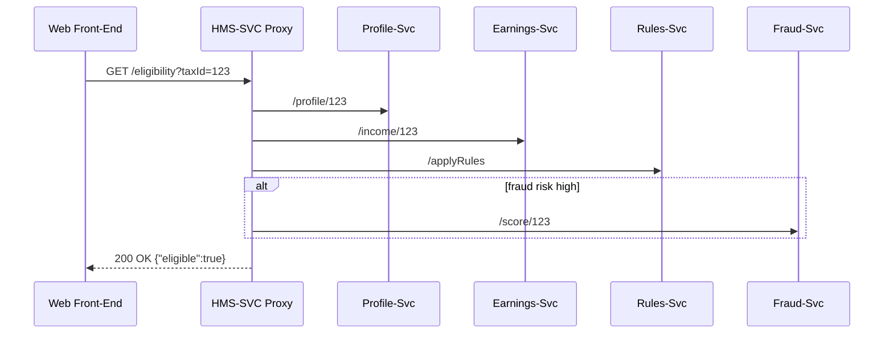
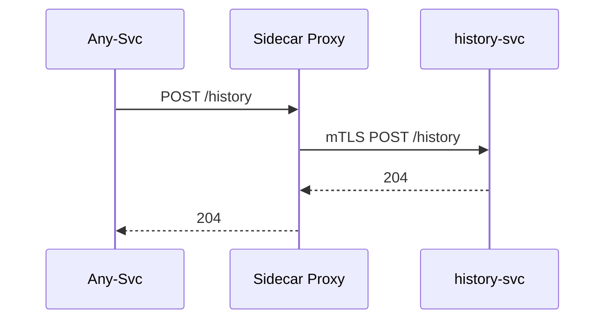

# Chapter 9: Core Service Mesh (HMS-SVC)

*A friendly sequel to [Human-in-the-Loop (HITL) Control](08_human_in_the_loop__hitl__control_.md)*  

---

## 1. Why Do We Need a “Service Mesh”?

Imagine the Department of Labor launches an online **“Gig-Worker Benefits Portal.”**  
Behind one “Check Eligibility” button hide five different micro-services:

1. **Profile-Svc** – looks up the worker’s tax ID  
2. **Earnings-Svc** – pulls 1099 income from IRS  
3. **Rules-Svc** – applies the latest policy blob from [HMS-CDF](02_policy___legislative_engine__hms_cdf__.md)  
4. **Fraud-Svc** – runs AI scoring built with [HMS-AGT](07_agent_framework__hms_agt___hms_agx__.md)  
5. **History-Svc** – writes an audit record into the data lake  

If any URL changes, SSL cert expires, or one service gets overloaded, the citizen will see a 💔 **“500 Internal Server Error.”**  
**HMS-SVC is the call-center operator that knows exactly which desk to ring, how to retry if the line is busy, and how to keep sensitive data shielded.**

---

## 2. Key Ideas in Plain English

| Mesh Concept | Friendly Analogy | Gig-Worker Portal Example |
|--------------|------------------|---------------------------|
| Service Registry | Phone book | “Where is Earnings-Svc running today?” |
| Sidecar Proxy | Personal bodyguard | Keeps hackers away from Rules-Svc |
| Circuit Breaker | Surge protector | If Fraud-Svc throws errors, cut the circuit & fall back |
| Load Balancer | DMV ticket machine | Fairly hands out requests to 3 replicas of Profile-Svc |
| Policy Filter | Bouncer at club door | Blocks any call that tries to fetch SSN without auth |

---

## 3. A 3-Minute Tour – “Check Eligibility” in Action

We’ll walk through **one HTTP call** from the browser to five micro-services without the user noticing.



*HMS-SVC is the only thing the UI ever talks to; it fans out the calls and stiches the answer together.*

---

## 4. Using HMS-SVC from Your Front-End (≤ 15 Lines)

```js
// services/eligibility.client.js
export async function checkEligibility(taxId){
  const res = await fetch(`/api/eligibility?taxId=${taxId}`)
  return await res.json()   // -> { eligible: true }
}
```

Explanation  
The browser calls **one stable URL**. It **never** needs to know where the five back-ends live.

---

## 5. Wiring a New Micro-Service into the Mesh

Let’s register a **History-Svc** that logs every decision.

### 5.1 Register (1 YAML file, 6 lines)

```yaml
# mesh/services/history-svc.yml
id: history-svc
url: http://history:7000
routes:
  - path: /history/**
    methods: [POST]
```

Explanation  
Drop the file in `/mesh/services/`; HMS-SVC hot-reloads it. No re-deploy of other code.

### 5.2 Call from Any Other Service (≤ 10 Lines)

```js
// inside Rules-Svc
await fetch('http://history-svc/history', {
  method:'POST',
  body: JSON.stringify({ user:123, action:'eligibility_passed' })
})
```

Because **history-svc** is now in the registry, the mesh does service-to-service DNS and mTLS automatically.

---

## 6. What Happens Under the Hood?

### 6.1 Step-by-Step on a Single Request

1. **Ingress Proxy** receives HTTPS from the browser.  
2. Proxy **looks up** `/eligibility` in the routing table.  
3. Proxy **fans out** to Profile-Svc & Earnings-Svc in parallel.  
4. Results flow back through **Policy Filters** (no PII leaks).  
5. **Circuit Breaker** trips if any downstream service errors > 5 % in 1 min.  
6. Proxy composes JSON and returns `200 OK` to the browser.  
7. **Observability hooks** send timing metrics to [HMS-OPS](17_observability___operations__hms_ops__.md).

### 6.2 Minimal SequenceDiagram (service-to-service)



*Every pod talks only to its own **Sidecar Proxy**; zero hard-coded hostnames.*

---

## 7. Peeking at the Mesh Code (All Tiny!)

### 7.1 The Router Table (JSON, 12 Lines)

```json
{
  "/eligibility": ["profile-svc", "earnings-svc", "rules-svc"],
  "/history/**":  ["history-svc"]
}
```

HMS-SVC stores this in Redis; the proxy consults it on every request.

### 7.2 Mini Proxy Handler (Node, 18 Lines)

```js
// mesh/proxy.js
import httpProxy from 'http-proxy'
import { getTargets } from './router.js'

export const proxy = httpProxy.createProxyServer({})

export function handle(req, res){
  const targets = getTargets(req.url)   // ['/profile','/earnings',…]
  Promise.all(targets.map(t => call(t, req)))
    .then(results => res.end(merge(results)))
    .catch(_ => res.writeHead(502).end('Bad Gateway'))
}

function call(target, req){
  return new Promise((ok, fail)=>{
    proxy.web(req, {}, err => err ? fail(err) : ok())
  })
}
```

Explanation  
* `getTargets()` looks at the JSON router table.  
* Requests are proxied in parallel.  
* Any error triggers a 502 and activates the circuit breaker.

### 7.3 Circuit Breaker (5 Lines)

```js
// mesh/circuit.js
let errors = 0
export function record(err){
  errors++
  if (errors > 5) openCircuit()
}
function openCircuit(){ /* skip target & return fallback */ }
```

Beginner-level: count errors, flip a flag.

---

## 8. Talking to Other Chapters

| Need | How HMS-SVC Helps | Where to Learn More |
|------|------------------|---------------------|
| A/B testing a new Rules-Svc version | Route `10 %` of traffic to `rules-svc-v2` | See *shadow routing* snippet in [Observability & Operations](17_observability___operations__hms_ops__.md) |
| Protect PII leaving the mesh | Attach a **Policy Filter** that calls [HMS-ESQ](04_compliance___legal_reasoning__hms_esq__.md) | Chapter 4 |
| Pausing traffic for a human decision | Insert a `hitl` step managed by [HITL Control](08_human_in_the_loop__hitl__control_.md) | Chapter 8 |
| Writing raw events to storage | Pipe sidecar logs to [Data Lake & Repository](10_data_lake___repository__hms_dta__.md) | *Next chapter* |

---

## 9. Frequently Asked Questions

**Q: Do I *have* to run Kubernetes or Envoy to use HMS-SVC?**  
No. The tutorial shows plain Node proxies. Later you can swap in Envoy or Istio—concepts stay identical.

**Q: How does the mesh find new services?**  
Each service publishes a small YAML file (see 5.1). A file watcher updates the in-memory registry within seconds.

**Q: Can one rogue service call the database of another agency?**  
Only if the sidecar policy allows it. By default, cross-agency calls must go through [Inter-Agency Exchange](11_inter_agency_exchange__hms_a2a__.md).

**Q: Does the mesh add latency?**  
Typical hop adds < 2 ms. Bulk of time is still spent in your business logic.

---

## 10. What You Learned

• **HMS-SVC** is the “engine room” that routes, secures, and scales every micro-service call.  
• The front-end hits **one** URL; the mesh fans out to multiple back-ends.  
• Registering a new service is just a 6-line YAML file.  
• Circuit breakers, load balancing, and policy filters are built-in and beginner-friendly.  

Ready to see where all those logs and data trails end up?  
Jump to [Data Lake & Repository (HMS-DTA)](10_data_lake___repository__hms_dta__.md) to learn how the platform stores and queries everything the mesh records.

---

---

Generated by [AI Codebase Knowledge Builder](https://github.com/The-Pocket/Tutorial-Codebase-Knowledge)