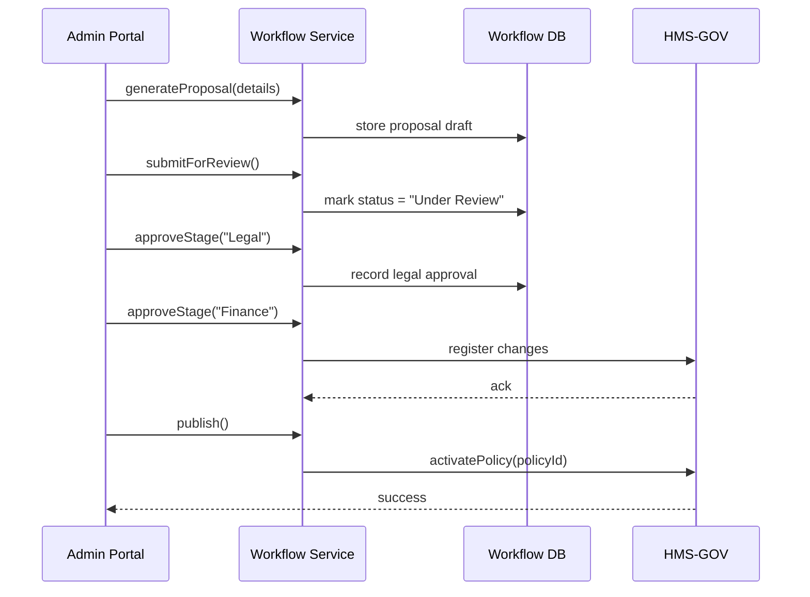

# Chapter 9: Policy Deployment Workflow

In [Chapter 8: AI Representative Agent](08_ai_representative_agent_.md) we learned how an AI agent can draft optimized protocols. Before those drafts become enforceable policies, they must pass through a **Policy Deployment Workflow**—much like a bill travels through committees, debates, and votes before becoming law.

## 9.1 Why a Policy Deployment Workflow?

Imagine the Department of Education wants to update its **Student Loan Disbursement** policy:
1. An officer writes a proposal (e.g., “Add income verification step”).  
2. The proposal goes to the Legal Committee.  
3. After legal review, it goes to Finance for cost analysis.  
4. Once all reviews pass, the policy is published and enforced automatically in HMS-GOV.

A **Policy Deployment Workflow** ensures each update is tracked, reviewed by the right roles, and only activated when fully approved. It:

- Keeps an audit trail of every step.  
- Enforces that only authorized reviewers can sign off.  
- Automates the final publication into HMS-GOV.

## 9.2 Key Concepts

1. **Proposal**  
   A drafted change to an existing policy or a brand-new policy.  
2. **Review Stages**  
   Checkpoints where specific roles (e.g., Legal, Finance) must approve.  
3. **Approval**  
   Final sign-off by a senior role (e.g., Agency Head).  
4. **Publication**  
   Publishing the policy into HMS-GOV’s registry so it can be enforced.  
5. **Activation**  
   Turning the published policy “on” so all modules start using it.

> Analogy: Think of HMS-GOV as the “Lawbook.” A proposal is a draft law, review stages are committee hearings, approval is the legislative vote, and publication/activation is the president signing the bill into law.

## 9.3 How to Use the Policy Deployment Workflow

Here’s a minimal example using the `PolicyDeploymentWorkflow` class.

```javascript
import { PolicyDeploymentWorkflow } from 'hms-mkt';

// 1. Create a workflow for our policy
const wf = new PolicyDeploymentWorkflow('student-loan-disbursement');

// 2. Generate a proposal with changes
await wf.generateProposal({
  description: 'Require annual income check',
  changes: [{ field: 'incomeCheck', required: true }]
});

// 3. Send it to reviewers
await wf.submitForReview();

// 4. Reviewers approve in order
await wf.approveStage('Legal Committee');
await wf.approveStage('Finance Office');

// 5. Publish and activate in HMS-GOV
await wf.publish();  // policy goes live immediately
console.log('Policy deployed successfully');
```

What this does:
- We draft and store a proposal.  
- We move it through two review stages.  
- We publish it, which registers and activates the policy in HMS-GOV.

## 9.4 Under the Hood: Step-by-Step Sequence



1. **generateProposal** stores the draft in the database.  
2. **submitForReview** flags the proposal for review.  
3. **approveStage** is called once per committee.  
4. **publish** tells HMS-GOV to register and activate the new policy.

## 9.5 Internal Implementation

### src/hms-mkt/workflow/PolicyDeploymentWorkflow.js

```javascript
// Manages the lifecycle of policy updates
export class PolicyDeploymentWorkflow {
  constructor(policyId) {
    this.policyId = policyId;
    this.stages   = [];   // e.g. ["Legal", "Finance"]
  }

  async generateProposal({ description, changes }) {
    // save draft to DB
    await db.insert('proposals', {
      policyId: this.policyId, description, changes, status: 'Draft'
    });
  }

  async submitForReview() {
    await db.update('proposals', { policyId: this.policyId }, { status: 'Under Review' });
  }

  async approveStage(stageName) {
    // record approval event
    await db.insert('approvals', { policyId: this.policyId, stage: stageName, time: Date.now() });
  }

  async publish() {
    // register and activate in HMS-GOV
    await hmsGov.registerPolicy(this.policyId);
    await hmsGov.activatePolicy(this.policyId);
    await db.update('proposals', { policyId: this.policyId }, { status: 'Published' });
  }
}
```

_Explanation:_  
- We keep track of proposals and approvals in simple tables.  
- `hmsGov.registerPolicy` and `hmsGov.activatePolicy` are calls to [Core System Platform (HMS-GOV)](01_core_system_platform__hms_gov__.md) to make the policy live.

### routes/workflows.js

```javascript
const express = require('express');
const { PolicyDeploymentWorkflow } = require('../workflow/PolicyDeploymentWorkflow');
const router = express.Router();

// POST /api/workflows/:policyId/propose
router.post('/:policyId/propose', async (req, res) => {
  const wf = new PolicyDeploymentWorkflow(req.params.policyId);
  await wf.generateProposal(req.body);
  res.json({ success: true });
});

// POST /api/workflows/:policyId/publish
router.post('/:policyId/publish', async (req, res) => {
  const wf = new PolicyDeploymentWorkflow(req.params.policyId);
  await wf.publish();
  res.json({ success: true });
});

module.exports = router;
```

_Explanation:_  
- We expose HTTP endpoints so the Admin Portal can call `generateProposal` and `publish`.  
- Review and approval endpoints are similar and enforce role checks with HMS-GOV.

## 9.6 Summary

In this chapter you learned how to move a policy update from draft to live:

- Defined the **Proposal**, **Review Stages**, **Approval**, **Publication**, and **Activation** steps.  
- Saw how to use the `PolicyDeploymentWorkflow` class to orchestrate each phase.  
- Walked through a **sequence diagram** illustrating every call from the Admin UI to HMS-GOV.  
- Peeked under the hood at minimal code for the workflow manager and Express routes.

With the Policy Deployment Workflow in place, you ensure every change is reviewed, auditable, and activated correctly. Up next, we’ll add interactive overrides in [Chapter 10: Human-in-the-Loop Override](10_human_in_the_loop_override_.md).

---

Generated by [AI Codebase Knowledge Builder](https://github.com/The-Pocket/Tutorial-Codebase-Knowledge)