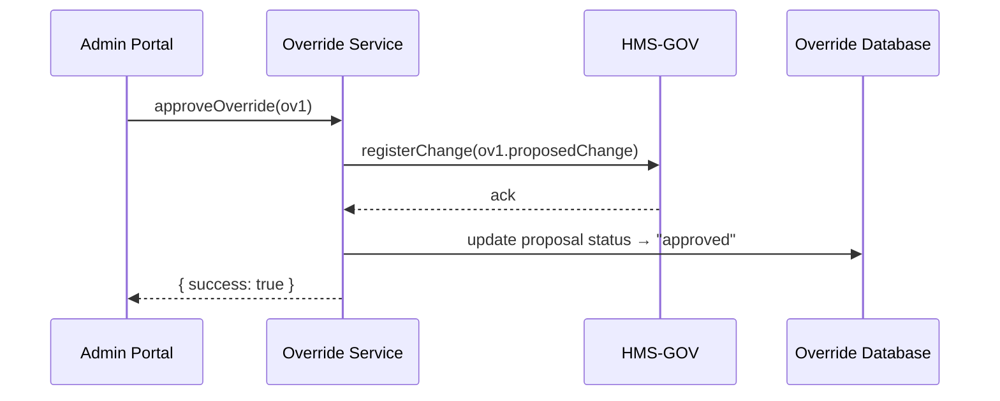

# Chapter 10: Human-in-the-Loop Override

Welcome back! In [Chapter 9: Policy Deployment Workflow](09_policy_deployment_workflow_.md) we saw how drafted policies move through review stages and go live. Sometimes AI agents or automated workflows propose changes that we want to vet before they affect real systems. That’s where **Human-in-the-Loop Override** comes in—a final safety net so officials can review, tweak, or reject AI-proposed updates before publication.

---

## 10.1 Why We Need Human-in-the-Loop Override

Imagine the Central Intelligence Agency’s AI system flags a new “Emergency Response Directive” draft that changes evacuation priorities based on sensor data. Before this auto-proposal goes live, a senior intelligence officer should inspect it. With Human-in-the-Loop Override, the officer can:

1. See exactly what the AI suggests.  
2. Edit any field (e.g., evacuation radius).  
3. Approve, tweak, or reject the change.  

> Analogy: Think of an AI drafting a directive like a junior aide writing a memo. The senior officer stamps “Approved,” “Revise,” or “Denied” before sending it out.

**Central Use Case**  
An AI agent proposes adding a checkpoint “Geo-Fence Validation” to city permit flows. The planning director opens the Override Dashboard, reviews the JSON diff, tweaks the wording, and clicks **Approve**. Only then does the change become enforceable.

---

## 10.2 Key Concepts

1. **Override Queue**  
   A list of pending AI-proposed changes waiting for human review.

2. **Proposal Record**  
   A single override entry containing:
   - `id`
   - `proposedChange` (JSON diff)
   - `submittedBy` (AI agent)
   - `timestamp`

3. **Review Dashboard**  
   UI component where officials browse, inspect diffs, and take action.

4. **Actions**  
   - **Approve**: commit the change.  
   - **Tweak**: modify the proposal then approve.  
   - **Reject**: discard the proposal.

5. **Audit Log**  
   Immutable record of every override decision (who acted, when, what they did).

---

## 10.3 How to Use Human-in-the-Loop Override

Below is a minimal example showing how your Admin Portal or script calls the Override Service.

### 10.3.1 Fetch Pending Overrides

```javascript
import { overrideService } from 'hms-mkt';

// Load all AI proposals awaiting review
const pending = await overrideService.fetchPendingOverrides();
console.log('Pending proposals:', pending);
// Output: [{ id: 'ov1', submittedBy: 'aiAgent01', timestamp: '...' }, …]
```
*Explanation:*  
`fetchPendingOverrides()` returns an array of proposals with basic metadata.

### 10.3.2 Review a Single Proposal

```javascript
// Load full details, including JSON diff
const proposal = await overrideService.getOverrideById('ov1');
console.log('Diff:', proposal.proposedChange);
// Output: { add: ['step:Geo-Fence Validation'], remove: [] }
```
*Explanation:*  
`getOverrideById(id)` fetches the “diff” the AI generated, so you can inspect specifics.

### 10.3.3 Approve, Tweak, or Reject

```javascript
// 1. Approve as-is
await overrideService.approveOverride('ov1');

// 2. Tweak then approve
const modified = { ...proposal.proposedChange, label: 'Geo-Fence Check' };
await overrideService.tweakOverride('ov1', modified);

// 3. Reject outright
await overrideService.rejectOverride('ov2');
```
*Explanation:*  
- `approveOverride(id)` commits the AI’s changes.  
- `tweakOverride(id, newChange)` applies your edits then commits.  
- `rejectOverride(id)` discards the proposal.

---

## 10.4 Under the Hood: Sequence Diagram

Here’s a simplified flow when an official approves an AI proposal:



1. **Admin Portal** calls `approveOverride`.  
2. **Override Service** tells **HMS-GOV** to apply the change.  
3. **HMS-GOV** acknowledges.  
4. **Override Service** marks the proposal “approved” in its database.  
5. Portal shows success to the user.

---

## 10.5 Internal Implementation

Let’s peek at a minimal `overrideService.js` implementation.

### src/hms-mkt/overrideService.js

```javascript
// In-memory store for demo; real code uses a DB
const proposals = [
  { id: 'ov1', proposedChange: {...}, status: 'pending' }
];

export const overrideService = {
  async fetchPendingOverrides() {
    return proposals.filter(p => p.status === 'pending');
  },

  async getOverrideById(id) {
    return proposals.find(p => p.id === id);
  },

  async approveOverride(id) {
    const p = await this.getOverrideById(id);
    await hmsGov.registerPolicyChange(p.proposedChange);
    p.status = 'approved';
    p.audit = { action: 'approved', by: currentUser(), time: Date.now() };
  },

  async tweakOverride(id, newChange) {
    const p = await this.getOverrideById(id);
    p.proposedChange = newChange;
    return this.approveOverride(id);
  },

  async rejectOverride(id) {
    const p = await this.getOverrideById(id);
    p.status = 'rejected';
    p.audit = { action: 'rejected', by: currentUser(), time: Date.now() };
  }
};
```

*Explanation:*  
- We keep a simple `proposals` array for pending items.  
- Approve/Tweak calls `hmsGov.registerPolicyChange()` to push updates into [Core System Platform (HMS-GOV)](01_core_system_platform__hms_gov__.md).  
- Every change records an `audit` entry for transparency.

---

## 10.6 Summary

In this chapter you learned:

- Why a **Human-in-the-Loop Override** provides a critical safety checkpoint.  
- The key concepts: **Override Queue**, **Proposal Record**, **Review Dashboard**, **Actions**, and **Audit Log**.  
- How to fetch, review, approve, tweak, or reject AI proposals with minimal code.  
- The runtime flow from the Admin Portal to HMS-GOV and back.  
- A simple `overrideService` implementation and how it ties into HMS-GOV.

With this safeguard in place, you can trust AI-powered suggestions without sacrificing oversight. Next up, we’ll see how to synchronize live policies with outside agencies in [External System Sync](11_external_system_sync_.md).

---

Generated by [AI Codebase Knowledge Builder](https://github.com/The-Pocket/Tutorial-Codebase-Knowledge)