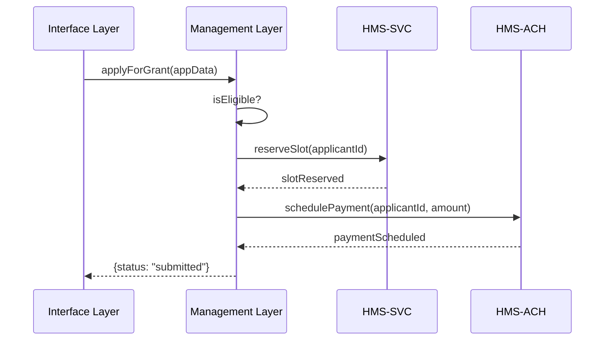

# Chapter 10: Management Layer

Now that you’ve seen how policy-makers review and publish changes in the [Admin/Gov Portal](09_admin_gov_portal_.md), it’s time to connect the dots between user actions and the underlying microservices. Enter the **Management Layer**—the operations department of HMS-MKT that orchestrates business logic, workflows, and service calls behind the scenes.

---

## 1. Motivation: Why a Management Layer?

Imagine a citizen applies for a “Small Business Grant.” The portal must:

1. Validate the application data.  
2. Reserve a grant slot in the Grants Service (HMS-SVC).  
3. Schedule an ACH payment via the Payments Service (HMS-ACH).  
4. Update audit logs and notify the applicant.

Without a central coordinator, each step becomes ad-hoc in the UI or buried in backend endpoints. The **Management Layer** provides one place to:

- Orchestrate multiple microservices in the right order.  
- Enforce business rules (eligibility checks, deadline windows).  
- Manage long-running workflows (retry on errors, track status).  

Think of it like the agency’s “Operations Office” that ensures each department (microservice) plays its part at the right time.

---

## 2. Key Concepts

1. **Orchestrator**  
   A service class that runs a business workflow from start to finish.

2. **Business Logic**  
   The rules that decide who qualifies, when to retry, or how to handle errors.

3. **Workflow Executor**  
   A component that tracks each step of a multi-step process (e.g., using protocol definitions from [Chapter 4](04_protocol_builder_.md)).

4. **Service Clients**  
   Lightweight wrappers for calling downstream microservices (HMS-SVC, HMS-ACH).

5. **Error Handling & Retries**  
   Built-in support to catch failures, log them, and retry or compensate.

---

## 3. Using the Management Layer

Below is a minimal example showing how to kick off a “Grant Application” workflow.

```js
// src/management/GrantManager.js
import { SvcClient } from '../clients/SvcClient'
import { AchClient } from '../clients/AchClient'

export class GrantManager {
  constructor() {
    this.svc = new SvcClient()
    this.ach = new AchClient()
  }

  async applyForGrant(appData) {
    // 1) Validate eligibility
    if (!this.isEligible(appData)) throw new Error('Not eligible')
    // 2) Reserve slot
    await this.svc.reserveSlot(appData.applicantId)
    // 3) Schedule payment
    await this.ach.schedulePayment(appData.applicantId, appData.amount)
    return { status: 'submitted' }
  }

  isEligible(data) {
    // simple rule: must be US citizen
    return data.citizenship === 'US'
  }
}
```

What happens when you call `applyForGrant`:

1. Eligibility is checked.  
2. A slot is reserved in HMS-SVC.  
3. An ACH payment is scheduled.  
4. A final status is returned to the caller.

---

## 4. Step-by-Step Workflow

Here’s a simple sequence diagram showing the flow:



1. The UI calls the **Management Layer**.  
2. It runs business checks.  
3. It orchestrates calls to each microservice.  
4. It returns a consolidated result.

---

## 5. Internal Implementation Details

Let’s peek inside our client wrappers and workflow executor.

### 5.1 Service Client (src/clients/SvcClient.js)

```js
export class SvcClient {
  async reserveSlot(applicantId) {
    // In real life: HTTP POST to /api/grants/reserve
    console.log(`Reserving slot for ${applicantId}`)
    // simulate network call
    return Promise.resolve()
  }
}
```

### 5.2 ACH Client (src/clients/AchClient.js)

```js
export class AchClient {
  async schedulePayment(id, amount) {
    // In real life: HTTP POST to /api/payments/schedule
    console.log(`Scheduling $${amount} payment for ${id}`)
    return Promise.resolve()
  }
}
```

### 5.3 Workflow Executor (src/management/WorkflowExecutor.js)

```js
export class WorkflowExecutor {
  constructor(steps) { this.steps = steps }
  async run(context) {
    for (const step of this.steps) {
      await step.action(context)
    }
  }
}
```

You could define the grant workflow as:

```js
import { WorkflowExecutor } from './WorkflowExecutor'

const grantWorkflow = new WorkflowExecutor([
  { action: ctx => ctx.manager.isEligible(ctx.data) },
  { action: ctx => ctx.manager.svc.reserveSlot(ctx.data.applicantId) },
  { action: ctx => ctx.manager.ach.schedulePayment(ctx.data.applicantId, ctx.data.amount) }
])

await grantWorkflow.run({ manager: grantMgr, data: appData })
```

This separates **definition** (the list of steps) from the **executor**, making it easy to swap in new workflows defined via [Protocol Builder](04_protocol_builder_.md).

---

## 6. Analogy: Department of Operations

Think of the **Management Layer** as an agency’s operations department:

- It reads the “playbook” (workflow steps).  
- It enforces the rules (eligibility, retries).  
- It calls each department (microservice) in order.  
- It tracks progress and reports back to the front desk (Interface Layer).

Without it, your portal would hard-code each API call in the UI or leave error handling scattered everywhere.

---

## 7. Summary & Next Steps

In this chapter, you learned how the **Management Layer**:

- Orchestrates multi-step business workflows.  
- Centralizes business logic and eligibility checks.  
- Wraps downstream microservices in simple client classes.  
- Uses a workflow executor to run steps in order.

Next, we’ll expose these orchestrations as REST endpoints in our [Backend API Service](11_backend_api_service_.md), so frontends and other systems can call them.

---

Generated by [AI Codebase Knowledge Builder](https://github.com/The-Pocket/Tutorial-Codebase-Knowledge)