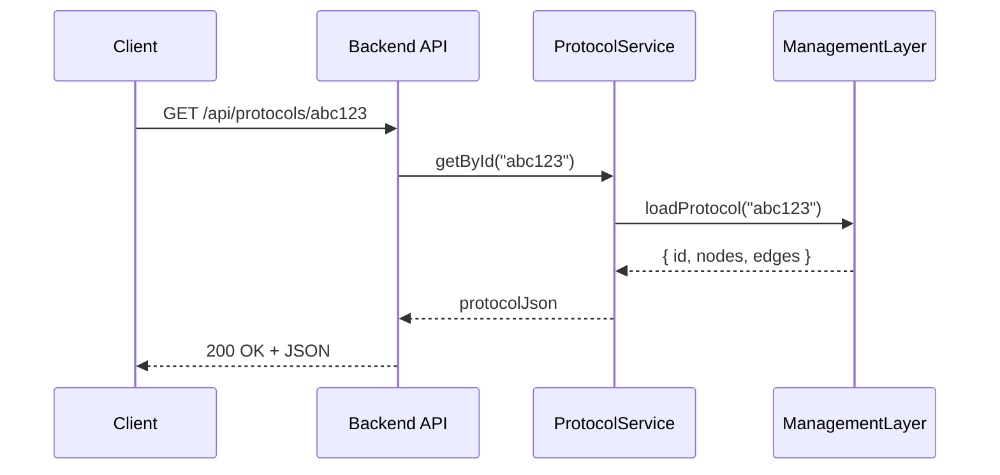

# Chapter 11: Backend API Service

In [Chapter 10: Management Layer](10_management_layer_.md), we learned how the Management Layer orchestrates workflows and microservices behind the scenes. Now we’ll expose those orchestrations as HTTP endpoints in our **Backend API Service**—the “mailroom clerk” that accepts requests, routes them to the right service, and returns results.

---

## 1. Motivation: Why a Backend API Service?

Imagine the USDA’s Agricultural Research Service (ARS) needs to let citizen scientists:
1. Submit a new research proposal.
2. Update an existing protocol definition.
3. Retrieve the status of their submission.

We want a simple, consistent set of URLs (endpoints) so UIs, mobile apps, or partner agencies can call our service just like sending a letter to the mailroom. The Backend API Service:

- Defines the public address book (routes like `/api/proposals`).  
- Validates incoming letters (JSON payloads).  
- Dispatches them to the right department (Management Layer, AI Agent, etc.).  
- Sends back a response (200 OK with data, or 4XX errors).

This keeps our system organized and easy to integrate with other government systems.

---

## 2. Key Concepts

1. **Router**  
   Maps URL paths and HTTP verbs to handler functions.

2. **Controller / Handler**  
   A small function that extracts data from the request, calls a service, and sends a response.

3. **Service Layer**  
   Calls into the [Management Layer](10_management_layer_.md) or other modules to perform business logic.

4. **Request & Response Models**  
   Simple JSON schemas that define expected input and output.

5. **Error Handling Middleware**  
   Catches exceptions and returns friendly error messages.

---

## 3. How to Use the Backend API Service

Below is a minimal Express.js example showing how to create, update, and retrieve “protocol definitions” (workflows) via HTTP.

### 3.1 Setup the Server and Middleware

```js
// src/index.js
import express from 'express'
import bodyParser from 'body-parser'
import protocolRoutes from './routes/protocolRoutes'

const app = express()
app.use(bodyParser.json())             // parse JSON bodies
app.use('/api/protocols', protocolRoutes)

app.use((err, req, res, next) => {     // error handler
  res.status(500).json({ error: err.message })
})

app.listen(4000, () => console.log('API running on port 4000'))
```

This starts an HTTP server on port 4000, mounts our routes under `/api/protocols`, and adds basic JSON parsing and error handling.

### 3.2 Define Routes

```js
// src/routes/protocolRoutes.js
import { Router } from 'express'
import {
  createProtocol,
  updateProtocol,
  getProtocol
} from '../controllers/protocolController'

const router = Router()

router.post('/', createProtocol)        // POST /api/protocols
router.get('/:id', getProtocol)         // GET  /api/protocols/:id
router.put('/:id', updateProtocol)      // PUT  /api/protocols/:id

export default router
```

This router sends each HTTP call to the appropriate controller function.

### 3.3 Write Controller Handlers

```js
// src/controllers/protocolController.js
import protocolService from '../services/protocolService'

export async function createProtocol(req, res, next) {
  try {
    const newProto = await protocolService.create(req.body)
    res.status(201).json(newProto)
  } catch (err) { next(err) }
}

export async function getProtocol(req, res, next) {
  try {
    const proto = await protocolService.getById(req.params.id)
    res.json(proto)
  } catch (err) { next(err) }
}

export async function updateProtocol(req, res, next) {
  try {
    const updated = await protocolService.update(req.params.id, req.body)
    res.json(updated)
  } catch (err) { next(err) }
}
```

Each handler:
1. Reads `req.body` or `req.params`.  
2. Calls the **Service Layer**.  
3. Returns JSON or passes errors to the error middleware.

---

## 4. What Happens Step-by-Step

Here’s a minimal sequence when a partner agency retrieves a protocol definition:



1. The client calls the API.  
2. Router directs to `getProtocol`.  
3. Controller calls `protocolService.getById`.  
4. Service invokes the [Management Layer](10_management_layer_.md) or data store.  
5. Data returns up the chain to the client.

---

## 5. Inside the Service Layer

Let’s peek at the simple service that bridges controllers to the Management Layer.

```js
// src/services/protocolService.js
import { ProtocolManager } from '../management/ProtocolManager'

const manager = new ProtocolManager()

export default {
  async create(data) {
    // validate data, then...
    return manager.createProtocol(data)
  },
  async getById(id) {
    return manager.fetchProtocol(id)
  },
  async update(id, data) {
    return manager.updateProtocol(id, data)
  }
}
```

- `ProtocolManager` lives in our [Management Layer](10_management_layer_.md).  
- The service does minimal validation and forwards calls.

---

## 6. Mailroom Clerk Analogy

Think of the **Backend API Service** like a mailroom clerk in a federal building:

- **Router**: The mail slot where letters (HTTP requests) arrive.  
- **Controller**: The clerk who opens each letter, reads the address, and decides which department to send it to.  
- **Service Layer**: The mail cart that carries the letter to the right office (e.g., Protocol Management).  
- **Response**: The clerk seals the return letter (HTTP response) and drops it back in your outbox.

This keeps mail (data) flowing smoothly and prevents you from having to track down every department yourself.

---

## 7. Summary & Next Steps

In this chapter, you learned how to:

- Define HTTP endpoints with Express.js.  
- Map routes to controller handlers and service calls.  
- Use the [Management Layer](10_management_layer_.md) under the hood.  
- Handle errors and return JSON responses.

Next, we’ll synchronize our policies and workflows with external systems—see [External System Synchronization](12_external_system_synchronization_.md).

---

Generated by [AI Codebase Knowledge Builder](https://github.com/The-Pocket/Tutorial-Codebase-Knowledge)