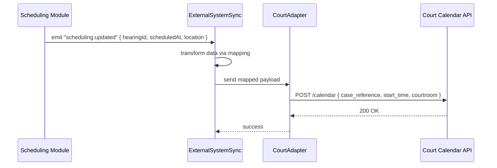

# Chapter 11: External System Sync

In [Chapter 10: Human-in-the-Loop Override](10_human_in_the_loop_override_.md) we saw how to vet AI-proposed policy changes. Now let’s look outward—how to send updates from our platform in **real time** to other scheduling or data-management systems. This is the **External System Sync**: the agency’s live pipeline to third-party services like court calendars or clinic schedules.

---

## 11.1 Why External System Sync?

Imagine your agency books a courtroom hearing:

1. A clerk schedules a hearing slot in our system.
2. The external Court’s calendar must update **immediately** so everyone sees the new date.
3. If the court’s API fails, we retry until it succeeds.

Without External System Sync, clerks would have to manually copy events. That’s error-prone and slow.

**Central Use Case**  
When a hearing is created or rescheduled in our Scheduling Module, we automatically push the change to the Court’s REST API, keeping calendars in lock-step.

---

## 11.2 Key Concepts

1. **Event Emitter**  
   Our platform emits events like `scheduling:created` or `data:updated`.

2. **Connector (ExternalSystemSync)**  
   A live listener that subscribes to events and kicks off sync logic.

3. **Adapter**  
   A small piece of code that “speaks” the external system’s API (REST, SOAP, Webhook).

4. **Mapping**  
   Configuration mapping internal fields (e.g. `hearingId`) to external ones (e.g. `case_reference`).

5. **Retry Logic**  
   Automatic retries with backoff for transient failures.

---

## 11.3 How to Use External System Sync

Below is a minimal example registering a connector to sync hearing updates to a court calendar.

```javascript
// index.js
import { ExternalSystemSync } from 'hms-mkt';
import { courtCalendarAdapter } from './adapters/courtCalendarAdapter.js';

// 1. Define a sync for hearing slots
const hearingSync = new ExternalSystemSync({
  name: 'CourtCalendarSync',
  event: 'scheduling:updated',
  adapter: courtCalendarAdapter,
  mapping: {
    hearingId:    'case_reference',
    scheduledAt:  'start_time',
    location:     'courtroom'
  }
});

// 2. Start listening and syncing
hearingSync.start();
```

Explanation:
- We import `ExternalSystemSync` and a custom `courtCalendarAdapter`.
- We tell it to listen for `scheduling:updated` events.
- `mapping` maps our internal fields to the court API’s field names.
- Calling `start()` subscribes to events and begins automatic syncing.

Here’s a simple adapter that calls the court’s REST API:

```javascript
// adapters/courtCalendarAdapter.js
export async function courtCalendarAdapter(payload) {
  // Send to external court system
  await fetch('https://court.example.gov/api/calendar', {
    method: 'POST',
    headers: { 'Content-Type': 'application/json' },
    body: JSON.stringify(payload)
  });
}
```

Explanation:
- The adapter receives a `payload` with mapped fields.
- It makes a POST to the court’s calendar endpoint.

---

## 11.4 Under the Hood: Sequence Flow



1. **Scheduling Module** emits an event with raw data.
2. **ExternalSystemSync** transforms fields per `mapping`.
3. It calls the **Adapter**, which makes the external HTTP request.
4. On success, sync is complete. On failure, built-in retry logic can reattempt.

---

## 11.5 Internal Implementation

### File: `src/hms-mkt/externalSync/ExternalSystemSync.js`

```javascript
import { EventBus } from '../core/eventBus.js';

export class ExternalSystemSync {
  constructor({ name, event, adapter, mapping }) {
    this.name    = name;
    this.event   = event;
    this.adapter = adapter;
    this.mapping = mapping;
  }

  start() {
    // Subscribe to our platform’s event bus
    EventBus.on(this.event, data => this.handleEvent(data));
  }

  async handleEvent(data) {
    const payload = this.transform(data);
    // Try adapter; add retry logic here if needed
    await this.adapter(payload);
  }

  transform(data) {
    // Map internal keys to external ones
    const out = {};
    for (const [intKey, extKey] of Object.entries(this.mapping)) {
      out[extKey] = data[intKey];
    }
    return out;
  }
}
```

Explanation:
- We import a simple `EventBus` that our modules use to emit events.
- The constructor saves `event`, `adapter`, and `mapping`.
- `start()` subscribes to the chosen event.
- `handleEvent()` transforms the data and invokes the adapter.
- `transform()` remaps fields as configured.

### File: `src/core/eventBus.js`

```javascript
// A very minimal EventBus
const listeners = {};

export const EventBus = {
  on(event, fn) {
    listeners[event] = listeners[event] || [];
    listeners[event].push(fn);
  },
  emit(event, data) {
    (listeners[event] || []).forEach(fn => fn(data));
  }
};
```

Explanation:
- Other parts of HMS-MKT call `EventBus.emit('scheduling:updated', {...})`.
- Our sync connector picks that up and processes it.

---

## 11.6 Summary

In this chapter you learned how to:

- Set up an **External System Sync** connector to push events in real time.  
- Define **mapping** between internal and external fields.  
- Write a simple **adapter** for a court calendar REST API.  
- See the runtime flow with a **sequence diagram**.  
- Peek under the hood at the `ExternalSystemSync` class and a minimal `EventBus`.

With External System Sync, your agency’s platform stays in perfect sync with third-party calendars and data systems—no manual copying needed.

Next up: monitoring those syncs and verifying data integrity in [Chapter 12: Metrics Monitoring & Verification](12_metrics_monitoring___verification_.md).

---

Generated by [AI Codebase Knowledge Builder](https://github.com/The-Pocket/Tutorial-Codebase-Knowledge)