# Chapter 11: HMS-DTA Unified Data Lake & Catalog  

[↠Back to Chapter 10: Security, Compliance & Legal Reasoning](10_security__compliance___legal_reasoning__hms_esq__hms_sys__.md)

---

## 1. Why Do We Need One “Shared Vault” for Data?

Imagine three federal offices all trying to answer one simple question:

> “Did cutting daily added-sugar limits from **50 g** to **25 g** lower childhood obesity in low-income counties?”

Agency | Owns Which Data | Where It Lives *Today*
------ | --------------- | -----------------------
USDA Center for Nutrition Policy & Promotion (CNPP) | School-lunch menus | Spreadsheet on a staffer’s laptop
Centers for Disease Control (CDC) | County obesity rates | Internal Postgres
Bureau of Labor Statistics (BLS) | County income levels | CSV on an FTP server

To merge these, a junior analyst usually:

1. Begs each office for a copy (“Please email me the CSV 🙏”).  
2. Spends a week cleaning mismatched columns.  
3. Hopes nothing changed by the time she finally runs `JOIN` …

**HMS-DTA** fixes all that.  
Instead of *three locked cabinets*, we give everyone one **audited, versioned, permissioned vault**:

* Datasets arrive once, in raw form, and never move again.  
* A **catalog** tells you what exists and the exact columns available.  
* Simple tags + ACLs keep private rows private, even during joins.  
* Every query leaves a breadcrumb trail for auditors.

By the end of this chapter you will:

1. Register a new dataset.  
2. Discover and join two public datasets in one SQL view.  
3. See how permissions are enforced under the hood.

---

## 2. Key Concepts (plain English)

| Term                | What It Really Means (Analogy)                         |
|---------------------|--------------------------------------------------------|
| Data Lake           | One giant **water reservoir** holding every raw file. |
| Catalog             | The **card catalog** telling you which “buckets” exist, their schema, owner, tags. |
| Version             | A **time-stamped snapshot** (“nutrition_v3”). |
| Tag                 | Colored stickers like `PHI`, `CUI`, `PUBLIC`. |
| Access Policy (ACL) | A **guest list**—who can read or join each column. |
| Audit Trail         | CCTV camera logging every “book” you pull. |

If you remember these six words, you already understand 80 % of HMS-DTA.

---

## 3. Guided Walk-Through: Sugar Policy Impact Study

### 3.1 Step 1 – Register the USDA School-Lunch Dataset

```bash
hms-dta dataset register lunch_menus.csv \
  --name usda_school_lunch \
  --tags PUBLIC,NUTRITION \
  --owner cnpp@usda.gov
```

What happens?

* File is copied into S3-style object storage.  
* Catalog entry created:

```jsonc
{
  "name": "usda_school_lunch",
  "version": 1,
  "columns": ["county_fips", "date", "added_sugar_g"],
  "tags": ["PUBLIC","NUTRITION"]
}
```

A friendly toast appears: **“Dataset registered ✔️”**

### 3.2 Step 2 – Discover Obesity & Income Datasets

```bash
hms-dta search "county obesity rate"
```

Terminal shows:

```
cdc_obesity_rates  (tags: PUBLIC, HEALTH)
bls_income_by_county (tags: PUBLIC, ECONOMIC)
```

Copy their names—we will join them next.

### 3.3 Step 3 – Create a Unified View (SQL)

```sql
-- file: sugar_impact.sql
CREATE VIEW sugar_policy_impact AS
SELECT 
  l.county_fips,
  AVG(l.added_sugar_g)      AS avg_sugar_g,
  AVG(o.obesity_rate)       AS avg_obesity,
  i.median_income
FROM usda_school_lunch       l
JOIN cdc_obesity_rates       o USING (county_fips)
JOIN bls_income_by_county    i USING (county_fips)
WHERE l.date BETWEEN '2024-01-01' AND '2024-12-31'
GROUP BY l.county_fips, i.median_income;
```

Run it:

```bash
hms-dta sql -f sugar_impact.sql
```

Within seconds you have a tidy table linking sugar intake, obesity, and income for every county—*without emailing a single CSV*.

---

## 4. What About Permissions?

Say the Office on Violence Against Women (OVW) wants to join **domestic-violence shelter admissions** (contains PII) with this view.  
Their dataset carries the tag `PII_HIGH`, so HMS-DTA enforces:

* Only rows/columns with matching policy clearance are returned.  
* Every query is logged for auditors (Chapter 15 will dive deeper).

Attempting an unauthorized join results in:

```
ERROR 403: Column "victim_name" is restricted by tag PII_HIGH
```

No manual data-masking scripts—guardrails are built-in.

---

## 5. Under the Hood – Step-by-Step (No Code)

```mermaid
sequenceDiagram
  participant AN as Analyst
  participant CT as Catalog API
  participant AU as Auth Service
  participant DL as Data Lake Storage
  participant LG as Audit Logger

  AN->>CT: RUN SQL (with JWT)
  CT->>AU: verify permissions
  AU-->>CT: ✅ scope=PUBLIC,NUTRITION
  CT->>DL: execute query with column filters
  DL-->>CT: result set
  CT->>LG: record query + row count
  CT-->>AN: CSV/Parquet stream
```



Five actors—easy to follow!

---

## 6. Tiny Peeks at the Real Code (< 20 Lines Each)

### 6.1 Route: Register Dataset  
_File `dta/src/routes/register.ts`_

```ts
router.post('/dataset', async (req, res) => {
  const { name, tags } = req.body
  const file = req.files[0]                    // multipart upload
  const v = 1                                  // first version

  await storage.put(`raw/${name}/v${v}.csv`, file.buffer)
  await catalog.insert({ name, version: v, tags, owner: req.user.email })

  res.json({ ok: true, version: v })
})
```

Explanation:

1. Upload file → object storage.  
2. Create catalog row with tags + owner.  
3. Return new version number.

### 6.2 SQL Guardrail Middleware  
_File `dta/src/middleware/acl.ts`_

```ts
export function enforceACL(sql, userTags) {
  const cols = parseColumns(sql)        // trivial regex
  const denied = cols.filter(c => c.tag && !userTags.has(c.tag))

  if (denied.length)
    throw new Error(`403 – access denied to ${denied.join(',')}`)
}
```

Runs **before** the query hits the lake.

---

## 7. How HMS-DTA Talks to Other Pieces

Component | Interaction
----------|-------------
[HMS-MKT Agent & Data Marketplace](03_hms_mkt_agent___data_marketplace_.md) | Datasets marked `PUBLIC` can be listed & metered without copying bytes.  
[HMS-ESQ Compliance Scanner](10_security__compliance___legal_reasoning__hms_esq__hms_sys__.md) | Uses the catalog to verify no restricted tags cross a FedRAMP boundary.  
[HMS-ACT Workflow Engine](08_hms_act_orchestration___workflow_engine_.md) | Steps can query the lake directly (e.g., fraud bot joins license data).  
[Activity Logging & Auditing](15_activity_logging___auditing__within_hms_act___ops__.md) | Reads the audit trail table for oversight dashboards.

---

## 8. 60-Second Playground

```bash
# 1. Start local stack
npm run dev --workspace=hms-dta

# 2. Register a toy CSV
echo -e "county_fips,added_sugar_g\n01001,20" > mini.csv
hms-dta dataset register mini.csv --name lunch_mini --tags PUBLIC

# 3. Query it
echo "SELECT * FROM lunch_mini;" | hms-dta sql
```

You should see your single row instantly—no DB setup required.

---

## 9. Recap & Looking Ahead

Today you:

• Learned why a **Unified Data Lake & Catalog** beats e-mailing spreadsheets.  
• Registered, discovered, and joined datasets in minutes.  
• Saw automatic tag-based permission checks in action.  
• Peeked at the tiny routes that power registration and ACLs.

In the next chapter we’ll learn how HMS synchronizes **external** systems (legacy mainframes, partner clouds) with this lake so everyone stays up-to-date:  
[Next Chapter: External System Synchronization Layer](12_external_system_synchronization_layer_.md)

---

Generated by [AI Codebase Knowledge Builder](https://github.com/The-Pocket/Tutorial-Codebase-Knowledge)