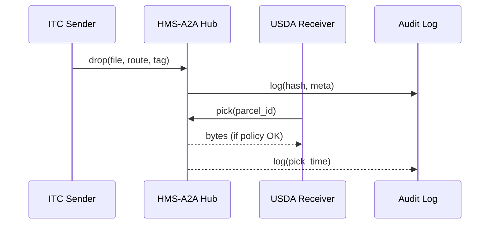

# Chapter 11: Inter-Agency Exchange (HMS-A2A)

*(A friendly sequel to [Data Lake & Repository (HMS-DTA)](10_data_lake___repository__hms_dta__.md))*  

---

## 1. Why Do We Need HMS-A2A?

Picture a **real** federal morning:

*The U.S. International Trade Commission (ITC) just finished its nightly batch that tallies soybean exports.*  
By 9 AM the **U.S. Department of Agriculture (USDA)** must ingest those figures to decide farm-subsidy rates.  
If an e-mail attachment is mistyped—or worse, tampered with—billions of dollars could flow the wrong way.

HMS-A2A is the **diplomatic pouch** between agencies:  
• contents are sealed (encryption),  
• every hand-off is recorded (audit trail), and  
• delivery rules are enforced (only the USDA key can open ITC’s soybean file).

One command lets ITC “drop” a parcel; another lets USDA “pick” it up.  
No FTP servers, no thumb-drives, no sleepless compliance officers.

---

## 2. Key Ideas in Plain English

| A2A Term | Friendly Analogy | Soybean Example |
|----------|------------------|-----------------|
| Parcel   | A locked briefcase | `soybean_2024Q2.zip` |
| Seal     | Tamper-evident tape | AES-256 envelope |
| Route    | Courier itinerary | ITC → USDA only |
| Receipt  | Signed delivery card | Hash + timestamp |
| Policy Filter | TSA scanner | Blocks PII in trade stats |

Remember these five words—90 % of A2A boils down to them.

---

## 3. A 3-Step Walk-Through  
**Goal:** ITC sends `soybean_2024Q2.csv` → USDA receives & stores in [HMS-DTA](10_data_lake___repository__hms_dta__.md).

### 3.1 ITC “Drop” the Parcel (CLI ≤ 15 lines)

```bash
# 1️⃣ itc_send.sh
hms-a2a drop \
  --file   ./soybean_2024Q2.csv \
  --to     USDA \
  --route  "ITC→USDA" \
  --tag    trade_stats
```

What happens?  
1. The file is **encrypted**.  
2. A **parcel ID** is returned (e.g., `parcel_7f3b`).  
3. A receipt hash is logged for auditors.

### 3.2 USDA “Pick” the Parcel (Node ≤ 18 lines)

```js
// 2️⃣ usda_receive.js
import { pick } from 'hms-a2a'

const data = await pick({
  id:     'parcel_7f3b',
  from:   'ITC',
  verify: true          // check signature + hash
})

console.log('✅ Received bytes:', data.length)
```

`verify:true` guarantees the file was not modified on the way.

### 3.3 Land in the Data Lake

```js
// 3️⃣ load_to_dta.js (excerpt)
import { ingest } from 'hms-dta'          // Chapter 10 helper

await ingest({
  dataset: 'soybean_exports',
  bytes:   data,               // from A2A
  tags:    ['trade','public']
})
```

Done—now analysts query it with DuckDB, same as earlier chapters.

---

## 4. What Happens Under the Hood?



Only **four** actors—but every byte is traceable.

---

## 5. Peeking at the Code (All Tiny!)

### 5.1 Sender SDK (drop) – 20 Lines

```js
// sdk/drop.js
import crypto from 'crypto'
import fs     from 'fs/promises'

export async function drop({ file, to, route, tag }){
  const bytes = await fs.readFile(file)
  const key   = await fetch(`/keys/${to}`).then(r=>r.arrayBuffer())
  const cipher= crypto.publicEncrypt(key, bytes)
  const hash  = crypto.createHash('sha256').update(cipher).digest('hex')
  await fetch('/a2a/parcels', {
    method:'POST',
    body: JSON.stringify({ to, route, tag, blob: cipher.toString('base64'), hash })
  })
  return { id:`parcel_${hash.slice(0,4)}` }
}
```

Beginners’ tour:  
• Read file → encrypt with **receiver’s public key** → POST to A2A hub.

### 5.2 Receiver SDK (pick) – 18 Lines

```js
// sdk/pick.js
import crypto from 'crypto'

export async function pick({ id, from, verify=false }){
  const res   = await fetch(`/a2a/parcels/${id}?from=${from}`)
  const body  = await res.json()
  const priv  = await fetch('/keys/self').then(r=>r.arrayBuffer())
  const bytes = crypto.privateDecrypt(priv, Buffer.from(body.blob,'base64'))
  if (verify){
    const hash = crypto.createHash('sha256').update(Buffer.from(body.blob,'base64')).digest('hex')
    if (hash !== body.hash) throw Error('Tamper detected!')
  }
  return bytes
}
```

• Fetch encrypted blob → decrypt with **own private key** → optional tamper check.

### 5.3 Minimal Hub Route (Express-style, 14 Lines)

```js
// routes/a2a.js
router.post('/parcels', async (req,res)=>{
  const p = { ...req.body, picked:false, ts:Date.now() }
  await db.parcels.insert(p)
  audit.log('DROP', p.hash)
  res.status(201).end()
})

router.get('/parcels/:id', async (req,res)=>{
  const p = await db.parcels.get(req.params.id)
  if (p.picked) return res.status(410).end('Gone')
  policy.checkRoute(req.query.from, p.route)   // TSA scan
  p.picked = true; await db.parcels.update(p.id,p)
  audit.log('PICK', p.hash)
  res.json(p)
})
```

• Stores once, serves once (parcel self-destructs after pickup).  
• `policy.checkRoute` rejects any off-path request.

---

## 6. Safety & Compliance Hooks

| Need | Where Implemented |
|------|------------------|
| Virus scan before accept | `preDrop()` hook calls ClamAV |
| PII filter on outbound data | `policy.checkContent()` uses [HMS-ESQ](04_compliance___legal_reasoning__hms_esq__.md) |
| Cross-agency metrics | Audit events flow to [HMS-OPS](17_observability___operations__hms_ops__.md) |
| Bulk data throttling | Hub enforces `MB/s` limits via [Core Service Mesh](09_core_service_mesh__hms_svc__.md) |

---

## 7. Frequently Asked Questions

**Q: Can I send parcels to multiple agencies at once?**  
Not yet. Latest version supports **one route = one receiver** to keep audit trails clear. Clone the drop if you need multiple recipients.

**Q: What is the largest file size?**  
Default limit is 2 GB per parcel. Adjust `A2A_MAX_MB` env variable if both sides agree.

**Q: How long are parcels stored if nobody picks them up?**  
Seven days, then auto-purged and marked *expired* in the log.

**Q: Does A2A replace FOIA document portals?**  
No—FOIA requests are public. A2A is for *government-to-government* traffic only.

---

## 8. What You Learned

• HMS-A2A ships encrypted, audited “parcels” between agencies with **one drop** and **one pick** command.  
• Every parcel has a route, seal, and receipt—easy to understand, easy to verify.  
• Under the hood, a tiny Express hub + AES encryption does the heavy lifting; hooks connect to policy, ops, and data-lake layers.  

Ready to sync **non-government** partners (vendors, banks, public APIs) with the same rigor? Continue to [External System Synchronizer](12_external_system_synchronizer_.md).

---

Generated by [AI Codebase Knowledge Builder](https://github.com/The-Pocket/Tutorial-Codebase-Knowledge)