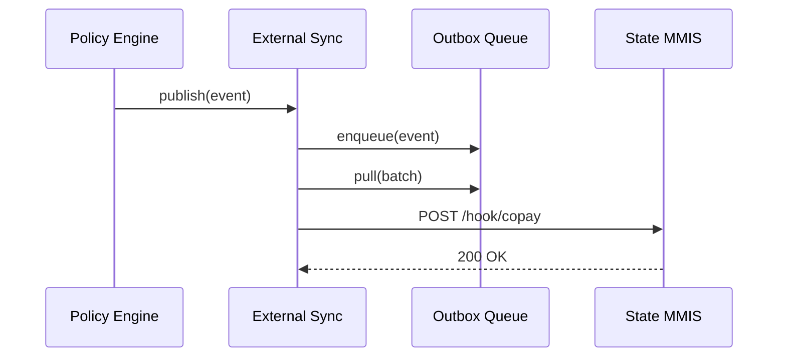

# Chapter 12: External System Synchronizer  

*A friendly sequel to [Inter-Agency Exchange (HMS-A2A)](11_inter_agency_exchange__hms_a2a__.md)*  

---

## 1. Why Do We Need an “External System Synchronizer”?

Imagine the **Centers for Medicare & Medicaid Services (CMS)** just ratified an *urgent* rule that lowers the copay for insulin from \$35 ➜ \$25.  
Within **seconds** every:

* State **Medicaid MMIS**  
* County-level **appointment scheduler**  
* Private **pharmacy network API**

must know the new price.  
If even one system lags, a diabetic patient could be over-charged at the pharmacy counter.

The **External System Synchronizer (ESS)** is the *news-wire* of HMS:

1. **Listens** for policy or data changes inside the platform.  
2. **Transforms** them into a tiny, well-formed message.  
3. **Pushes** that message out as a webhook or API call—instantly.

Think “National Weather Service tornado alert,” but for government rules and data.

---

## 2. Key Ideas in Plain English

| Term | Friendly Analogy | CMS Example |
|------|------------------|-------------|
| Change Feed | Police scanner | “Copay table just changed” |
| Subscription | Magazine delivery | MMIS wants only *drug* updates |
| Delivery Channel | Mail vs. email | REST POST vs. AWS SNS |
| Replay Token | DVR rewind | Re-send everything since `cursor=42` |
| Throttle | Speed bump | Max 5 alerts / sec to an old legacy box |

You only need these **five** ideas to master ESS.

---

## 3. Quick Walk-Through: Pushing the Insulin Copay Change

### 3.1 CMS Registers an External Subscriber (6 lines)

```yaml
# ess/subscribers/mmis.yml
id: md-mm1
url: https://mmis.state.md.gov/hook/copay
topics: ["drug.copay"]
throttle: 5           # events / second
secret: "s3cr3t"      # HMAC for authenticity
```

*Drop the YAML file—ESS auto-reloads it in under 5 s.*

---

### 3.2 A Policy Change Hits HMS

```js
// somewhere in HMS-CDF (Chapter 2)
await ess.publish({
  topic:  'drug.copay',
  data:   { ndc:'00002-8215', copay:25 },
  cursor: 1842                   // monotonic counter
})
```

Explanation  
`ess.publish()` is a **one-liner** any internal service can call.

---

### 3.3 ESS Pushes a Webhook (≤ 15 lines internal code)

```js
// ess/dispatcher.js
export async function dispatch(evt, sub){
  const sig = hmac(sub.secret, JSON.stringify(evt))
  await fetch(sub.url, {
    method: 'POST',
    headers: { 'X-ESS-Signature': sig },
    body: JSON.stringify(evt)
  })
}
```

• Builds an HMAC signature.  
• POSTs JSON to the subscriber’s URL.  
• Retries with back-off if `5xx`.

---

### 3.4 What the State MMIS Receives

```json
{
  "topic":  "drug.copay",
  "cursor": 1842,
  "ts":     "2024-05-07T14:03:11Z",
  "data":   { "ndc": "00002-8215", "copay": 25 }
}
```

If the MMIS missed something, it can call:

```
GET /ess/replay?since_cursor=1800
```

and catch up.

---

## 4. Under the Hood – The 5-Step Journey



1. **Publish** – Any internal component drops an event.  
2. **Queue** – Ensures at-least-once delivery.  
3. **Dispatch** – ESS looks up eligible subscribers.  
4. **Push** – Sends signed webhooks.  
5. **Ack** – Success clears the cursor.

---

## 5. Using ESS in Your Own Code (≤ 20 Lines Total)

### 5.1 Publishing

```js
import { publish } from 'hms-ess'

await publish({
  topic: 'appointment.cancelled',
  data:  { apptId: 9981, reason: 'snow' }
})
```

### 5.2 Subscribing (for a vendor)

```bash
curl -X POST https://ess.gov/register \
  -d '{
        "url":"https://vendor.com/hook",
        "topics":["appointment.*"],
        "secret":"vend0r"
      }'
```

**That’s it!** ESS handles retries, signing, and throttling.

---

## 6. Inside ESS – File Structure & Mini Code

```
/ess
  dispatcher.js        # sends webhooks
  registry.js          # loads YAML subscribers
  queue.js             # simple Redis wrapper
  server.js            # REST endpoints (publish, replay)
```

### 6.1 registry.js (≤ 12 lines)

```js
import fs from 'fs/promises'
export async function load(){
  const files = await fs.readdir('./ess/subscribers')
  return Promise.all(files.map(f => fs.readFile(`./ess/subscribers/${f}`,'utf8')
      .then(yaml => YAML.parse(yaml))))
}
```

One function, one responsibility: **read YAML, return array**.

### 6.2 queue.js (≤ 14 lines)

```js
import Redis from 'ioredis'
const r = new Redis()
export async function push(evt){ await r.lpush('ess', JSON.stringify(evt)) }
export async function pop(n=10){
  const res = await r.brpop('ess', 0)
  return res ? [JSON.parse(res[1])] : []
}
```

*Uses Redis lists for durability and blocking pops.*

---

## 7. Safety Nets & Compliance Hooks

| Risk | ESS Mitigation | Linked Chapter |
|------|----------------|----------------|
| Subscriber offline |  ➔ Retries + dead-letter queue | [Observability & Operations](17_observability___operations__hms_ops__.md) |
| PII leakage | ➔ Events pass through [HMS-ESQ](04_compliance___legal_reasoning__hms_esq__.md) filters |
| Flood to legacy system | ➔ `throttle` directive per subscriber |
| Forged callback | ➔ HMAC signature with shared `secret` |

---

## 8. Frequently Asked Questions

**Q: Can a subscriber pull instead of receive webhooks?**  
Yes—call `GET /ess/poll?topics=drug.copay&cursor=…` for a long-poll fallback.

**Q: How big can an event be?**  
Default payload limit is 256 KB. Larger data should be shared via [HMS-A2A](11_inter_agency_exchange__hms_a2a__.md) parcels.

**Q: Does ESS reorder events?**  
No—events are published with a **monotonic cursor**; subscribers use it to detect gaps and request replay.

**Q: Is SSL termination required?**  
ESS enforces HTTPS only. Plain HTTP endpoints are rejected during registration.

---

## 9. What You Learned

• The **External System Synchronizer** is HMS’s real-time “news-wire” for pushing changes to outside systems.  
• A single `publish()` call emits an event; ESS fans it out to all matching subscribers—signed, throttled, and replayable.  
• Registering a subscriber is a **6-line YAML**; ESS handles retries, ordering, and compliance.  
• Safety nets include HMAC signatures, PII filters, and back-pressure controls.

Ready to see how money actually moves once the outside world knows about a change?  
Jump to [Financial Clearinghouse (HMS-ACH)](13_financial_clearinghouse__hms_ach__.md).

---

---

Generated by [AI Codebase Knowledge Builder](https://github.com/The-Pocket/Tutorial-Codebase-Knowledge)