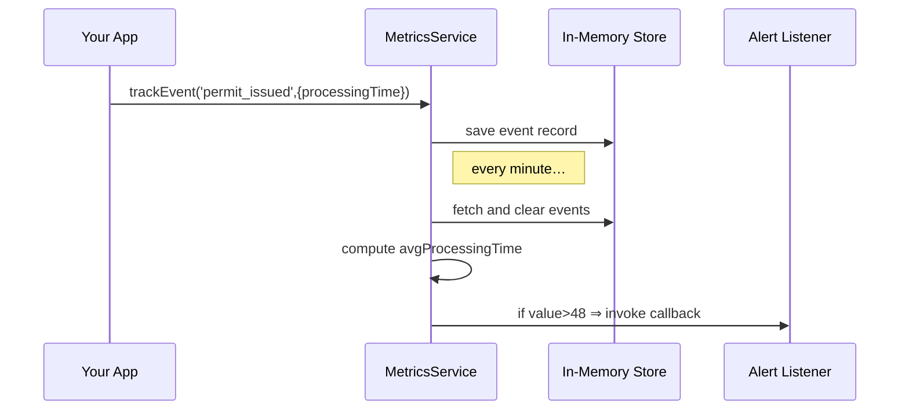

# Chapter 12: Metrics Monitoring & Verification

In [Chapter 11: External System Sync](11_external_system_sync_.md) we learned how to keep calendars and third-party systems up to date. Now that our features are live, we need to know if they’re actually working as intended. That’s where **Metrics Monitoring & Verification** comes in.

Imagine a city council rolls out a new rule to speed up permit issuance. A week later, managers want answers like:

- “Are permits really processed faster?”  
- “What’s the average time from submission to issuance?”  
- “Did stakeholder satisfaction improve?”

Think of this as a scoreboard for your system—automatically collecting, computing, and alerting on key performance indicators so you don’t have to hunt through logs.

---

## 12.1 Why We Need Metrics Monitoring & Verification

Central Use Case  
After deploying the “Fast‐Track Permit” protocol, the Planning Department wants to:

1. **Track** when each permit is submitted and issued.  
2. **Compute** the average processing time per day.  
3. **Alert** managers if that average creeps above 48 hours.  

Without an automated system, you’d manually export data, drop into a spreadsheet, draw charts—and you’d be days behind. Automated monitoring keeps everyone informed in real time.

---

## 12.2 Key Concepts

1. **Event Tracking**  
   Emitting events (e.g. `permit_submitted`, `permit_issued`) whenever something happens.

2. **Metrics Definition**  
   Writing small functions that consume event streams and compute values (averages, counts).

3. **Scheduling**  
   Periodically running metric computations (e.g. every minute or hour).

4. **Alerts**  
   Rules that watch metrics and notify stakeholders when thresholds are crossed.

5. **Dashboard**  
   A simple UI or console log that shows current metric values and recent alerts.

---

## 12.3 Using the Metrics Service

Here’s a minimal example showing how your application can start tracking and alerting:

```javascript
import { MetricsService } from 'hms-mkt/metricsService.js';

// 1. Create a metrics instance for "permit-issuance"
const metrics = new MetricsService('permit-issuance');

// 2. Track submission and issuance events
metrics.trackEvent('permit_submitted');
metrics.trackEvent('permit_issued', { processingTime: 72 }); // hours

// 3. Define an average‐processing‐time metric over recent events
metrics.defineMetric('avgProcessingTime', events => {
  const times = events
    .filter(e => e.type === 'permit_issued')
    .map(e => e.data.processingTime);
  if (!times.length) return 0;
  return times.reduce((a,b)=>a+b,0) / times.length;
});

// 4. Alert if average goes above 48 hours
metrics.onAlert('avgProcessingTime', {
  threshold: 48,
  comparator: '>'
}, value => {
  console.warn(`[ALERT] Avg processing time is high: ${value.toFixed(1)} hrs`);
});

// 5. Start periodic monitoring (every 60 seconds)
metrics.startMonitoring(60000);
```

What happens:

1. We track events as they occur in code.  
2. We define how to compute “avgProcessingTime” from the event list.  
3. We register an alert rule to watch that metric.  
4. Every minute, the service computes metrics and fires alerts if needed.

---

## 12.4 Under the Hood: Sequence Diagram

Here’s a simplified view of what happens at runtime:



1. Your app logs events to the MetricsService.  
2. MetricsService stages them in a store.  
3. On each interval, it reads and clears new events.  
4. It computes defined metrics and triggers any matching alerts.

---

## 12.5 Internal Implementation

Below is a stripped-down version of the core `MetricsService`. Comments skip non-essential details.

### File: src/hms-mkt/metricsService.js (Part 1)

```javascript
export class MetricsService {
  constructor(namespace) {
    this.namespace = namespace;
    this.events    = [];   // collected events
    this.metrics   = {};   // name → compute function
    this.alerts    = [];   // alert rules
  }

  trackEvent(type, data = {}) {
    this.events.push({ type, data, timestamp: Date.now() });
  }

  defineMetric(name, fn) {
    this.metrics[name] = fn;
  }

  onAlert(metricName, { threshold, comparator }, callback) {
    this.alerts.push({ metricName, threshold, comparator, callback });
  }
}
```

### File: src/hms-mkt/metricsService.js (Part 2)

```javascript
  startMonitoring(intervalMs = 60000) {
    setInterval(() => this.checkMetrics(), intervalMs);
  }

  checkMetrics() {
    // Grab and clear events
    const batch = this.events.splice(0, this.events.length);
    // Compute each metric
    for (const [name, fn] of Object.entries(this.metrics)) {
      const value = fn(batch);
      // Check alerts for this metric
      this.alerts
        .filter(a => a.metricName === name)
        .forEach(a => {
          if ((a.comparator === '>' && value > a.threshold) ||
              (a.comparator === '<' && value < a.threshold)) {
            a.callback(value);
          }
        });
    }
  }
}
```

Explanation:

- **trackEvent** appends events to an array.  
- **defineMetric** registers a function that computes a metric from a list of events.  
- **onAlert** saves rules for threshold checks.  
- **startMonitoring** sets up a timer to call **checkMetrics** periodically.  
- **checkMetrics** takes the new events, runs each metric function, and fires callbacks when rules match.

---

## 12.6 Summary

In this chapter you learned to:

- Emit domain events for key actions (e.g., permit submission and issuance).  
- Define custom metrics (like average processing time) over those events.  
- Schedule periodic computation and fire alerts when thresholds are crossed.  
- Peek under the hood at the minimal `MetricsService` implementation.

With **Metrics Monitoring & Verification**, your team gets real-time insights—no spreadsheets needed—so you can confirm that new policies and processes are truly delivering faster service.

This wraps up our journey through HMS-MKT’s core features. Thanks for following along!

---

Generated by [AI Codebase Knowledge Builder](https://github.com/The-Pocket/Tutorial-Codebase-Knowledge)