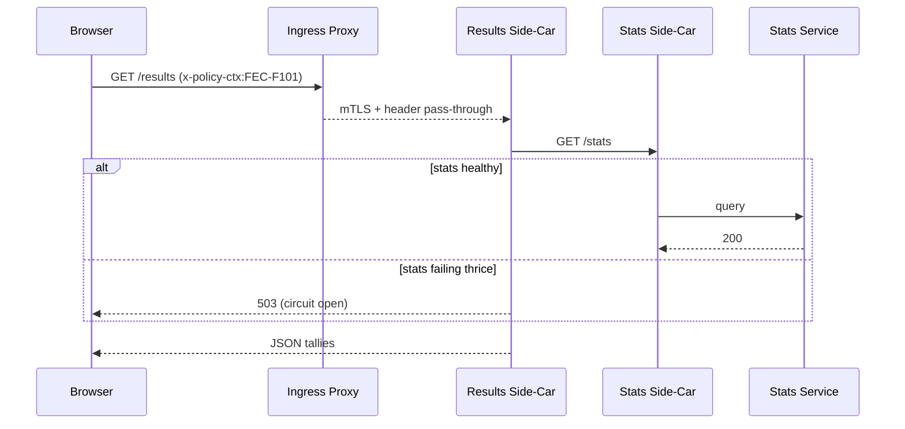

# Chapter 12: Microservice Mesh & Scalability Backbone
*(Filename: 12_microservice_mesh___scalability_backbone_.md)*  

[← Back to Chapter 11: External System Sync Adapter](11_external_system_sync_adapter_.md)

---

## 1. Why Do We Need a “High-Speed Federal Highway”?

Election night, 7 pm EST.  
• The **Federal Election Commission (FEC)** live-publishes precinct tallies.  
• Millions of citizens refresh `vote.gov`.  
• Newsroom dashboards in all 50 states hammer the **Results API**.  

If even one tiny micro-service times out, every page spinner becomes tomorrow’s headline.  
The **Microservice Mesh & Scalability Backbone** is our digital **Inter-State Highway System**:

1. Cars = requests  
2. Toll booths = side-cars that check IDs (mutual TLS) and reroute around accidents (retries, circuit breaking)  
3. Extra lanes open automatically when traffic spikes (horizontal auto-scaling)  
4. Every car carries its compliance sticker (policy metadata header) so state troopers never stop it for inspection again

---

## 2. Key Ideas in Plain English

| Term               | Friendly Analogy                                    |
|--------------------|-----------------------------------------------------|
| Service Mesh       | Interstate highway network connecting many on-ramps (services). |
| Side-Car Proxy     | Toll booth welded next to each service, doing ID checks & detours. |
| Mutual TLS (mTLS)  | Secret handshake at every booth—no fake cars.       |
| Circuit Breaker    | “Road Closed” sign after 3 accidents (failures).    |
| Horizontal Scaling | DOT opens more lanes when traffic builds up.        |
| Policy Header      | Compliance sticker on windshield (`x-policy-ctx`).  |

---

## 3. The Beginner’s “Hello Mesh” Use-Case

Goal: make sure the **/results** micro-service survives the election-night stampede—even if:

* traffic jumps 20×,  
* the **Stats** service it depends on hiccups,  
* and every request must prove it follows **FEC Policy F-101**.

We will:

1. Attach a side-car (Envoy) to `/results`.  
2. Auto-scale pods when QPS > 100.  
3. Add a circuit breaker around calls to `/stats`.  
4. Forward a `x-policy-ctx: FEC-F101` header on every hop.

---

## 4. Wiring a Side-Car in 15 Lines

```yaml
# File: k8s/results-deploy.yml
apiVersion: apps/v1
kind: Deployment
metadata: { name: results }
spec:
  replicas: 2
  selector: { matchLabels: { app: results } }
  template:
    metadata:
      labels: { app: results }
      annotations:          # ① tell mesh to inject proxy
        mesh.codifyhq.io/inject: "enabled"
        mesh.codifyhq.io/policy: "FEC-F101"
    spec:
      containers:
        - name: app
          image: gov/fec-results:1.0
```

Explanation  
① The two annotations ask the mesh controller to:

* **inject** an Envoy side-car next to the container, and  
* attach policy context `FEC-F101` to every outbound request.

*You wrote **zero** networking code.*

---

## 5. Adding Automatic Lanes (Horizontal Scaling)

```yaml
# File: k8s/results-hpa.yml
apiVersion: autoscaling/v2
kind: HorizontalPodAutoscaler
metadata: { name: results-hpa }
spec:
  scaleTargetRef: { kind: Deployment, name: results }
  minReplicas: 2
  maxReplicas: 30
  metrics:
    - type: Resource
      resource: { name: cpu, target: { type: Utilization, averageUtilization: 70 } }
```

When average CPU passes 70 %, Kubernetes clones more **results** pods—each with its own side-car—instantly adding lanes to our highway.

---

## 6. Circuit Breaker for the “/stats” On-Ramp

```yaml
# File: mesh/stats-destination.yml
apiVersion: mesh.codifyhq.io/v1
kind: TrafficPolicy
metadata: { name: stats-breaker }
spec:
  destination: { service: stats }
  outlierDetection:
    consecutiveErrors: 3   # ① close road after 3 fails
    baseEjectionTime: 30s  # ② wait 30 s before retry
```

Once the **Stats** service fails 3 times, the mesh stops sending cars there, returning a fast **503** instead of hanging.

---

## 7. What a Single Request Looks Like



Only **5 participants**, all mTLS-encrypted, header intact end-to-end.

---

## 8. Under the Hood (Tiny Code Peeks)

### 8.1 Auto-Inject Controller (Go ≤ 20 lines)

```go
// File: controller/inject.go (simplified)
func mutate(pod *v1.Pod) {
  if pod.Annotations["mesh.codifyhq.io/inject"] != "enabled" { return }
  sidecar := corev1.Container{
      Name:  "envoy",
      Image: "envoyproxy/envoy:v1.29",
      Args:  []string{"--config", "/etc/envoy/envoy.yaml"},
  }
  pod.Spec.Containers = append(pod.Spec.Containers, sidecar)
}
```

Runs as an admission webhook; every new pod with the annotation gets an Envoy automatically.

### 8.2 Header Propagation Filter (Lua ≤ 12 lines)

```lua
-- File: envoy/policy_header.lua
function envoy_on_request(handle)
  local hdr = handle:header("x-policy-ctx")
  if not hdr then
     hdr = handle:metadata():get("mesh.policy")  -- inject default
     handle:headers():add("x-policy-ctx", hdr)
  end
end
```

The Lua filter (bundled inside Envoy) ensures the policy header always exists, satisfying [Governance Layer](06_governance_layer__hms_gov__.md) audits.

---

## 9. How Other HMS-MKT Layers Benefit

* **RBAC** (see [Chapter 5](05_authorization___role_based_access_control__rbac__.md)) offloads token checks to the side-car—less code in services.  
* **Metrics Pipeline** ([Chapter 10](10_metrics___observability_pipeline_.md)) scrapes Envoy stats like `upstream_rq_time` without touching application code.  
* **Sync Adapters** ([Chapter 11](11_external_system_sync_adapter_.md)) inherit retries & back-off automatically—external outages no longer freeze the platform.

---

## 10. Frequently Asked Questions

**Q: Do I need to change application code for mTLS?**  
A: No. Envoy handles certificates; apps keep using plain `http://stats:8080`.

**Q: Can I route some traffic to a canary version?**  
A: Yes. Add a `TrafficSplit` resource: `v1=90 %`, `v2=10 %`—one YAML file.

**Q: What about on-prem agencies without Kubernetes?**  
A: Deploy lightweight side-cars via Docker Compose; the mesh control-plane can still run centrally.

**Q: Does header propagation leak PII?**  
A: Only *policy IDs* travel; side-cars strip any unapproved headers per Governance rules.

---

## 11. Recap

You have:

• Injected side-cars that handle encryption, retries, and circuit breakers—no app changes.  
• Opened new “lanes” on demand with a 14-line HPA.  
• Stamped every request with compliance metadata, passing audits automatically.  

With this **high-speed highway** in place, HMS-MKT can grow from one state-level pilot to a coast-to-coast federal staple—without traffic jams or policy mishaps.

*Congratulations—you’ve reached the end of the core tutorial series!* 🎉

Feel free to revisit any topic, and happy building!

---

Generated by [AI Codebase Knowledge Builder](https://github.com/The-Pocket/Tutorial-Codebase-Knowledge)