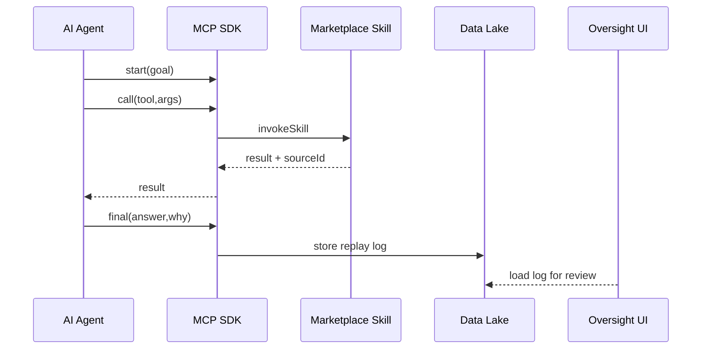

# Chapter 13: HMS-MCP Model Context Protocol  
*(HMS-MKT Project)*  

[← Back to Chapter 12: External System Synchronization Layer](12_external_system_synchronization_layer_.md)

---

## 1. Why Do We Need a “Black-Box Decoder Ring”?

Picture the **Environmental Protection Agency (EPA)**.  
An AI agent now helps clerks decide whether to **grant or revoke Air-Quality Permits** for factories.

Good news: decisions are faster.  
Bad news: a factory owner appeals, shouting:

> “The robot killed my permit with no explanation!”

Congress, the media, and the factory demand to see **exactly HOW** the AI reached its verdict—step-by-step, data-by-data.

Enter **HMS-MCP (Model Context Protocol)**:  
a tiny, JSON-based “decoder ring” that forces every AI tool inside HMS to:

1. Ask for data in a structured way.  
2. Cite every source it used.  
3. Expose its reasoning in plain language—*minus* the confusing fluff.  
4. Package all of that in a replayable file for auditors.

Think of MCP as the **“chain-of-thought without the fog.”**

---

## 2. Key Concepts (Plain English)

| MCP Word | What It Really Means | Analogy |
|----------|---------------------|---------|
| **Context Request** | AI’s formal “data wishlist.” | Shopping list. |
| **Tool Invocation** | A single call to a skill or API. | Swiping a credit card at checkout. |
| **Source Citation** | Metadata of every doc / row used. | Footnotes in a research paper. |
| **Reasoning Snapshot** | Human-readable explanation for each step. | Sticky notes on a whiteboard. |
| **Replay Log** | Complete JSON bundle sent to auditors. | Black-box flight recorder. |

Remember these five words—you now speak 80 % of MCP.

---

## 3. Guided Walk-Through: Why Was ACME Factory Denied?

### 3.1 Step-by-Step Flow (Bird’s-Eye)

1. EPA clerk enters ACME’s permit request.  
2. AI agent (built with [HMS-AGT + AGX](04_ai_representative_agent__hms_agt___agx__.md)) fires an **MCP Context Request**.  
3. Agent gathers data (emissions, past fines, nearby schools) via marketplace skills.  
4. AI produces a verdict **“Deny”** and emits an **MCP Replay Log**.  
5. Oversight committee loads the log inside the [HITL Framework](14_human_in_the_loop__hitl__oversight_framework_.md) and watches every move—no magic, no secrets.

### 3.2 What the MCP Packet Looks Like (≤ 20 Lines)

```jsonc
{
  "mcpVersion": "1.0",
  "requestId": "req_789",
  "goal": "Evaluate EPA permit #ACME-2024",
  "steps": [
    {
      "id": "s1",
      "tool": "emission-lookup/epa",
      "arguments": { "facilityId": "ACME-123" },
      "result": { "avgNOx": 180 },
      "source": "epa_db.v5",
      "reason": "Need baseline emissions"
    },
    {
      "id": "s2",
      "tool": "risk-score-calculator",
      "arguments": { "avgNOx": 180, "schoolsWithin5mi": 3 },
      "result": { "riskScore": 92 },
      "source": "model:risk-v2",
      "reason": "Calculate public-health risk"
    }
  ],
  "finalAnswer": "DENY_PERMIT",
  "justification":
    "RiskScore 92>80 threshold set in policy USDA-EPA-001.",
  "citations": ["epa_db.v5#row42", "policy.USDA-EPA-001#section3"]
}
```

Line-by-line notes:  
* `steps[]` = ordered history; each has **tool**, **arguments**, **result**, **source**, **reason**.  
* `finalAnswer` + `justification` = snapshot ready for clerks or courts.  
* `citations[]` = unique IDs auditors can click to open the raw data.

---

## 4. Generating MCP in Code (Client Side)

```ts
// epaAgent.ts  – simplified, < 20 lines
import { mcp } from '@hms/mcp-sdk'
import { invokeSkill } from '@hms/svc-client'

const ctx = mcp.start('Evaluate EPA permit #ACME-2024')

const emissions = await ctx.call('emission-lookup/epa', { facilityId:'ACME-123' })
const schools   = await ctx.call('geo.countSchools',   { lat:34.1, lon:-118.2 })

const risk = await ctx.call('risk-score-calculator',
              { avgNOx: emissions.avgNOx, schoolsWithin5mi: schools.count })

if (risk.score > 80)
  ctx.final('DENY_PERMIT', 'RiskScore '+risk.score+'>80 threshold.')

await ctx.export('s3://mcp-logs/req_789.json')
```

Explanation  
1. `mcp.start()` opens a fresh **Context Request**.  
2. Every `ctx.call()` auto-records **tool**, **args**, **result**, **reason**.  
3. `ctx.final()` seals the packet.  
4. `ctx.export()` writes the replay file—done!

---

## 5. What Happens Under the Hood?



Only five players—easy to trace.

---

## 6. Peek Inside the MCP SDK (Core Logic ≤ 18 Lines)

```ts
// mcp-sdk/src/index.ts
export function start(goal:string){
  const ctx = { goal, steps:[], id:'req_'+Date.now() }

  ctx.call = async (tool,args) => {
    const res  = await invokeSkill(tool,args)
    ctx.steps.push({
      id:'s'+ctx.steps.length+1, tool, arguments:args,
      result:res.data, source:res.source, reason:toolDescription(tool)
    })
    return res.data
  }

  ctx.final = (answer,why) => { ctx.finalAnswer = answer; ctx.justification = why }

  ctx.export = async (uri) => storage.put(uri, JSON.stringify(ctx,null,2))

  return ctx
}
```

Highlights:  
* `steps.push()` auto-numbers actions.  
* `source` comes back from the skill call (Chapter 3 style).  
* Entire context is dumped to object storage in one line.

---

## 7. Where MCP Plugs Into the Rest of HMS

Component | Interaction
----------|------------
[AI Representative Agent](04_ai_representative_agent__hms_agt___agx__.md) | Wraps every plan in an MCP Context.  
[HMS-ESQ Legal Scanner](10_security__compliance___legal_reasoning__hms_esq__hms_sys__.md) | Reads `citations[]` to cross-check statutory authority.  
[Unified Data Lake & Catalog](11_hms_dta_unified_data_lake___catalog_.md) | Stores all **Replay Logs** under tag `AUDIT`.  
[Human-in-the-Loop Framework](14_human_in_the_loop__hitl__oversight_framework_.md) | Lets reviewers play back each `step` before approving.  
[Activity Logging & Auditing](15_activity_logging___auditing__within_hms_act___ops__.md) | References `requestId` for full traceability.

---

## 8. 60-Second Playground

```bash
# 1. Run the demo agent (includes MCP SDK)
npm run demo --workspace=epa-agent

# 2. Open the generated log
cat ./logs/req_*.json | jq '.steps[].reason'
```

You should see plain-English reasons like **“Need baseline emissions.”**

---

## 9. Recap & What’s Next

In this chapter you:

• Met **HMS-MCP**, the “decoder ring” that makes every AI decision transparent.  
• Built an MCP packet in < 20 lines of code.  
• Learned the five core pieces: Context Request, Tool Invocation, Source Citation, Reasoning Snapshot, Replay Log.  
• Saw how oversight teams can replay decisions click-by-click.

In the next chapter we’ll put humans back in the cockpit: learn how reviewers pause, amend, or override AI actions with the [Human-in-the-Loop (HITL) Oversight Framework](14_human_in_the_loop__hitl__oversight_framework_.md).

---

Generated by [AI Codebase Knowledge Builder](https://github.com/The-Pocket/Tutorial-Codebase-Knowledge)