# Chapter 14: Marketplace Layer (HMS-MKT)

*A friendly sequel to [Financial Clearinghouse (HMS-ACH)](13_financial_clearinghouse__hms_ach__.md)*  

---

## 1. Why Do We Need a Marketplace?

Picture the **Department of Labor (DOL)** on a tight deadline:

*Congress just passed a bill that extends unemployment benefits for gig-workers.*  
DOL must launch:

1. A **bot** that explains the new rules  
2. A **scheduler** that books video calls with claimants  
3. A **workflow** that verifies IRS 1099 income  

Building each item from scratch could take **months**.  
But what if another agency (say, the **Office of Energy Efficiency and Renewable Energy**) already published a battle-tested scheduler, and FEMA shared a reusable “income-verification” workflow last hurricane season?

**HMS-MKT is the “App Store” for government tech.**  
Agencies **list** their vetted data sets, agent skills, and workflows; others **search, rate, license, and one-click deploy** them—saving time, money, and headaches.

---

## 2. Key Concepts (Plain English)

| Marketplace Term | Friendly Analogy | DOL Example |
|------------------|------------------|-------------|
| Listing          | An app in the mobile store | “Smart Scheduler v2” |
| Asset Type       | Book genre | dataset • agent skill • workflow |
| Rating           | 5-star review | ⭐⭐⭐⭐☆ (4.6) |
| License          | Library card | “Gov-Wide, no PII” |
| Procurement Meta | Price tag & barcode | cost: \$0, CO: Jane Smith, SAM ID… |
| Fork             | “Make a copy” | Clone FEMA’s workflow & tweak it |

Remember these six words—you now speak *Marketplace*.

---

## 3. A 3-Minute Tour: Reusing a Scheduler

### 3.1 Search the Store (≤ 10 lines)

```js
// dol_marketplace.client.js
export async function search(term){
  const res = await fetch(`/api/mkt?query=${encodeURIComponent(term)}`)
  return res.json()         // -> [{ id:'sched_v2', stars:4.6, type:'skill' }]
}
```

> “scheduler” returns **Smart Scheduler v2**—rated 4.6, free for federal use.

### 3.2 Preview the Listing (≤ 15 lines)

```js
const item = await fetch('/api/mkt/sched_v2').then(r=>r.json())
console.log(item)
/*
{
  id: 'sched_v2',
  description: 'AI slot-matcher for citizen appointments',
  type: 'skill',
  license: 'Gov-Wide, no PII',
  dependencies: ['calendar-api'],
  ratings: [{agency:'FLETC', stars:5, note:'Easy!'}]
}
*/
```

### 3.3 Acquire & Install (one-liner!)

```js
await fetch('/api/mkt/sched_v2/install', { method:'POST' })
```

The skill is now visible in the **Protocol Builder** (see [Protocol Builder Page](03_protocol_builder_page_.md)) and any agent can call `tools.scheduler.book()`.

---

## 4. Behind the Curtain – What Really Happens?

```mermaid
sequenceDiagram
  participant DOL as DOL Admin
  participant MKT as HMS-MKT
  participant ESQ as HMS-ESQ
  participant DTA as HMS-DTA
  participant ACT as HMS-ACT

  DOL->>MKT: install(sched_v2)
  MKT->>ESQ: check license & compliance
  ESQ-->>MKT: ✅
  MKT->>DTA: copy asset → /lake/assets/sched_v2
  MKT->>ACT: register skill
  MKT-->>DOL: "Installed 🎉"
```



1. **Compliance** checked instantly.  
2. Asset copied to the **Data Lake** for provenance.  
3. **Workflow Orchestrator** registers the new skill.  
4. End-user gets a success toast in under 3 seconds.

---

## 5. Listing Your Own Asset (Agency Side)

### 5.1 Drop a 9-Line YAML File

```yaml
# mkt/listings/smart_scheduler.yml
id: sched_v2
title: Smart Scheduler
type: skill
repo:  https://github.com/eere/smart-scheduler
license: Gov-Wide
cost: 0
owner: carla.wright@eere.gov
tags: [scheduling, citizen]
```

Save → HMS-MKT watches the folder and auto-publishes.

### 5.2 Optional Procurement Metadata (add 6 lines)

```yaml
  naics: 541511
  sam_id: SPE123456
  cto_approved: true
```

Now busy program managers can copy-paste into paperwork **instead of hunting vendors**.

---

## 6. Under-the-Hood Code (All Tiny!)

### 6.1 Marketplace API – Search Route (12 lines)

```js
// routes/mkt.search.js
router.get('/', async (req,res)=>{
  const q = req.query.query.toLowerCase()
  const hits = await db.listings.find(
    l => l.title.toLowerCase().includes(q) || l.tags.some(t=>t.includes(q))
  )
  res.json(hits.slice(0,10))     // first 10 results
})
```

### 6.2 Install Route (18 lines)

```js
// routes/mkt.install.js
router.post('/:id/install', async (req,res)=>{
  const item = await db.listings.get(req.params.id)
  await esq.legalCheck(item)                 // policy guard-rail
  const bytes = await git.cloneZip(item.repo)
  await dta.save(`/lake/assets/${item.id}.zip`, bytes)
  await act.register(item)                   // skill or workflow
  res.status(201).end()
})
```

*Less than 20 lines turn a **GitHub repo** into a **clickable skill**.*

---

## 7. Ratings in 8 Lines

```js
// routes/mkt.rate.js
router.post('/:id/rate', async (req,res)=>{
  const { stars, note } = req.body
  await db.ratings.insert({ id:req.params.id, stars, note, agency:req.user.agency })
  res.sendStatus(204)
})
```

Average stars are calculated on read—no fancy math.

---

## 8. How Other Layers Plug In

| Layer | Marketplace Touch-Point |
|-------|------------------------|
| [HMS-ESQ](04_compliance___legal_reasoning__hms_esq__.md) | Blocks listings that violate licensing or PII rules |
| [HMS-DTA](10_data_lake___repository__hms_dta__.md) | Stores asset blobs & rating logs |
| [HMS-ACT](05_workflow_orchestrator__hms_act__.md) | Auto-registers skills/workflows after install |
| [HITL Control](08_human_in_the_loop__hitl__control_.md) | Flags installs over \$100 K for human procurement review |
| [HMS-OPS](17_observability___operations__hms_ops__.md) | Tracks download counts & failsafe rollbacks |

---

## 9. Frequently Asked Questions

**Q: Can commercial vendors publish paid listings?**  
Yes—set `cost: 50000` (for example). A procurement officer must then **endorse** the purchase via HITL before install.

**Q: How do I update a listing?**  
Bump the YAML `version` field. HMS-MKT shows “Update available” badges to prior installers.

**Q: What if an asset has a vulnerability?**  
Mark `status: deprecated` in the YAML. HMS-MKT broadcasts a “recall” alert to every agency that installed it.

**Q: Are ratings anonymous?**  
No—every star is tied to an agency name; transparency builds trust.

---

## 10. What You Learned

• **HMS-MKT** is the government’s **App Store** for data sets, agent skills, and workflows.  
• Searching, previewing, installing, and rating all fit in under 20 lines of code each.  
• Compliance, provenance, and procurement metadata are built-in—no extra spreadsheets.  
• The marketplace glues seamlessly to earlier layers: ESQ for legal checks, DTA for storage, ACT for execution, and HITL for large purchases.

Ready to see how users get a polished, modular front-end for all these goodies? Continue to [Micro-Frontend Experience (HMS-MFE)](15_micro_frontend_experience__hms_mfe__.md).

---

---

Generated by [AI Codebase Knowledge Builder](https://github.com/The-Pocket/Tutorial-Codebase-Knowledge)