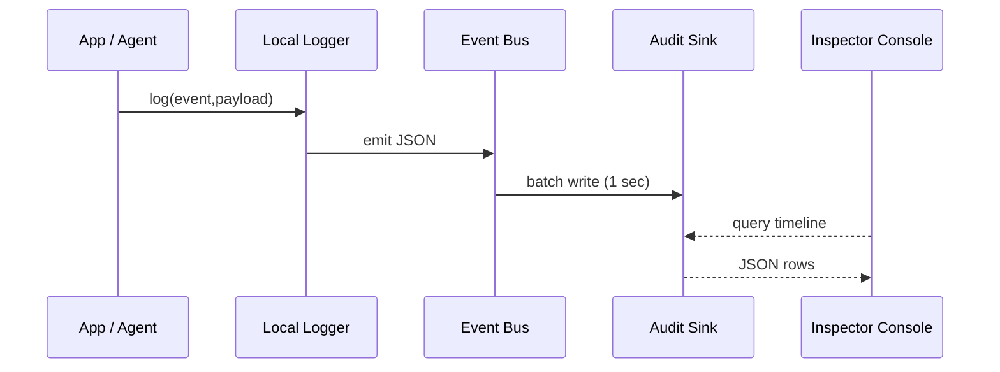

# Chapter 15: Activity Logging & Auditing (within HMS-ACT / OPS)

[← Back to Chapter 14: Human-in-the-Loop (HITL) Oversight Framework](14_human_in_the_loop__hitl__oversight_framework_.md)

---

## 1. Why Bother? A Real-World Story

Late on a Friday the **Fish and Wildlife Service (FWS)** denies ACME Corp.’s request to build a marina near an endangered manatee habitat.  
Two weeks later ACME files a **Freedom of Information Act (FOIA)** request:

> “Provide every click, AI inference, and human approval that led to permit **WF-2024-392** being denied.”

Without airtight logs the agency could face:

* Lost public trust (“Did someone delete evidence?”)  
* Legal penalties for incomplete FOIA delivery  
* A furious Inspector General audit

**HMS-ACT’s Activity Logging & Auditing layer** is the always-on court-stenographer that captures **every** step—human or machine—and lets auditors replay it like a DVR.

By the end of this chapter you will:

1. Emit a log entry from your own code in **one line**.  
2. Reconstruct a full timeline for permit **WF-2024-392**.  
3. Peek under the hood at the 15-line logger inside HMS-ACT.

---

## 2. Key Concepts (plain English)

| Term | What It Really Means |
|------|----------------------|
| Log Event 📜 | One JSON record (“user = j.smith clicked ‘Approve’”). |
| Correlation ID 🔗 | The glue that stitches many events into one story (`permitId=WF-2024-392`). |
| Span 🧩 | A sub-action inside a bigger job (e.g., “AI risk-score calculation”). |
| Audit Sink 🗄️ | Write-once storage where final logs land (S3, PostgreSQL `audit_log` table). |
| Redaction Tag 🩹 | Marked fields (PII, PHI) that are hidden from public FOIA exports. |
| Inspector Console 🔍 | Read-only UI/CLI for auditors to query timelines. |

Keep these six words handy—everything else is sprinkles.

---

## 3. Quick-Start: Log, Then Rewind the Tape

### 3.1 Emit a Log Entry (1 Line of Code)

```ts
import { log } from '@hms/act-logger'

log('permit.decision', {              // event name
  permitId: 'WF-2024-392',            // correlation ID
  action: 'DENY',                     // what happened
  reason: 'RiskScore 92 > threshold'  // details
})
```

Explanation  
1. `permit.decision` is a **Log Event** name (use kebab-case).  
2. The payload can be any JSON; at least one field should be a **Correlation ID**.  
3. All PII fields can be wrapped with `{ value:'...', redact:true }`—the logger hides them in FOIA exports.

### 3.2 Replay the Timeline (CLI – 1 Line)

```bash
hms-audit timeline permitId=WF-2024-392
```

Sample output:

```
08:00 user=clerk.maria  event=permit.uploadDocs
08:05 bot=risk-score    event=ai.inference       span=WF-2024-392#s2
08:06 user=mgr.allen    event=hitl.approve
08:07 system            event=permit.decision    action=DENY
```

Auditors now have every heartbeat—no guessing.

---

## 4. Under the Hood (No-Code Walkthrough)



1. **App/Agent** calls `log()`.  
2. **Local Logger** tags entry with timestamp, user ID, and hostname.  
3. **Event Bus** buffers for 1 second to reduce I/O.  
4. **Audit Sink** stores immutable rows—cannot be updated or deleted.  
5. **Inspector Console** (CLI/UI) runs filtered SQL on the sink.

---

## 5. Tiny Peek at the Logger Code (≤ 15 Lines)

_File: `act-logger/src/index.ts`_

```ts
import bus from './bus'               // simple Node EventEmitter

export function log(type: string, data: Record<string, any>) {
  bus.emit('log', {
    id:  crypto.randomUUID(),
    type,
    ts:  Date.now(),
    user: currentUser(),              // pulls from JWT or system
    host: os.hostname(),
    ...data
  })
}

/* Batching & persistence (hidden) */
bus.on('log', debounce(writeBatch, 1000))
```

Highlights  
• One function, five universal fields (`id`, `type`, `ts`, `user`, `host`).  
• Everything else is caller-defined payload.  
• `writeBatch()` (not shown) handles S3/Postgres insert and redaction.

---

## 6. Tagging & Redaction

Mark sensitive fields like this:

```ts
log('citizen.lookup', {
  citizenId: { value: 'C-987', redact: true },   // hidden in FOIA export
  permitId: 'WF-2024-392'
})
```

During FOIA export:

```json
{
  "ts": "2024-04-29T08:00:00Z",
  "event": "citizen.lookup",
  "citizenId": "[REDACTED]",
  "permitId": "WF-2024-392"
}
```

Auditors with higher clearance can disable redaction via `--no-redact`.

---

## 7. How It Connects to the Rest of HMS

Component | How Logging Is Used
----------|--------------------
[HMS-ACT Workflow Engine](08_hms_act_orchestration___workflow_engine_.md) | Emits `workflow.step.*` events automatically.  
[HITL Oversight](14_human_in_the_loop__hitl__oversight_framework_.md) | Logs every approval / rejection under `hitl.*`.  
[MCP Model Context Protocol](13_hms_mcp_model_context_protocol_.md) | Uploads the *replay log* and links its `requestId` in every inference event.  
[External Sync Layer](12_external_system_synchronization_layer_.md) | Captures each `sync.ack` / `sync.nack` for traceability.  
[Legal Scanner (HMS-ESQ)](10_security__compliance___legal_reasoning__hms_esq__hms_sys__.md) | Records `scan.*` results for auditors.

---

## 8. 60-Second Playground

```bash
# 1. Start local sink (Postgres) + logger dev server
npm run dev --workspace=hms-logger

# 2. Emit two fake events
node -e "const {log}=require('./dist'); log('demo.start',{runId:'R1'})"
node -e "const {log}=require('./dist'); log('demo.end',  {runId:'R1'})"

# 3. Query them
hms-audit timeline runId=R1
```

You should see `demo.start` and `demo.end` with timestamps and user `system`.

---

## 9. Best Practices Cheat-Sheet

👍 Do                                   | 🚫 Don’t
-------------------------------------- | ----------------------------------------
Use clear event names (`permit.decision`) | Log only “Something happened.”
Always include a correlation ID         | Scatter unrelated IDs across events.
Redact PII fields early                 | Store raw SSNs and “clean later.”
Batch writes (provided)                 | Call the DB on every keystroke.
Check logs in staging                   | Ship to prod and hope.

---

## 10. Recap

• You emitted a log entry in **one line**.  
• Ran `hms-audit timeline ...` to replay an entire decision trail.  
• Learned the six pillars: Log Event, Correlation ID, Span, Audit Sink, Redaction Tag, Inspector Console.  
• Peeked at the super-tiny logger engine and saw how other HMS pieces feed it.

> With Activity Logging & Auditing in place, every bureaucratic “black box” is now a **glass box**—transparent, tamper-proof, and FOIA-ready.

*There is no next chapter—congratulations on completing the HMS-MKT beginner journey!*

---

Generated by [AI Codebase Knowledge Builder](https://github.com/The-Pocket/Tutorial-Codebase-Knowledge)