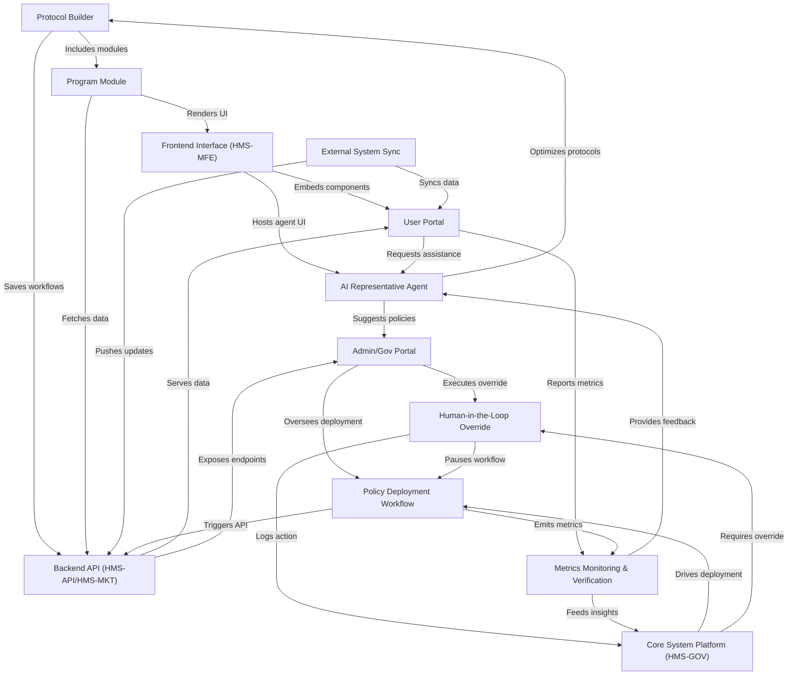

# Tutorial: HMS-MKT

**HMS-MKT** is a **web portal** where governments can *visualize*, *assemble*, and *deploy* citizen services and policies. Through a **Protocol Builder** and **Program Modules**, administrators and end-users collaborate; **AI agents** propose optimizations, and **Human-in-the-Loop Overrides** ensure trusted governance. A **Backend API**, **External System Sync**, and dashboard interfaces tie everything together, driving continuous **metrics monitoring** and transparent **policy workflows**.

**Source Repository:** [None](None)

## Chapters

1. [Core System Platform (HMS-GOV)
](01_core_system_platform__hms_gov__.md)
2. [Protocol Builder
](02_protocol_builder_.md)
3. [Program Module
](03_program_module_.md)
4. [Backend API (HMS-API/HMS-MKT)
](04_backend_api__hms_api_hms_mkt__.md)
5. [Frontend Interface (HMS-MFE)
](05_frontend_interface__hms_mfe__.md)
6. [User Portal
](06_user_portal_.md)
7. [Admin/Gov Portal
](07_admin_gov_portal_.md)
8. [AI Representative Agent
](08_ai_representative_agent_.md)
9. [Policy Deployment Workflow
](09_policy_deployment_workflow_.md)
10. [Human-in-the-Loop Override
](10_human_in_the_loop_override_.md)
11. [External System Sync
](11_external_system_sync_.md)
12. [Metrics Monitoring & Verification
](12_metrics_monitoring___verification_.md)

---

Generated by [AI Codebase Knowledge Builder](https://github.com/The-Pocket/Tutorial-Codebase-Knowledge)