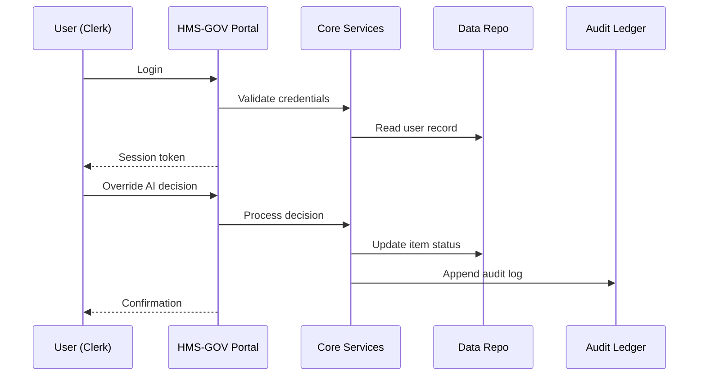

# Chapter 1: Governance Layer (HMS-GOV)

*“Every well-run city has a city hall. HMS-GOV is that city hall for the entire HMS-NFO platform.”*

---

## 1. Why Do We Need a “City Hall”?

Imagine a citizen submits a request to the **Udall Foundation** for environmental mediation funding.  
Behind the scenes an AI agent has already:

1. Collected the digital form.  
2. Checked it for completeness.  
3. Proposed a decision: *“Approve with minor changes.”*

But before any money can move, a **human decision-maker** (maybe an agency official) must review that proposal. HMS-GOV is the single web portal where this official:

* Sees every pending request.  
* Reads the AI recommendation.  
* Clicks **Approve**, **Reject**, or **Request Changes**.  
* Triggers new policy rules if necessary.

Without HMS-GOV, each department would build its own dashboard, decisions would get lost, and nobody could tell who approved what.  


## 2. Key Concepts in Plain English

| Concept | What it Really Means | Analogy |
|---------|---------------------|---------|
| Role-Based Access | Different people see different menus. | Mayor vs. Clerk badges. |
| Decision Queue | List of items waiting for human review. | Inbox on the clerk’s desk. |
| Policy Registry | Central list of rules currently in force. | The city’s rulebook. |
| Change Proposal | Any new rule or modification suggested by AI or humans. | A bill placed on the council agenda. |
| Audit Trail | Immutable log of every click. | CCTV in the council chamber. |

---

## 3. A 5-Minute Walk-Through

Below is a **tiny** Python-flavored pseudo-script that shows how a developer (or even a test script) might interact with HMS-GOV’s public API.

```python
# file: demo_submit_request.py
import hms_gov_client as gov

# 1. Login as agency clerk
session = gov.login(user="clerk@udall.gov", password="secret")

# 2. Fetch pending AI proposals
queue = gov.get_decision_queue(session)
print("Items waiting:", len(queue))

# 3. Pick first item and display summary
item = queue[0]
print(item.summary())          # => "AI suggests approve grant #1234"

# 4. Override AI (human says: needs revision)
gov.record_decision(
    session=session,
    item_id=item.id,
    verdict="REQUEST_CHANGES",
    comment="Missing community-impact report."
)
```

Explanation (≤20 lines of code):

1. `gov.login()` returns a session token – the digital equivalent of a building pass.  
2. `get_decision_queue()` pulls the clerk’s inbox.  
3. `record_decision()` leaves an official, auditable entry in the ledger.

---

## 4. What Happens Under the Hood?

Let’s keep it story-level first:



Key takeaways:

* Only **five** moving parts keep the mental load light.  
* Every action ends in `Audit Ledger` for future inspectors.  

---

### 4.1 Skeleton of the Server Endpoint

```python
# file: hms_gov/api.py
from fastapi import FastAPI, Depends
from .models import Decision, User
from .store import save_decision, log_audit

app = FastAPI()

@app.post("/decisions/{item_id}")
def record_decision(item_id: str, decision: Decision, user: User = Depends(auth)):
    # 1. Authorize user role
    if not user.can_decide:
        raise HTTPException(status_code=403)

    # 2. Persist the decision
    save_decision(item_id, decision, user)

    # 3. Write audit line
    log_audit(
        actor=user.email,
        action="DECIDE",
        item=item_id,
        result=decision.verdict
    )
    return {"status": "ok"}
```

What to notice:

* Less than 20 lines – the real logic lives in helper modules.  
* Easy to unit-test because business rules are in `save_decision()`.

---

## 5. Where HMS-GOV Fits in the Bigger Picture

HMS-GOV talks daily with:

* the policy-crafting engine in [Legislative Workflow Engine (HMS-CDF)](02_legislative_workflow_engine__hms_cdf__.md)  
* the compliance checker in [Legal & Compliance Reasoner (HMS-ESQ)](03_legal___compliance_reasoner__hms_esq__.md)  
* the human oversight tooling in [Human-in-the-Loop Oversight (HITL)](04_human_in_the_loop_oversight__hitl__.md)

You don’t have to learn those yet—but remember HMS-GOV is the **hub** they all report to.

---

## 6. Hands-On Exercise (Optional)

1. Clone the repo (placeholder):  
   `git clone https://github.com/example/hms-nfo.git`  
2. Run the mock server:  
   `python -m hms_gov.mock_server`  
3. Open `http://localhost:8000/docs` to explore the auto-generated API.  
4. Try the `POST /decisions/{item_id}` endpoint with sample data.

You just played the role of a federal clerk approving (or changing) an AI suggestion!

---

## 7. Recap

* HMS-GOV is the **governance hub**—the place where humans keep ultimate control.  
* It manages roles, decision queues, policy changes, and audit trails.  
* A simple API call pattern—login, fetch queue, record decision—covers 80 % of use cases.  

Ready to learn how new rules are drafted and routed through committees?  
Jump into the next chapter: [Legislative Workflow Engine (HMS-CDF)](02_legislative_workflow_engine__hms_cdf__.md).

---

Generated by [AI Codebase Knowledge Builder](https://github.com/The-Pocket/Tutorial-Codebase-Knowledge)