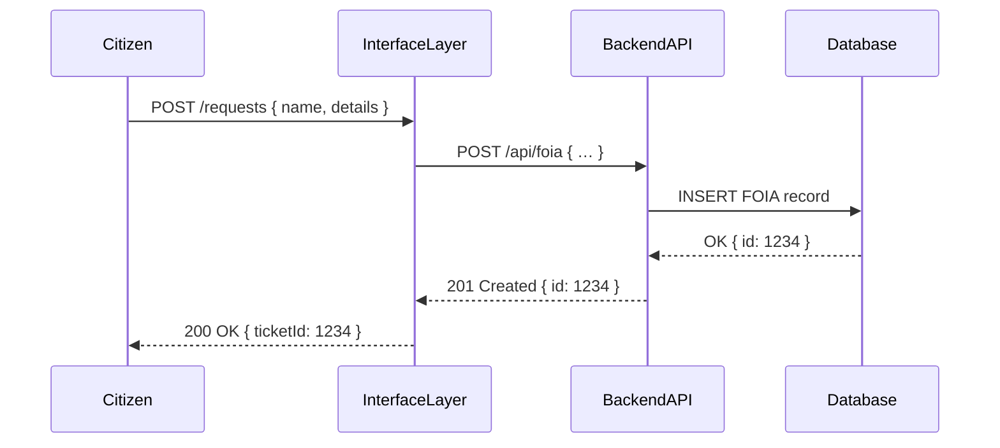

# Chapter 1: Interface Layer

Welcome to the first chapter! In this chapter, we’ll explore the **Interface Layer**, your system’s “customer service desk.” It’s where citizens and administrators connect to HMS-NFO: users click buttons or fill forms, and the Interface Layer turns those actions into precise calls your backend can handle.

---

## 1. Why an Interface Layer?

Imagine Alice, a citizen, wants to submit a Freedom of Information Act (FOIA) request to the Labor Department. She fills out a form on a website, clicks **Submit**, and expects a confirmation. Behind the scenes, the Interface Layer:

1. Captures Alice’s input.
2. Validates it (e.g., required fields).
3. Translates it into a structured API call.
4. Sends it on to the backend for processing.

Without a dedicated layer, every frontend or admin portal would duplicate this logic—leading to bugs, inconsistencies, and extra maintenance.

---

## 2. Key Concepts

1. **Public-Facing Frontend (HMS-MFE)**  
   – Where citizens (like Alice) interact.  
   – Example: FOIA request form.

2. **Admin/Secure Portal (HMS-GOV)**  
   – Where government officers review, approve, or reject.  
   – Example: A clerk logs in to assign a FOIA ticket.

3. **Request Translation**  
   – Converting user data into backend API calls (REST/GraphQL).

4. **Error Handling & Feedback**  
   – Showing success or friendly error messages to users.

---

## 3. Solving the FOIA Use Case

Let’s walk through a minimal example of submitting a FOIA request.

### 3.1. Frontend Call

```js
// hms-mfe/src/foiaForm.js
async function onSubmit(formData) {
  try {
    const response = await fetch('/interface/requests', {
      method: 'POST',
      headers: { 'Content-Type': 'application/json' },
      body: JSON.stringify(formData)
    });
    const result = await response.json();
    alert(`Request received! Ticket #${result.ticketId}`);
  } catch (e) {
    alert('Oops! Something went wrong.');
  }
}
```

> **What happens?**  
> When Alice clicks **Submit**, `onSubmit` sends her data to the Interface Layer endpoint `/interface/requests`. A successful response shows a ticket number.

### 3.2. Interface Layer Endpoint

```js
// src/interface/index.js
const express = require('express');
const requestHandler = require('./handlers/requestHandler');
const router = express.Router();

router.post('/requests', requestHandler.submit);

module.exports = router;
```

> **Explanation:**  
> We set up an Express router that listens at `/requests` and delegates to our handler logic.

---

## 4. Under the Hood: Sequence Diagram

Here’s a bird’s-eye view of the flow:



---

## 5. Inside the Handler

Let’s look at `requestHandler.js` where the magic happens:

```js
// src/interface/handlers/requestHandler.js
const apiClient = require('../../backend/apiClient');

async function submit(req, res) {
  // 1. Validate input (omitted for brevity)
  // 2. Forward to backend API
  const result = await apiClient.post('/foia', req.body);
  // 3. Send back ticket info
  res.json({ status: 'success', ticketId: result.id });
}

module.exports = { submit };
```

> **Details:**  
> - `apiClient` wraps HTTP calls to the backend.  
> - We take `req.body`, forward it, then return a simplified JSON payload to the frontend.

---

## 6. What’s Next?

Now that you know how the Interface Layer acts as the gateway—validating and routing user actions—let’s dive deeper into the citizen-facing side. In the next chapter we’ll explore the [Frontend Interface (HMS-MFE)](02_frontend_interface__hms_mfe__.md), where we build forms, components, and friendly UI for citizens to interact with HMS-NFO.

---

*Congratulations—you’ve mastered Chapter 1!*

---

Generated by [AI Codebase Knowledge Builder](https://github.com/The-Pocket/Tutorial-Codebase-Knowledge)