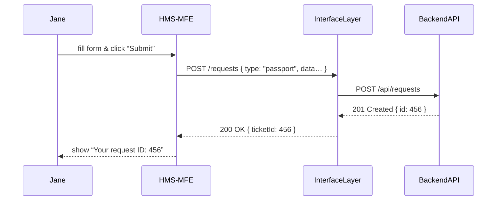

# Chapter 2: Frontend Interface (HMS-MFE)

Welcome back! In [Chapter 1: Interface Layer](01_interface_layer_.md) we saw how user actions get validated and routed to your backend. Now, we’ll build the **public portal**—the part citizens and employees actually see and click: **HMS-MFE**.

---

## 1. Why a Dedicated Frontend?

Imagine Jane needs to renew her passport. She visits a clunky website, gets lost in a maze of forms, and gives up. HMS-MFE is like a friendly clerk who:

- Presents clear, accessible forms (passport renewal, FOIA requests, etc.).
- Lets users check status updates.
- Gathers feedback on their experience.

By centralizing UI logic here, we ensure every process looks and feels consistent—just like a well-staffed DMV window—without duplicating code across portals.

---

## 2. Key Concepts

1. **Pages & Routing**  
   - Home / Request form  
   - Status check  
   - Feedback survey  

2. **Components**  
   - Reusable form fields  
   - Status cards  
   - Navigation bar  

3. **State & Data Fetching**  
   - `useState` & `useEffect` (React)  
   - Calling the Interface Layer endpoints  

4. **Accessibility & Layout**  
   - Simple labels, ARIA roles  
   - Consistent styling  

---

## 3. Building a Passport Renewal Form

### 3.1. Sequence Overview

Here’s what happens when Jane submits her passport renewal:



---

### 3.2. `RequestForm` Component

```js
// hms-mfe/src/components/RequestForm.js
import React, { useState } from 'react';

function RequestForm() {
  const [formData, setFormData] = useState({ name: '', details: '' });

  function handleChange(e) {
    setFormData({ ...formData, [e.target.name]: e.target.value });
  }

  async function handleSubmit(e) {
    e.preventDefault();
    const res = await fetch('/interface/requests', {
      method: 'POST',
      headers: { 'Content-Type': 'application/json' },
      body: JSON.stringify({ type: 'passport', ...formData })
    });
    const result = await res.json();
    alert(`Submitted! ID: ${result.ticketId}`);
  }

  return (
    <form onSubmit={handleSubmit}>
      <label>
        Full Name
        <input name="name" onChange={handleChange} required />
      </label>
      <label>
        Renewal Details
        <textarea name="details" onChange={handleChange} />
      </label>
      <button type="submit">Submit Renewal</button>
    </form>
  );
}

export default RequestForm;
```

What’s happening?  
- We track form fields in state.  
- On submit, we POST to the Interface Layer (`/interface/requests`).  
- Then show the returned ticket ID in an alert.

---

### 3.3. `StatusPage` Component

```js
// hms-mfe/src/components/StatusPage.js
import React, { useState, useEffect } from 'react';

function StatusPage() {
  const [status, setStatus] = useState(null);

  useEffect(() => {
    // In real use, get ID from URL or input
    fetch('/interface/requests/456/status')
      .then(r => r.json())
      .then(data => setStatus(data.current));
  }, []);

  if (!status) return <div>Loading status…</div>;
  return <div>Your current status: <strong>{status}</strong></div>;
}

export default StatusPage;
```

Here we fetch the current status for ticket `456` and display it once loaded.

---

### 3.4. App & Routing

```js
// hms-mfe/src/App.js
import { BrowserRouter as Router, Routes, Route, Link } from 'react-router-dom';
import RequestForm from './components/RequestForm';
import StatusPage  from './components/StatusPage';

function App() {
  return (
    <Router>
      <nav>
        <Link to="/">New Request</Link> | 
        <Link to="/status">Check Status</Link>
      </nav>
      <Routes>
        <Route path="/" element={<RequestForm />} />
        <Route path="/status" element={<StatusPage />} />
      </Routes>
    </Router>
  );
}

export default App;
```

- We use **React Router** for simple navigation.  
- `/` shows the renewal form, `/status` shows current status.

---

## 4. Under the Hood: Data Flow

1. User interacts with a React component (e.g., submits a form).  
2. The component uses `fetch()` to call `/interface/requests`.  
3. The Interface Layer (see [Chapter 1](01_interface_layer_.md)) forwards to the backend.  
4. Response bubbles back to HMS-MFE, which updates the UI.

This clear separation means MFE focuses only on **presentation and user experience**—validation, routing, styling—while business logic lives elsewhere.

---

## 5. What We’ve Learned

- How to structure a micro-frontend for public users.  
- Building reusable React components for forms and status pages.  
- Wiring up navigation with React Router.  
- Calling the Interface Layer endpoints for requests and status.

Up next, we’ll switch hats to see how government officers interact with those same requests in the secure portal. See [Chapter 3: Admin/Gov Portal (HMS-GOV)](03_admin_gov_portal__hms_gov__.md).

---

Generated by [AI Codebase Knowledge Builder](https://github.com/The-Pocket/Tutorial-Codebase-Knowledge)