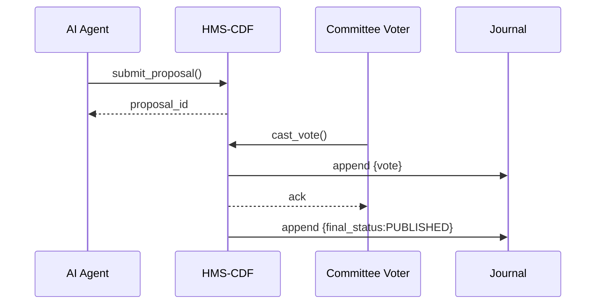

# Chapter 2: Legislative Workflow Engine (HMS-CDF)


*(linked from [Governance Layer (HMS-GOV)](01_governance_layer__hms_gov__.md))*  

---

## 1. Why Build a “Mini-Congress” for Software?

Picture a clerk at the **Postal Regulatory Commission** receiving a wave of AI-generated policy tweaks such as:

*“Lower the postage-fee refund window from 30 → 21 days.”*

If every tweak were deployed instantly, yesterday’s letters could become illegal overnight.  
HMS-CDF slows the chaos **just enough**:

1. **Draft** – collect the change in clear language & machine-readable JSON.  
2. **Vote** – route it through the right reviewers (humans *or* specialized agents).  
3. **Publish** – record the outcome in an immutable ledger before any service code picks it up.

You get **Congress-like due process at AI speed**—hours not months.

---

## 2. Key Concepts (Plain English)

| Concept | What It Really Means | Analogy |
|---------|---------------------|---------|
| Proposal | A text + JSON package describing a rule change. | A bill dropped in the House hopper. |
| Committee | A group of voters (people or agents) assigned to review. | A House Committee on Oversight. |
| Ballot | A single “Approve / Reject / Abstain” action from a voter. | Pressing the Yea/Nay button. |
| Docket | Queue of proposals waiting for action. | Today’s legislative calendar. |
| Journal | Tamper-proof log of every step. | The Congressional Record. |

---

## 3. A Five-Minute Walk-Through

Let’s file a **refund-window change** and watch it travel.

```python
# file: demo_cdf_submit.py
import hms_cdf_client as cdf

# 1. Login as AI Policy Agent
session = cdf.login("ai_agent", "secret")

# 2. Draft the proposal
proposal_id = cdf.submit_proposal(
    session=session,
    title="Refund Window: 30 -> 21 Days",
    json_rule={"refund_window_days": 21},
    rationale="Reduces claim fraud by 18% (sim data)."
)
print("Drafted:", proposal_id)

# 3. Trigger a vote by the 'Postal_Policy' committee
cdf.open_ballot(session, proposal_id, committee="Postal_Policy")
```

What just happened?

1. The draft is stored in the **Docket**.  
2. The committee list is attached.  
3. The proposal status moves to **“IN_VOTE”**.

Now a *human* member can cast a vote:

```python
# file: demo_cdf_vote.py
import hms_cdf_client as cdf

member = cdf.login("commissioner@prc.gov", "pwd")
cdf.cast_vote(member, proposal_id, verdict="APPROVE", note="Looks solid.")
```

After all required votes arrive, HMS-CDF auto-publishes to the **Journal** and notifies [HMS-GOV](01_governance_layer__hms_gov__.md).

---

## 4. What Happens Under the Hood?



Five actors, zero mystery.

---

## 5. Internal Design (Rust-flavored but friendly)

HMS-CDF is a **deterministic state machine**. The core enum:

```rust
// file: cdf/src/state.rs
#[derive(Clone)]
pub enum Stage {
    Draft,
    InVote,
    Published,
    Rejected,
}
```

Transition logic—*only 12 lines*:

```rust
// file: cdf/src/transition.rs
pub fn next(stage: Stage, event: Event) -> Stage {
    use Stage::*;
    match (stage, event) {
        (Draft, Event::OpenBallot) => InVote,
        (InVote, Event::AllApproved) => Published,
        (InVote, Event::AnyRejected) => Rejected,
        _ => stage, // no-op
    }
}
```

Explanation:

1. Each call to `submit_proposal`, `cast_vote`, or `close_ballot` emits an `Event`.  
2. `next()` calculates the new `Stage`.  
3. The **Journal** writes `{old, event, new}`—immutable audit.

The result: every node, test, or audit inspector replays the same events and lands at the *identical* state. No “it works on my machine” drama.

---

## 6. Linking with Other Layers

• [HMS-GOV](01_governance_layer__hms_gov__.md) uses the *Journal* to build dashboards.  
• [Legal & Compliance Reasoner (HMS-ESQ)](03_legal___compliance_reasoner__hms_esq__.md) attaches legal citations **before** a proposal can exit *Draft*.

---

## 7. Hands-On Exercise

1. `git clone https://github.com/example/hms-nfo.git`  
2. `cd hms-nfo && cargo run -p cdf_mock_server`  
3. `curl -X POST localhost:9000/proposals` with the JSON body shown earlier.  
4. Open `localhost:9000/journal` to watch events stream in real time.

You just legislated at light-speed!

---

## 8. Recap & What’s Next

• HMS-CDF is the platform’s **rule-making engine**—draft → vote → publish.  
• Written in Rust for *speed* and *determinism*.  
• Provides a crystal-clear audit trail for every policy change.

Up next, we’ll verify each new rule against actual statutes in  
[Legal & Compliance Reasoner (HMS-ESQ)](03_legal___compliance_reasoner__hms_esq__.md).

---

Generated by [AI Codebase Knowledge Builder](https://github.com/The-Pocket/Tutorial-Codebase-Knowledge)