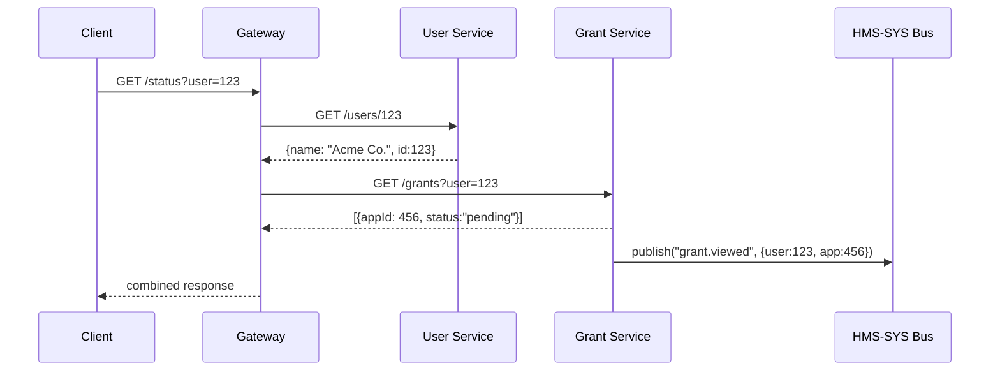
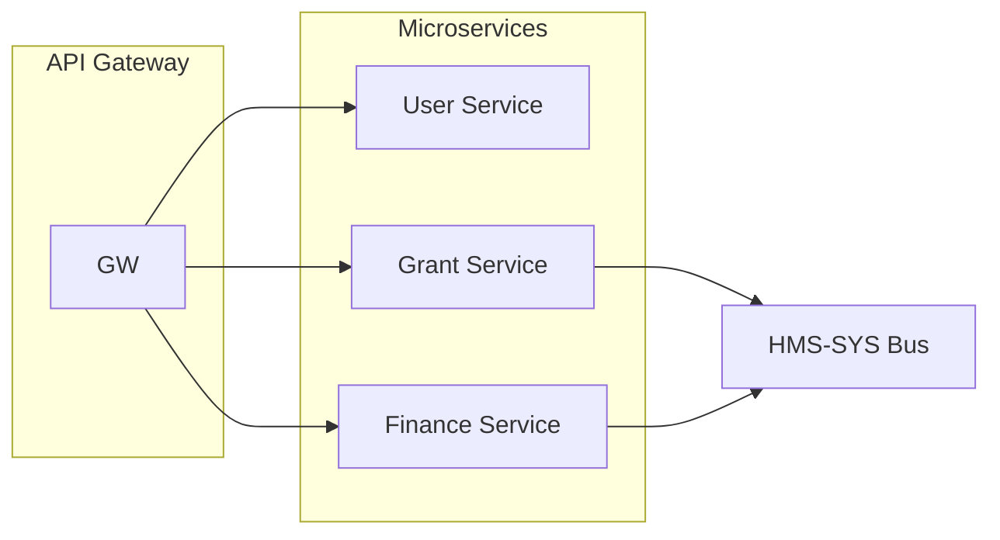

# Chapter 2: Microservices Architecture

Welcome back! In [Chapter 1: Core System Platform (HMS-SYS)](01_core_system_platform__hms_sys__.md), we built the plumbing—database, messaging bus, and configuration—for our government-focused system. Now, let’s see how we break that system into independent “departments” called **microservices**.

---

## 1. Motivation: Why Microservices?

Imagine a federal grants portal for the Small Business Administration (SBA). In a monolithic system, *every* feature—user profiles, application intake, financial tracking—lives in one giant codebase. A small change to the grant form can force the whole portal offline.

Microservices solve this by letting each department run on its own:

- **User Service** manages citizen or business profiles.  
- **Grant Service** handles intake and review of applications.  
- **Finance Service** tracks payments and reimbursements.

They communicate over a shared network (and our HMS-SYS messaging bus), so you can update the Grant Service without shutting down the User Service or Finance Service. Think of it like updating the passport office without closing the IRS.

---

## 2. Key Concepts

1. **Service Boundaries**  
   Each microservice owns a single domain (e.g., grants).  
2. **Independent Data Stores**  
   Services use their own databases to avoid conflicts.  
3. **Network Communication**  
   Services talk via HTTP/gRPC or publish events on our HMS-SYS bus.  
4. **Independent Deployment**  
   You can deploy or roll back one service without touching the others.  
5. **Fault Isolation**  
   One crashed department doesn’t shut the entire agency down.

---

## 3. A Simple Workflow Example

Let’s walk through a citizen checking their grant status:

1. **Client** calls the **API Gateway** (not covered yet) at `/status?user=123`.  
2. Gateway routes to **User Service**, which returns basic info about user 123.  
3. Gateway then calls **Grant Service** to get application status.  
4. **Grant Service** might publish an event like `grant.viewed` on the HMS-SYS bus.  
5. Gateway returns combined info back to the client.

### 3.1 Sequence Diagram



---

## 4. Writing a Microservice

Below is a super-simple **User Service** in Python using Flask and HMS-SYS’s database.  

File: `services/user_service.py`

```python
from flask import Flask, jsonify
from hms_sys.db import HMSDatabase

app = Flask(__name__)
db = HMSDatabase.connect("user_db")  # each service has its own DB

@app.route("/users/<user_id>")
def get_user(user_id):
    # Fetch user from our user_db
    user = db.get("users", user_id)
    return jsonify(user)

if __name__ == "__main__":
    app.run(port=5001)
```

Explanation:  
- We connect to a dedicated `"user_db"`.  
- We expose a single HTTP endpoint to fetch user data.  
- This service runs independently on port 5001.

You could build a **Grant Service** the same way, just pointing to `"grant_db"` and exposing `/grants`.

---

## 5. Under the Hood: What Really Happens

When `get_user` runs:

1. Flask receives `GET /users/123`.  
2. Code calls `HMSDatabase.connect("user_db")` (from [HMS-SYS](01_core_system_platform__hms_sys__.md)).  
3. The database client queries the `users` table and returns a record.  
4. Flask wraps that record into a JSON response.  

Behind the scenes, HMS-SYS handles connection pooling and credentials, so the service code stays clean and focused.

---

## 6. A High-Level Architecture Diagram



- **API Gateway** routes external requests.  
- **Microservices** live in their own containers or servers.  
- **HMS-SYS Bus** carries events like `grant.submitted`.

---

## 7. Conclusion

In this chapter, you learned how **microservices** let us split a large government portal into independent, domain-focused services—each with its own database, deploy pipeline, and runtime. We saw:

- Why microservices matter for uptime and agility.  
- Core concepts like service boundaries and fault isolation.  
- A minimal Flask-based example using [HMS-SYS](01_core_system_platform__hms_sys__.md).  
- Diagrams showing both sequence flows and overall architecture.

Next up, we’ll add a more robust **Backend API** layer to tie these services together.

[Backend API (HMS-API / HMS-MKT)](03_backend_api__hms_api___hms_mkt__.md)

---

Generated by [AI Codebase Knowledge Builder](https://github.com/The-Pocket/Tutorial-Codebase-Knowledge)