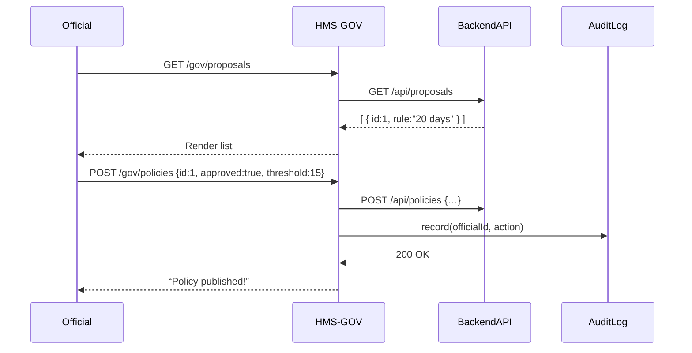

# Chapter 3: Admin/Gov Portal (HMS-GOV)

In [Chapter 2: Frontend Interface (HMS-MFE)](02_frontend_interface__hms_mfe__.md) we built the citizen-facing site. Now, let’s put on the government-official hat and dive into **HMS-GOV**, the secure command center where decision-makers review AI proposals, tweak settings, and publish new policies.

---

## 1. Why a Secure Portal?

Imagine the Department of Labor has an AI that scans FOIA requests and proposes to bump priorities for cases pending over 20 days. Before any change hits production, an official must:

1. See the AI’s suggestions in one place.  
2. Adjust thresholds (e.g., change “20 days” to “15 days”).  
3. Approve or reject each proposal.  
4. Publish the final policy.  

HMS-GOV ensures these steps happen safely, with human oversight and a clear audit trail.

---

## 2. Key Concepts

1. **Secure Dashboard**  
   – Only authorized officers can log in.  
   – Shows pending AI proposals in a clean list.

2. **Proposal Review Panel**  
   – Each card displays an AI suggestion (e.g., “Elevate FOIA requests older than 20 days”).  
   – Officials can approve/reject or override parameters.

3. **Parameter Override**  
   – Change numeric values or text before approval.  
   – Ensures legal and strategic alignment.

4. **Publish Policy**  
   – Once approved, sends a call to the backend to activate the change.  
   – Triggers notifications or downstream workflows.

5. **Audit Trail**  
   – Logs who approved what and when.  
   – Supports compliance and future reviews.

---

## 3. Solving the FOIA Backlog Use Case

Let’s walk through how an official handles one proposal.

### 3.1 High-Level Flow



---

## 4. Building the Portal UI

Here’s a minimal React component to list proposals and approve one.

```js
// hms-gov/src/ProposalList.js
import React, { useState, useEffect } from 'react';

function ProposalList() {
  const [proposals, setProposals] = useState([]);

  useEffect(() => {
    fetch('/gov/proposals')
      .then(r => r.json())
      .then(setProposals);
  }, []);

  async function approve(p) {
    await fetch('/gov/policies', {
      method: 'POST',
      headers:{'Content-Type':'application/json'},
      body: JSON.stringify({
        proposalId: p.id,
        approved: true,
        threshold: p.thresholdInput || p.threshold
      })
    });
    alert('Published!');
  }

  return proposals.map(p => (
    <div key={p.id}>
      <h4>Elevate FOIA > {p.threshold} days</h4>
      <input 
        type="number" 
        defaultValue={p.threshold}
        onChange={e => p.thresholdInput = e.target.value}
      />
      <button onClick={() => approve(p)}>Approve & Publish</button>
    </div>
  ));
}

export default ProposalList;
```

What’s happening?  
- We fetch AI proposals on load.  
- For each proposal, show the current threshold and an input to override it.  
- On “Approve & Publish”, we send a POST to `/gov/policies`.

---

## 5. Under the Hood: Server Routes

### 5.1 Route Definition

```js
// gov-server/src/routes/policies.js
const express = require('express');
const { listProposals, publishPolicy } = require('../handlers/policies');
const router = express.Router();

router.get('/proposals', listProposals);
router.post('/policies', publishPolicy);

module.exports = router;
```

### 5.2 Handler Logic

```js
// gov-server/src/handlers/policies.js
const apiClient = require('../../backend/apiClient');
const auditLog  = require('../lib/auditLog');

async function listProposals(req, res) {
  const data = await apiClient.get('/proposals');
  res.json(data);
}

async function publishPolicy(req, res) {
  const { proposalId, approved, threshold } = req.body;
  // 1. Forward to main API
  await apiClient.post('/policies', { proposalId, approved, threshold });
  // 2. Record in audit log
  await auditLog.record(req.user.id, 'publish', proposalId);
  res.json({ status: 'ok' });
}

module.exports = { listProposals, publishPolicy };
```

Explanation:  
- `listProposals` fetches AI suggestions from the backend.  
- `publishPolicy` sends your decision back to the backend API and logs the action.

---

## 6. What We’ve Learned

- How HMS-GOV empowers officials to review and approve AI-driven proposals.  
- The key UI pieces: listing proposals, overriding parameters, and publishing policies.  
- Server routes and handlers that call the backend API and log actions.  

Up next, we’ll see how users navigate intent-first in [Chapter 4: Intent-Driven Navigation](04_intent_driven_navigation_.md).

---

Generated by [AI Codebase Knowledge Builder](https://github.com/The-Pocket/Tutorial-Codebase-Knowledge)