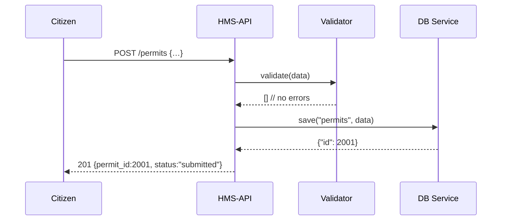

# Chapter 3: Backend API (HMS-API / HMS-MKT)

Welcome back! In [Chapter 2: Microservices Architecture](02_microservices_architecture_.md), we saw how individual services—like User or Grant—run independently. Now we’ll build the **Backend API** (also called **HMS-API** or **HMS-MKT**), the “civil servant” layer that glues those microservices and databases together into a secure, organized permit‐office for your data.

---

## 1. Motivation: Why a Backend API?

Imagine a citizen applies for a building permit online:

1. They fill out a web form on the frontend.  
2. The form data travels to the **Backend API**.  
3. The API:
   - Checks that all required fields are present (validation).  
   - Applies business rules (e.g., “foundation depth must be ≥ 3 feet”).  
   - Saves the application in the database.  
   - Returns an approval or error message.

Without a clear API layer, frontends and external systems would talk directly to databases or microservices, making validation, security, and versioning a mess. **HMS-API** centralizes:

- Authentication and authorization  
- Input validation  
- Routing to the right microservices  
- Response formatting  
- Error handling  

It’s like a permit office clerk who reviews your documents, applies the rules, stamps your file, and tells you the outcome.

---

## 2. Key Concepts

1. **Endpoints**  
   HTTP routes (e.g., `POST /permits`, `GET /permits/{id}`) that clients call.  

2. **Controllers**  
   Code modules that handle each endpoint’s request and response.  

3. **Validation**  
   Checks on incoming data (required fields, correct types, business rules).  

4. **Business Logic**  
   Domain rules—e.g., calculating fees, checking applicant eligibility.  

5. **Persistence**  
   Saving and loading data via [HMS-SYS Database Service](01_core_system_platform__hms_sys__.md).  

---

## 3. Using HMS-API: A Simple Permit Workflow

### 3.1 Create a Permit Application

```python
# file: hms_api/app.py
from flask import Flask, request, jsonify
from hms_sys.db import HMSDatabase
from .validation import validate_permit

app = Flask(__name__)
db = HMSDatabase.connect("permit_db")  # each API uses its own DB

@app.route("/permits", methods=["POST"])
def create_permit():
    data = request.json
    errors = validate_permit(data)
    if errors:
        return jsonify({"errors": errors}), 400

    record = db.save("permits", data)
    return jsonify({"permit_id": record["id"], "status": "submitted"}), 201
```

Explanation:  
- We read JSON from the client.  
- We call `validate_permit` to enforce rules.  
- On success, we call `db.save` (from [HMS-SYS](01_core_system_platform__hms_sys__.md)) and return a new ID.

### 3.2 Fetch Permit Status

```python
# file: hms_api/app.py (continued)
@app.route("/permits/<permit_id>", methods=["GET"])
def get_permit(permit_id):
    record = db.get("permits", permit_id)
    if not record:
        return jsonify({"error": "Not found"}), 404
    return jsonify(record), 200
```

Explanation:  
- We look up the `permit_id`.  
- If missing, we return HTTP 404. Otherwise, we return the full record.

---

## 4. Under the Hood: What Happens Step-by-Step

Below is a minimal sequence of what happens on `POST /permits`:



1. **Citizen** sends form data.  
2. **API** calls the **Validator**.  
3. On success, **API** calls the **DB Service**.  
4. **DB** returns a new record ID.  
5. **API** responds with HTTP 201 and the permit details.

---

## 5. Internal Implementation

Let’s peek into the small modules that make this work.

### 5.1 Validation Logic

```python
# file: hms_api/validation.py
def validate_permit(data):
    errors = []
    if not data.get("applicant_name"):
        errors.append("Applicant name is required.")
    if data.get("building_height", 0) <= 0:
        errors.append("Building height must be positive.")
    # Add more business rules...
    return errors
```

Explanation:  
- We collect errors in a list.  
- If the list is non‐empty, the API returns `400 Bad Request`.

### 5.2 Database Service (reuse from HMS-SYS)

```python
# imported from hms_sys/db.py
class HMSDatabase:
    @staticmethod
    def connect(name):
        print(f"Connected to DB '{name}'")
        return HMSDatabase()

    def save(self, table, data):
        # Imagine INSERT INTO ... RETURNING id
        new_id = 2001  # dummy
        return {"id": new_id}

    def get(self, table, key):
        # Imagine SELECT * FROM table WHERE id=key
        return {"id": key, "applicant_name": "Jane Doe", "status": "pending"}
```

Explanation:  
- `connect` gives us a handle.  
- `save` and `get` simulate database operations.

---

## 6. Conclusion

In this chapter you learned how **HMS-API** (or **HMS-MKT**) acts as the gatekeeper for your microservices:

- Defines clear HTTP endpoints for CRUD operations.  
- Validates input and applies business rules.  
- Persists to and retrieves from the [HMS-SYS Database Service](01_core_system_platform__hms_sys__.md).  
- Returns consistent, secure responses to clients.

Next up, we’ll build the user-facing side: the **Frontend Interface (HMS-MFE)**. Check it out here:

[Chapter 4: Frontend Interface (HMS-MFE)](04_frontend_interface__hms_mfe__.md)

---

Generated by [AI Codebase Knowledge Builder](https://github.com/The-Pocket/Tutorial-Codebase-Knowledge)