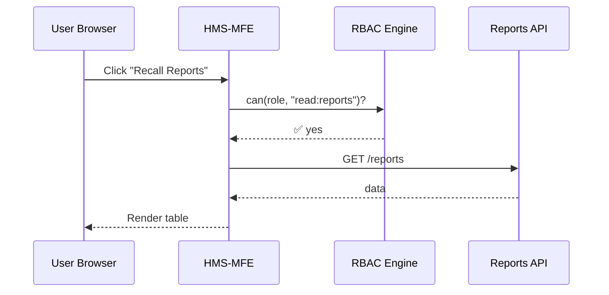

# Chapter 3: Role-Based Access Control (RBAC)  
*(Digital “Who-Goes-Where” Badges)*  

[← Back to Chapter 2: Intent-Driven Navigation & Journeys](02_intent_driven_navigation___journeys_.md)

---

## 1. Why Should I Care?  

Meet Jordan, an analyst at the **Consumer Product Safety Commission (CPSC)**.  
He needs to:

1. View last month’s product-recall reports.  
2. Edit an upcoming press release draft.  
3. Peek at system-wide audit logs (he actually **should not**).

With no access control, a typo in a URL might let Jordan see or change anything.  
RBAC adds invisible security guards at every digital doorway, so:

• Citizens see only their own filings.  
• Program managers can edit department data.  
• Super-admins (rare) can view system logs.  

This “badging” system is also a **FedRAMP** and **NIST** must-have.

---

## 2. Key Concepts (Plain English)

| Term | What It Really Means | Quick Analogy |
|------|----------------------|---------------|
| Role | A named badge (e.g., `citizen`, `analyst`, `super_admin`). | The color of your lanyard. |
| Permission | A single allowed action (`read:reports`, `edit:press_release`). | Doors your lanyard opens. |
| Policy | List of permissions attached to a role. | “Blue lanyard opens doors A & B.” |
| Principle of Least Privilege | Give only what’s needed—no more. | Mailroom clerks don’t get the server room key. |
| Access Token | Tiny passport stored in the browser saying, “I’m Jordan, role=analyst.” | Stamp in your notebook. |

---

## 3. A 2-Minute Code Taste

### 3.1 Define Roles & Policies

```ts
// access/roles.ts
export const policies = {
  citizen: ["read:own_filing"],
  analyst: ["read:reports", "edit:press_release"],
  super_admin: ["*"],           // ← all permissions
};
```

Explanation  
We map **role names** to **permission lists**. A wildcard `*` means “everything”.

---

### 3.2 Tiny “Guard” Function (Middleware)

```ts
// access/can.ts
import { policies } from "./roles";

export function can(role: string, permission: string) {
  const perms = policies[role] || [];
  return perms.includes("*") || perms.includes(permission);
}
```

If `can("analyst","edit:press_release")` returns `true`, show the editor; otherwise show “Access Denied”.

---

### 3.3 Gating a Journey Waypoint

```tsx
// journeys/recalls/RecallReports.tsx
import { can } from "../../access/can";

export function RecallReports({ user }) {
  if (!can(user.role, "read:reports")) {
    return <p>🚫 Sorry, no access.</p>;
  }
  return <ReportsTable />;
}
```

Jordan (role `analyst`) sees the table; a normal citizen sees the stop sign.

---

## 4. What Happens Under the Hood?



If RBAC returns ❌, the flow stops—no API call, no data leak.

---

## 5. Step-By-Step Flow (Words Only)

1. User’s **Access Token** arrives after login (stored in `sessionStorage`).  
2. Every page or API call asks `can(role, permission)` first.  
3. If **allowed**, the request continues; otherwise the user gets a friendly error.  
4. Logs are written for every denied attempt—helpful for audits.

---

## 6. Inside the Files

```
hms-core/
  access/
    roles.ts          // role ➜ permission map
    can.ts            // single check helper
    withGuard.tsx     // React HOC (optional shortcut)
  auth/
    login.ts          // issues access token
    tokenStorage.ts   // get/set token
```

`withGuard.tsx` is a tiny Higher-Order Component you can wrap around routes to avoid manual checks everywhere.

---

### 6.1 Optional: React Guard Wrapper (≤ 20 Lines)

```tsx
// access/withGuard.tsx
import { can } from "./can";
export function withGuard(Component, permission) {
  return function Guarded(props) {
    const user = useUser();            // custom hook
    if (!can(user.role, permission)) {
      return <p>🚫 Not permitted.</p>;
    }
    return <Component {...props} />;
  };
}
```

Usage:

```tsx
export default withGuard(RecallReports, "read:reports");
```

No need to sprinkle `can()` checks in every file.

---

## 7. Persisting Roles in an Access Token

```ts
// auth/login.ts
export function issueToken(userId: string, role: string) {
  const token = btoa(JSON.stringify({ userId, role }));
  sessionStorage.setItem("token", token);
}
```

Explanation  
We store a **base64-encoded** JSON object for demo purposes. Swap in JWT later for real crypto.

---

## 8. Compliance Corner  

• **FedRAMP LOW/MODERATE**: RBAC mapping sheets help with “AC-2 Account Management” controls.  
• **NIST SP 800-53**: Satisfies controls like “AC-6 Least Privilege” and “AU-2 Event Logging” (when you log denies).

---

## 9. Hands-On Exercise

1. Run `npm start`.  
2. Sign in as `role=citizen`.  
3. Navigate to *Recall Reports* → you should see “🚫 Sorry, no access.”  
4. Change the stored token role to `analyst` in DevTools (for demo only).  
5. Refresh the page—reports now appear. 🎉  

Observe how **one word in the token** changes everything.

---

## 10. Common Pitfalls & Quick Fixes

| Problem | Symptom | Fix |
|---------|---------|-----|
| Forgot to guard an API route | Data leak in browser console | Add `can()` check on server too—defense in depth |
| Role drift | Staff gets extra permissions over time | Schedule quarterly role review |
| Hard-coding roles in UI | Impossible to update quickly | Centralize roles in `roles.ts` or a DB table |

---

## 11. Summary & What’s Next

You now have a working mental model of RBAC: **roles ➜ permissions ➜ policy checks**.  
This keeps Jordan in-bounds, protects citizen data, and satisfies auditors.

Next we’ll explore how to build and reuse beautiful UI pieces that respect these guards using our [Modular Component Library](04_modular_component_library_.md).

*Lock the doors, then furnish the rooms!*

---

Generated by [AI Codebase Knowledge Builder](https://github.com/The-Pocket/Tutorial-Codebase-Knowledge)