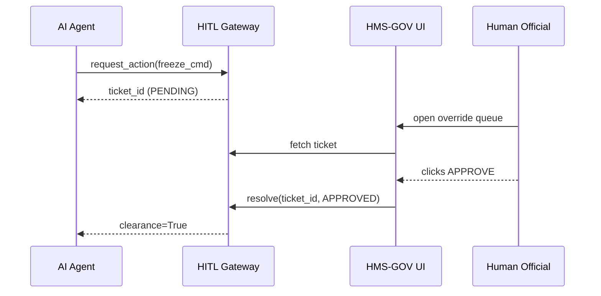

# Chapter 4: Human-in-the-Loop Oversight (HITL)

*(linked from [Legal & Compliance Reasoner (HMS-ESQ)](03_legal___compliance_reasoner__hms_esq__.md))*  

---

## 1. Why Put a Human “Handbrake” on Our AI?

Imagine the **Indian Health Service (IHS)** is using an AI agent to pre-screen tele-medicine claims.  
At 2 a.m. the agent detects suspicious patterns and prepares to **freeze** payments for 12 rural clinics.

Great catch—**unless the pattern is a false alarm** caused by a bad data feed.  
With **Human-in-the-Loop Oversight (HITL)**:

1. The agent flags “High-Impact Action Pending.”  
2. The system automatically **pauses** the freeze.  
3. An on-call IHS official receives a mobile alert, reviews the evidence in **HMS-GOV**, and clicks either **Proceed** or **Cancel**.

HITL is the constitutional fire-break that keeps elected or appointed humans in charge, even while AI works at machine speed.

---

## 2. Key Concepts in Plain English

| Concept | What It Really Means | Friendly Analogy |
|---------|---------------------|------------------|
| Pause Switch | A Boolean flag (`ON/OFF`) any agent must check before performing sensitive steps. | The “Emergency Stop” button on a factory conveyor. |
| Override Queue | List of AI actions waiting for a human verdict. | Stack of folders on a supervisor’s desk. |
| Authority Chain | Mapping of *which* humans can clear *which* actions. | Firefighter → Captain → Chief escalation ladder. |
| Timeout Escalation | Auto-escalate if no human responds in time. | Smoke alarm that calls 911 if nobody presses “I’m OK.” |
| Audit Handshake | Signed record that human saw the AI recommendation and clicked a button. | Delivery receipt requiring a signature. |

---

## 3. Five-Minute Walk-Through

### 3.1 What an Agent Does

Below is a **tiny** Python-flavored snippet from an HMS-ACT agent that wants to freeze payments:

```python
# file: agent_freeze.py
from hms_hitl_client import request_action, check_clearance

# Proposed action payload
freeze_cmd = {
    "type": "FREEZE_PAYMENTS",
    "scope": {"clinics": ["RuralClinic_001", "RuralClinic_002"]},
    "reason": "Anomaly score 0.92"
}

# 1. Ask HITL for clearance
ticket_id = request_action(freeze_cmd)

# 2. Poll until a human decides
while not check_clearance(ticket_id):
    sleep(5)      # keep waiting

# 3. Execute only if approved
execute_freeze(freeze_cmd)
```

Explanation:

1. `request_action` posts the **intent** to HITL.  
2. HITL instantly puts the intent in the **Override Queue** and returns a `ticket_id`.  
3. The agent *must* wait until `check_clearance` returns `True` (human approved) before running `execute_freeze()`.

> Key takeaway: **One extra function call** (`request_action`) forces every high-impact task to respect human authority.

### 3.2 What the Human Sees

Inside the **HMS-GOV** dashboard the on-call official sees:

```
------------------------------------------------------------
⚠️  ACTION PENDING
Agent: IHS_FraudScreener
Type: FREEZE_PAYMENTS
Clinics: RuralClinic_001, RuralClinic_002
Reason: Anomaly score 0.92
[ View Evidence ]   [ Approve ]   [ Reject ]
------------------------------------------------------------
```

A single click sets the destiny of that ticket.

---

## 4. Under the Hood (No Black Magic)

### 4.1 Bird’s-Eye Sequence



Only **four actors** keep the mental model simple.

### 4.2 Minimal Gateway Code (10 Lines)

```python
# file: hitl_gateway/api.py
from fastapi import FastAPI
app = FastAPI()
TICKETS = {}  # {"id": {"status": "PENDING"|"APPROVED"|"REJECTED", ...}}

@app.post("/request")
def request_action(cmd: dict):
    tid = uuid4().hex
    TICKETS[tid] = {"status": "PENDING", "cmd": cmd}
    notify_human(tid)              # SMS / email
    return {"ticket_id": tid}

@app.get("/status/{tid}")
def status(tid: str):
    return {"clear": TICKETS[tid]["status"] == "APPROVED"}
```

What to notice:

* **Single in-memory dictionary** is enough for the demo.  
* `notify_human` could be an email, Slack, or pager duty call.  
* Real deployment swaps the dict for the [Central Data Repository (HMS-DTA)](07_central_data_repository__hms_dta__.md) and adds auth.

---

## 5. How Agents Must Behave

All official HMS-AGT agents follow one rule:

> “Before executing a **sensitive action**, poll HITL until `clear == True`.”

A utility wrapper enforces this:

```python
# file: hms_hitl_client.py
def safe_execute(cmd, action_fn):
    tid = request_action(cmd)
    while not check_clearance(tid):
        sleep(3)
    action_fn(cmd)          # executes only when human says OK
```

Developers simply write:

```python
safe_execute(freeze_cmd, execute_freeze)
```

No excuses, no accidental bypass.

---

## 6. Typical Escalation Policy (YAML Snippet)

```yaml
# file: hitl_policies.yml
FREEZE_PAYMENTS:
  approvers: ["IHS_Fraud_Manager", "IHS_CFO"]
  timeout_minutes: 30
  on_timeout: "AUTO_DENY"
```

The gateway reads this file to know **who** to ping and **what** to do if nobody answers.

---

## 7. Frequently Asked Questions

**Q1: Can the agent *ever* skip HITL?**  
Only for actions labeled *routine* in the policy file. Anything tagged `sensitive: true` must go through the queue.

**Q2: What if the human makes a mistake?**  
Every decision is logged in the immutable audit ledger. The next chapter—[Accountability & Performance Metrics Tracker](05_accountability___performance_metrics_tracker_.md)—shows how we surface those metrics.

**Q3: Does this slow things down?**  
Yes, intentionally. The design trades a few extra minutes for **public trust** and **legal compliance**.

---

## 8. Hands-On Exercise (5 Minutes)

1. Clone the repo:  
   `git clone https://github.com/example/hms-nfo.git`
2. Start the mock HITL server:  
   `python -m hitl_gateway.mock`
3. In a second terminal run the agent script:  
   `python examples/agent_freeze.py`
4. Watch the terminal stall at “Waiting for clearance…”.  
5. Open the auto-launched browser tab, click **Approve**, and see the agent continue.

Congratulations—**you just acted as the final authority over the AI.**

---

## 9. Recap & Where We Go Next

• **HITL** provides a simple, universal **pause switch** so no AI can act unilaterally.  
• Agents issue a `request_action`, humans respond in **HMS-GOV**, and execution resumes only after approval.  
• All clicks and verdicts feed into the audit ledger, which powers the upcoming **performance & accountability dashboards**.

Ready to see how those dashboards hold both *humans* and *machines* accountable?  
Jump to: [Accountability & Performance Metrics Tracker](05_accountability___performance_metrics_tracker_.md)

---

Generated by [AI Codebase Knowledge Builder](https://github.com/The-Pocket/Tutorial-Codebase-Knowledge)