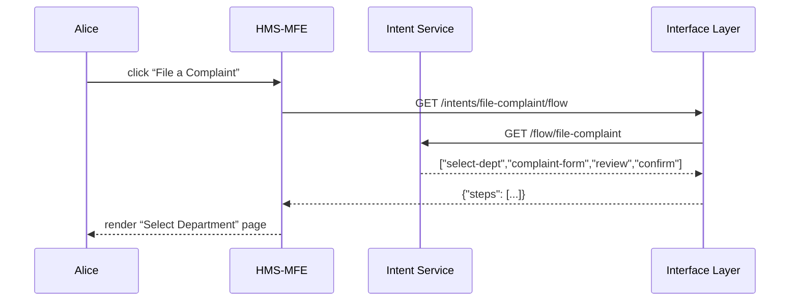

# Chapter 4: Intent-Driven Navigation

In [Chapter 3: Admin/Gov Portal (HMS-GOV)](03_admin_gov_portal__hms_gov__.md) we saw how officials review and publish policies. Now, let’s switch gears and make life easier for citizens by guiding them through their goals—step by step—using **Intent-Driven Navigation**.

---

## 1. Why Intent-Driven Navigation?

Imagine Alice wants to file a complaint with the Department of Homeland Security. Instead of hunting through menus, our system acts like a friendly tour guide in a museum:

1. It infers Alice’s goal (“File a complaint”).
2. Looks up the best path of pages and services.
3. Presents only the next step she needs.

This cuts confusion, reduces clicks, and makes government forms as simple as “point-and-click.”

---

## 2. A Simple Use Case: Filing a Complaint

Here’s the high-level flow:

1. Alice lands on the HMS homepage.
2. She clicks **“File a Complaint.”**
3. The system fetches a tailored flow:  
   – Choose Department → Fill Complaint Form → Review → Confirmation.
4. Alice sees only the first page; after she completes it, she’s taken to the next.

---

### 2.1 Sequence Diagram



---

## 3. Key Concepts

1. **Intent**  
   A named goal (e.g., `file-complaint`).

2. **Flow**  
   An ordered list of steps/pages for that intent.

3. **Navigator**  
   A component that fetches the flow and walks the user through each step.

4. **Page Renderer**  
   Loads the right form or info screen for a given step.

---

## 4. Using Intent-Driven Navigation

### 4.1 Define Flows

Create a simple mapping of intent names to steps:

```js
// src/navigation/intentFlows.js
module.exports = {
  'file-complaint': [
    'select-dept',
    'complaint-form',
    'review',
    'confirmation'
  ],
  'foia-request': [
    'request-type',
    'details',
    'summary'
  ]
};
```
This tells our system which pages to stitch together.

---

### 4.2 Expose an API for Flows

```js
// src/navigation/intentHandler.js
const flows = require('./intentFlows');

exports.getFlow = (req, res) => {
  const flow = flows[req.params.intent] || [];
  res.json({ steps: flow });
};
```
We return the array of steps for any `GET /intents/:intent/flow` call.

---

### 4.3 Wire Up the Route

```js
// src/navigation/router.js
const express = require('express');
const { getFlow } = require('./intentHandler');
const router = express.Router();

router.get('/intents/:intent/flow', getFlow);
module.exports = router;
```
The **Interface Layer** (see [Chapter 1](01_interface_layer_.md)) mounts this so frontends can fetch intent flows under `/interface/intents/...`.

---

### 4.4 Build the Navigator Component

```js
// hms-mfe/src/components/IntentNavigator.js
import React, { useState, useEffect } from 'react';

function IntentNavigator({ intent }) {
  const [steps, setSteps] = useState([]);
  const [idx, setIdx] = useState(0);

  useEffect(() => {
    fetch(`/interface/intents/${intent}/flow`)
      .then(r => r.json())
      .then(data => setSteps(data.steps));
  }, [intent]);

  if (!steps.length) return <div>Loading…</div>;

  const current = steps[idx];
  function next() { setIdx(i => i + 1); }

  return (
    <div>
      <h2>Step {idx+1}: {current}</h2>
      {/* Render a form or info based on `current` */}
      <button onClick={next} disabled={idx >= steps.length-1}>
        Next
      </button>
    </div>
  );
}

export default IntentNavigator;
```
- On mount, we fetch the flow.  
- We show only the **current** step name and a Next button.  
- In a real app you’d swap in proper page components per step.

---

## 5. Under the Hood

1. HMS-MFE calls `/interface/intents/:intent/flow`.  
2. The **Interface Layer** forwards to our Intent Service.  
3. Intent Service returns the flow array.  
4. HMS-MFE renders each page in order, calling other endpoints as needed (forms, lookups).

This keeps navigation logic centralized—no more hard-coding routes in multiple frontends.

---

## 6. What We’ve Learned

- Intent-Driven Navigation infers user goals and presents only the needed steps.  
- We store simple flow mappings in `intentFlows.js`.  
- The Interface Layer exposes a `/intents/:intent/flow` API.  
- A React `IntentNavigator` fetches the steps and guides the user.

Next up, we’ll add intelligence to our system—meet the [AI Representative Agent (HMS-A2A)](05_ai_representative_agent__hms_a2a__.md), which can suggest next actions and auto-fill forms!

---

Generated by [AI Codebase Knowledge Builder](https://github.com/The-Pocket/Tutorial-Codebase-Knowledge)