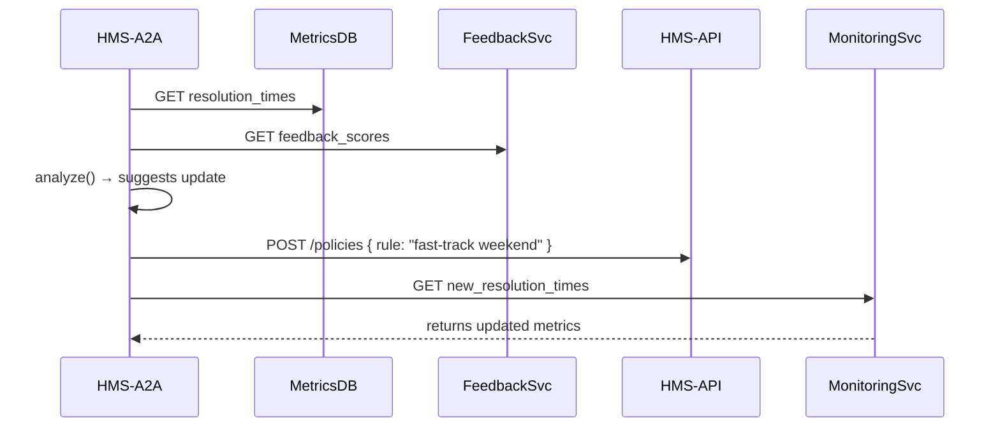

# Chapter 5: AI Representative Agent (HMS-A2A)

Welcome back! In [Chapter 4: Intent-Driven Navigation](04_intent_driven_navigation_.md), we guided citizens step-by-step through their goals. Now we’ll meet the **AI Representative Agent (HMS-A2A)**, your system’s digital policy advisor—an automated think-tank that watches how users interact, spots bottlenecks, and proposes workflow improvements.

---

## 1. Why an AI Representative Agent?

Imagine the Department of Labor is overwhelmed with FOIA requests. Some forms sit unresolved past 30 days. Instead of relying on manual reports, HMS-A2A:

1. Reads real-time usage metrics (e.g., average resolution time).  
2. Analyzes citizen feedback (e.g., “form too confusing”).  
3. Cross-references external data (e.g., seasonal request spikes).  
4. Suggests a policy tweak (e.g., “route FOIA forms filed on weekends to fast-track queue”).  
5. Submits that update via the API.  
6. Monitors if resolution times improve—and refines again.

This continuous loop refines government workflows without sleeping!

---

## 2. Key Concepts

1. **Data Ingestion**  
   – Pull metrics from your database or monitoring service.  
   – Fetch user feedback from surveys (see [Chapter 2: HMS-MFE](02_frontend_interface__hms_mfe__.md)).  

2. **Analysis & Recommendation**  
   – A simple rule engine or ML model decides “what to change.”  

3. **Conflict Resolution**  
   – If two suggestions contradict (e.g., “raise threshold” vs. “lower threshold”), the agent picks the one with higher impact score.  

4. **API Submission**  
   – Uses your backend API ([Chapter 7: HMS-API/HMS-MKT](07_backend_api__hms_api_hms_mkt__.md)) to submit updates.  

5. **Monitoring Loop**  
   – Checks post-update metrics to see if performance improved.  

---

## 3. Solving the FOIA Backlog Use Case

Let’s walk through a minimal example:

### 3.1 Sequence Diagram



1. **Fetch** metrics & feedback.  
2. **Analyze** and propose a change.  
3. **Submit** it via the API.  
4. **Monitor** results and repeat.

---

## 4. Using HMS-A2A in Your Code

### 4.1 Agent Configuration

Create a simple config file to define which data sources to poll:

```js
// hms-a2a/config.js
module.exports = {
  pollIntervalMs: 6 * 60 * 60 * 1000, // every 6 hours
  metricsEndpoint: '/metrics/resolution_times',
  feedbackEndpoint: '/feedback/scores',
  policyApi: '/api/policies',
};
```

*Explanation:* We poll every 6 hours, pointing to our metrics, feedback, and policy API endpoints.

---

### 4.2 Agent Implementation

```js
// hms-a2a/agent.js
const { pollIntervalMs, metricsEndpoint } = require('./config');
const apiClient = require('../backend/apiClient');

async function runCycle() {
  const metrics = await apiClient.get(metricsEndpoint);
  const suggestion = analyze(metrics);           // your logic
  if (suggestion) {
    await apiClient.post('/policies', suggestion);
  }
}

setInterval(runCycle, pollIntervalMs);
```

*Explanation:*  
- `runCycle()` fetches metrics, runs `analyze()`, and—if there’s a suggestion—submits it.

---

### 4.3 Example `analyze()` Function

```js
// hms-a2a/analyzer.js
function analyze(metrics) {
  const avg = metrics.reduce((a,b)=>a+b,0) / metrics.length;
  if (avg > 30) {
    return { proposal: 'speed-up-weekend', thresholdDays: 15 };
  }
  return null; // no change needed
}
module.exports = analyze;
```

*Explanation:*  
- If the average resolution time exceeds 30 days, suggest lowering the threshold to 15 days.

---

## 5. Under the Hood: What Happens Step-by-Step

1. **Scheduler** triggers `runCycle()`.  
2. **Metrics Fetch**: agent calls the Metrics service.  
3. **Feedback Fetch** (omitted above for brevity): same pattern.  
4. **Analyze**: custom logic picks the highest-impact change.  
5. **Submit**: agent posts to `/policies` on your backend.  
6. **Monitor**: next cycle reads updated metrics to confirm improvement.

This loop is your digital think-tank—always learning and optimizing.

---

## 6. What We’ve Learned

- HMS-A2A polls data, analyzes it, and proposes policy updates automatically.  
- We saw how to configure and code a minimal agent.  
- We walked through a real FOIA backlog example, from metrics to API submission.

Next, we’ll add a safety net: human oversight. See [Chapter 6: Human-in-the-Loop (HITL) Oversight](06_human_in_the_loop__hitl__oversight_.md) to review and approve AI proposals before they go live.

---

Generated by [AI Codebase Knowledge Builder](https://github.com/The-Pocket/Tutorial-Codebase-Knowledge)