# Chapter 6: AI Governance Values Framework  
*(The “City Charter” For Every Algorithm)*  

[← Back to Chapter 5: Governance Layer (HMS-GOV)](05_governance_layer__hms_gov__.md)

---

## 1. Why Do We Need a Values Framework?

Picture Toni, a homeowner in coastal Florida who applies for a **Federal Emergency Management Agency (FEMA)** elevation grant.  
An AI agent reviews thousands of applications overnight and marks Toni’s as **denied**.  
Toni clicks a button:

> “Explain my denial.”

Within seconds she receives a plain-language answer:  

> “Your property is already 3 ft above the base flood elevation. FEMA rules require at least 4 ft risk.”

Behind that calm reply lies the **AI Governance Values Framework**—a set of non-negotiable principles baked into every decision, log line, and API response across HMS-NFO.

Without it:
* Denials feel random.
* Inspectors can’t trace decisions.
* FOIA officers drown in paperwork.

With it:
* Every decision is **traceable, explainable, and ethically aligned**.
* Audits take hours, not months.

---

## 2. The Five Core Values (Plain English)

| Value      | What It Really Means | One-Sentence Analogy |
|------------|----------------------|----------------------|
| Transparency | Users can see **how** and **why** a decision was made. | Glass walls in City Hall. |
| Truth       | The system never fabricates facts or sources. | No rumor mills; only certified documents. |
| Safety      | Decisions avoid physical, financial, or digital harm. | “First, do no harm.” |
| Ethics      | Actions respect fairness, non-discrimination, and public trust. | Blindfolded Lady Justice. |
| Privacy     | Personal data is minimized and protected. | Shredded copies of unneeded forms. |

Whenever an AI model speaks or an API acts, it must satisfy **all five** or be blocked.

---

## 3. High-Level Architecture

```mermaid
flowchart LR
  subgraph ValuesMesh
    VG[Values Guard<br/>(library)]
    LG[Audit Logger]
  end
  UI(User Request) --> VG
  VG -->|ok| Service
  VG --x|violation| UI
  Service --> LG
  VG --> LG
```

1. Every inbound **decision** flows through `ValuesGuard`.  
2. If all values pass, the service proceeds; otherwise the user gets a clear violation message.  
3. **Every step** is written to `AuditLogger`.

---

## 4. Mini Use-Case Walk-Through

### 4.1 Toni Applies

```ts
// frontend/submit.ts
post("/api/grants", formData);  // ValuesGuard runs server-side
```

### 4.2 AI Review & Logging (≤ 20 lines)

```ts
// services/grants/review.ts
import { valuesCheck, logDecision } from "@hms-nfo/values";

export async function review(app) {
  const result = await model.predict(app);
  const reason = "Property already 3ft above flood elevation.";

  valuesCheck({
    action: "deny_grant",
    values: ["truth", "ethics", "safety"],
    context: { appId: app.id, reason }
  });

  logDecision(app.id, "deny", reason);   // traceable!
  return { status: "denied", reason };
}
```

**Explanation**  
1. `valuesCheck` validates the decision against declared values.  
2. `logDecision` writes to an immutable store for future “why?” queries.

### 4.3 Citizen Asks “Why?”

```ts
// services/grants/explain.ts
export function explain(appId) {
  return getLog(appId);   // returns plain-language reason
}
```

---

## 5. What Happens Under the Hood?

```mermaid
sequenceDiagram
    participant U as Toni
    participant FE as HMS-MFE
    participant SVC as Grant Service
    participant VG as ValuesGuard
    participant LOG as AuditLog

    U->>FE: Submit grant form
    FE->>SVC: POST /grants
    SVC->>VG: check(values)
    VG-->>SVC: ✅ pass
    SVC->>LOG: write "denied + reason"
    SVC-->>FE: {denied, reason}
    FE-->>U: Shows denial + "Explain" link
```



If `VG` returned ❌ (e.g., missing privacy safeguard), the service would abort and an **error report** would still hit `AuditLog`.

---

## 6. File Glimpse

```
values-framework/
  src/
    index.ts          // re-exports helpers
    guard.ts          // valuesCheck()
    logger.ts         // logDecision()
  logs/
    decisions/2023-10-12/
      FEMA_elev_123.json
```

Simple enough that new devs can trace the path in minutes.

---

## 7. Core Helpers (Each ≤ 15 Lines)

### 7.1 `valuesCheck`

```ts
// guard.ts
export function valuesCheck({ action, values, context }) {
  const missing = CORE_VALUES.filter(v => !values.includes(v));
  if (missing.length)
    throw new Error(`Value breach: ${missing.join(",")}`);
  // Extra: run policy plugins here
}
```

### 7.2 `logDecision`

```ts
// logger.ts
import fs from "fs";

export function logDecision(id, verdict, reason) {
  const entry = { id, verdict, reason, ts: Date.now() };
  fs.writeFileSync(`logs/decisions/${id}.json`, JSON.stringify(entry));
}
```

Both functions are intentionally tiny—easy to audit.

---

## 8. Hands-On: Spot a Violation

1. Clone the repo, `npm start`.  
2. In `review.ts`, remove `"truth"` from the `values` array.  
3. Resubmit Toni’s application.  
4. Console shows: `Value breach: truth` and the HTTP response is `400`. 🎉

You just simulated an automated ethical fail-safe.

---

## 9. Common Pitfalls & Fast Fixes

| Pitfall | Symptom | Fix |
|---------|---------|-----|
| Forget to call `valuesCheck` | Decisions bypass charter | Add ESLint rule: “no-unchecked-decision” |
| Vague reasons | Citizens still confused | Require `reason` ≥ 15 chars in `logDecision` |
| Oversharing PII in logs | Privacy breach | Mask fields via `sanitize()` hook before writing |

---

## 10. How It Connects

* **Policy updates** from [Governance Layer](05_governance_layer__hms_gov__.md) can add new values (e.g., *“sustainability”*).  
* **Humans-in-the-Loop** will review flagged decisions in the next chapter: [Human-in-the-Loop (HITL) Oversight](07_human_in_the_loop__hitl__oversight_.md).  
* **Compliance & Audit Trail Module** (Chapter 8) consumes the same logs for FOIA exports.

---

## 11. Summary

The **AI Governance Values Framework** is your always-on **ethical safety net**:

1. Five core values guard every decision.  
2. `ValuesGuard` blocks violations at runtime.  
3. `AuditLogger` records the who, what, and why—making FOIA and inspector visits painless.

Ready to see how real humans double-check the machines?  
Continue to [Human-in-the-Loop (HITL) Oversight](07_human_in_the_loop__hitl__oversight_.md).

---

---

Generated by [AI Codebase Knowledge Builder](https://github.com/The-Pocket/Tutorial-Codebase-Knowledge)