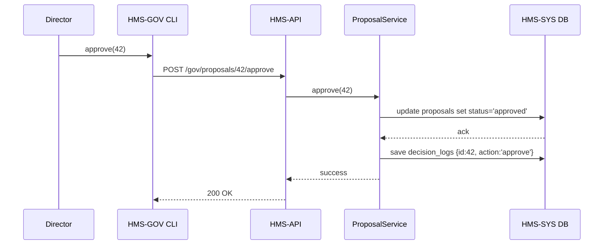

# Chapter 6: Gov/Admin Platform (HMS-GOV)

In the previous chapter, we built **Specialized Domain Interfaces** for specific sectors like veterans or education. Now, let’s step behind the scenes and see how agency leaders, ministers, and policy-makers gain a real-time “control room” to monitor, approve, or override those domain workflows.

[← Back to Chapter 5: Specialized Domain Interfaces](05_specialized_domain_interfaces_.md)

---

## 1. Motivation: Why a Gov/Admin Platform?

Imagine the National Park Service (NPS) wants to manage visitor quotas across all 400+ parks. Automated systems ingest trail-usage data, weather forecasts, and resource budgets, then generate AI-driven proposals: “Open Trail A at 6 AM,” “Limit group sizes to 20,” or “Deploy 2 rangers to Canyon Rim.”

Park directors need a single pane of glass to:

1. See high-level metrics (visitor counts, ranger workloads).  
2. Review AI-generated proposals.  
3. Approve, tweak, or reject recommendations.  
4. Keep a record of every decision.

That’s exactly what the **Gov/Admin Platform (HMS-GOV)** provides: a briefing book for human decision-makers, with dashboards, proposal lists, and override controls—while ensuring the human retains final authority.

---

## 2. Key Concepts

1. **Dashboard**  
   Real-time charts and summaries (e.g., current visitor stats, budget spend).

2. **AI-Generated Proposals**  
   Suggested actions computed by the [AI Representative Agent (HMS-A2A)](11_ai_representative_agent__hms_a2a__.md).

3. **Monitoring Tools**  
   Live logs, alert feeds, KPI trackers to spot anomalies.

4. **Approval Workflow**  
   Buttons and dialogs to “Approve,” “Request Changes,” or “Reject” each proposal.

5. **Override Mechanism**  
   If automation runs amok, leaders can immediately override any action.

6. **Decision Log**  
   Immutable record of who approved what, when, and why—crucial for audits.

---

## 3. Using HMS-GOV: A Step-by-Step Example

Let’s walk through a minimal Python script that an NPS director might run in a command-line “control room” tool. 

### 3.1 Load the Dashboard and Proposals

```python
# file: control_room.py
from hms_gov.dashboard import Dashboard
from hms_gov.proposal_service import ProposalService

# 1. Show summary metrics
dash = Dashboard.load()
dash.show()  # Prints: "Total Visitors: 12,345 | Active Alerts: 3"

# 2. List pending proposals
pending = ProposalService.get_pending()
for p in pending:
    print(f"{p.id}: {p.summary}")
```

Explanation:  
- `Dashboard.load()` fetches and displays key stats.  
- `get_pending()` returns a list of AI proposals, each with an `id` and human-readable `summary`.

### 3.2 Approve or Override a Proposal

```python
# Continuing in control_room.py

# Approve proposal #42
ProposalService.approve(proposal_id=42)
print("Proposal 42 approved.")

# Override autopilot for proposal #43
ProposalService.override(proposal_id=43, reason="Weather conditions changed")
print("Proposal 43 overridden.")
```

Explanation:  
- `approve()` marks the proposal as “approved” and notifies downstream services.  
- `override()` forces a “rejected” decision, logs the reason, and halts any automated execution.

---

## 4. What Happens Under the Hood?

Here’s a simplified sequence when you call `ProposalService.approve(42)`:



1. **CLI** calls the **HMS-API** endpoint for approval.  
2. **API** delegates to `ProposalService`.  
3. `ProposalService` updates the `proposals` table and appends to `decision_logs`.  
4. Downstream microservices pick up the approved proposal via events on the [HMS-SYS Messaging Bus](01_core_system_platform__hms_sys__.md).

---

## 5. Internal Implementation Details

Let’s peek at the core of the proposal service:

### 5.1 Proposal Service Code

```python
# file: src/hms_gov/proposal_service.py
from hms_sys.db import HMSDatabase
from hms_sys.bus import HMSBus

class ProposalService:
    db = HMSDatabase.connect("gov_db")
    bus = HMSBus.connect()

    @staticmethod
    def get_pending():
        # Returns list of proposals where status='pending'
        return ProposalService.db.query("proposals", filter={"status":"pending"})

    @staticmethod
    def approve(proposal_id):
        # 1. Update status
        ProposalService.db.update("proposals", proposal_id, {"status":"approved"})
        # 2. Log decision
        ProposalService.db.save("decision_logs", {
            "proposal_id": proposal_id,
            "action": "approved"
        })
        # 3. Notify other services
        ProposalService.bus.publish("gov.proposal.approved", {"id": proposal_id})
```

Explanation:  
- We reuse the **HMS-SYS Database Service** ([Chapter 1](01_core_system_platform__hms_sys__.md)).  
- We log every decision for transparency.  
- We publish an event so that, for example, the “Park Operations Service” can enact the approved change.

### 5.2 Dashboard Code Snippet

```python
# file: src/hms_gov/dashboard.py
from hms_sys.db import HMSDatabase

class Dashboard:
    def __init__(self, metrics):
        self.metrics = metrics

    @staticmethod
    def load():
        db = HMSDatabase.connect("gov_db")
        # Aggregates visitor_count and alert_count
        metrics = {
            "total_visitors": db.query_one("stats", {"key":"visitors"})["value"],
            "active_alerts": db.query_one("stats", {"key":"alerts"})["value"]
        }
        return Dashboard(metrics)

    def show(self):
        print(f"Total Visitors: {self.metrics['total_visitors']} | "
              f"Active Alerts: {self.metrics['active_alerts']}")
```

Explanation:  
- We read aggregated stats from a `stats` table.  
- `Dashboard.show()` prints a concise summary for quick situational awareness.

---

## 6. Conclusion

In this chapter, you learned how **HMS-GOV** provides a centralized “briefing room” for agency leaders with:

- Real-time **dashboards**  
- AI-driven **proposals** to review  
- Clear **approve/override** workflows  
- Immutable **decision logs** for accountability

Next up, we’ll secure all these powerful tools with robust **Authentication & Authorization**—making sure only the right people can press “Approve.”  

[→ Chapter 7: Authentication & Authorization](07_authentication___authorization_.md)

---

Generated by [AI Codebase Knowledge Builder](https://github.com/The-Pocket/Tutorial-Codebase-Knowledge)