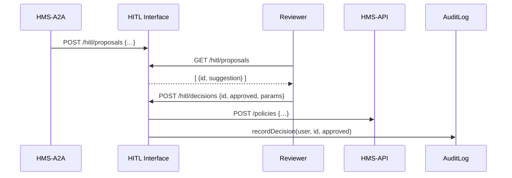

# Chapter 6: Human-in-the-Loop (HITL) Oversight

Welcome back! In [Chapter 5: AI Representative Agent (HMS-A2A)](05_ai_representative_agent__hms_a2a__.md), we saw how our agent can auto-suggest policy tweaks. Now we’ll add a crucial safety net: **Human-in-the-Loop (HITL) Oversight**. This is where a real person reviews AI proposals—just like a legislative committee checks a drafted bill—before anything goes live.

---

## 1. Why HITL Oversight?

Imagine the AI suggests “Fast-track FOIA requests filed on weekends.” We want a government official to:

1. See exactly what the AI proposed.  
2. Tweak parameters (e.g., only weekends with low volume).  
3. Approve or reject the suggestion.  
4. Keep an audit trail for accountability.

HITL ensures we stay within policy bounds, maintain transparency, and catch any odd recommendations.

---

## 2. Key Concepts

1. **Proposal Queue**  
   A list of AI-generated recommendations waiting for human review.

2. **Review Form**  
   A UI where officials can inspect, override, or reject each suggestion.

3. **Approval Action**  
   The button or endpoint that sends the final decision to production.

4. **Audit Log**  
   A record of who approved what and when—essential for compliance.

5. **Fallback**  
   If no one reviews a proposal within a time window, it can be escalated or auto-rejected.

---

## 3. Solving the FOIA Backlog Use Case

Here’s the high-level flow when the AI agent posts a new suggestion and an official approves it:



---

## 4. HITL Interface: Fetching Proposals

First, we need an endpoint to list pending proposals.  
_File: `hitl-server/src/routes/proposals.js`_

```js
const express = require('express');
const router = express.Router();
const { list, decide } = require('../handlers/proposals');

router.get('/hitl/proposals', list);      // Fetch AI suggestions
router.post('/hitl/decisions', decide);   // Submit human decision

module.exports = router;
```

Explanation:  
- `GET /hitl/proposals` returns AI-generated items.  
- `POST /hitl/decisions` accepts review outcomes.

---

## 5. Review Handler Logic

_File: `hitl-server/src/handlers/proposals.js`_

```js
const apiClient = require('../../backend/apiClient');
const audit = require('../lib/auditLog');

async function list(req, res) {
  // In reality, fetch from a queue or DB
  const proposals = await apiClient.get('/pending-policies');
  res.json(proposals);
}

async function decide(req, res) {
  const { id, approved, params } = req.body;
  if (approved) {
    // Send to live policy API
    await apiClient.post('/policies', { id, params });
  }
  // Always record who did what
  await audit.record(req.user.id, id, approved);
  res.json({ status: 'ok' });
}

module.exports = { list, decide };
```

Explanation:  
1. `list` pulls AI suggestions.  
2. `decide` forwards approved policies and logs every action.

---

## 6. Reviewer UI Snippet

Here’s a minimal React component for officials to review one proposal.  
_File: `hms-gov/src/components/HitlReview.js`_

```js
import React, { useState, useEffect } from 'react';

function HitlReview() {
  const [items, setItems] = useState([]);
  useEffect(() => {
    fetch('/hitl/proposals').then(r=>r.json()).then(setItems);
  }, []);

  async function handleDecision(item, ok) {
    await fetch('/hitl/decisions', {
      method:'POST',
      headers:{'Content-Type':'application/json'},
      body: JSON.stringify({ id:item.id, approved:ok, params:item.params })
    });
    alert(ok ? 'Approved!' : 'Rejected');
  }

  return items.map(i => (
    <div key={i.id}>
      <p>{i.suggestion}</p>
      <button onClick={()=>handleDecision(i,true)}>Approve</button>
      <button onClick={()=>handleDecision(i,false)}>Reject</button>
    </div>
  ));
}

export default HitlReview;
```

Explanation:  
- On load, fetch pending suggestions.  
- Show each suggestion with Approve/Reject buttons.  
- Send the decision back to our HITL endpoints.

---

## 7. Under the Hood: What Happens

1. **AI Agent** submits a proposal to `/hitl/proposals`.  
2. **Interface Layer** stores it in a queue or DB.  
3. **Reviewer UI** fetches the list via `GET /hitl/proposals`.  
4. Human inspects, clicks **Approve** or **Reject**.  
5. **Interface Handler** forwards approvals to the live policy API and logs every decision.  
6. **Audit Log** now holds a permanent record for compliance reviews.

This loop ensures accountability and keeps AI-driven actions under policy guardrails.

---

## 8. What We’ve Learned

- **HITL Oversight** places a human review checkpoint before AI changes go live.  
- We built endpoints to **list** proposals and **submit** decisions.  
- A simple React UI lets officials approve or reject suggestions.  
- Every decision is logged for transparency.

Up next, we’ll see how these approved policies are actually stored and served by the core services in [Chapter 7: Backend API (HMS-API/HMS-MKT)](07_backend_api__hms_api_hms_mkt__.md).

---

Generated by [AI Codebase Knowledge Builder](https://github.com/The-Pocket/Tutorial-Codebase-Knowledge)