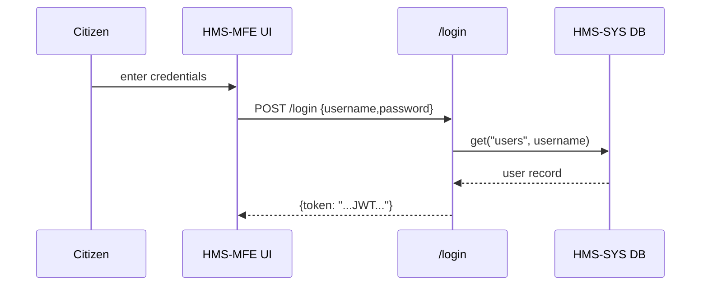
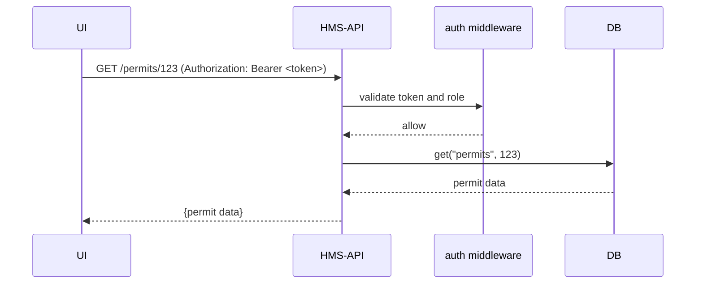

# Chapter 7: Authentication & Authorization

In [Chapter 6: Gov/Admin Platform (HMS-GOV)](06_gov_admin_platform__hms_gov__.md) we saw how administrators review and approve proposals. Before anyone can view or act on those proposals, we need a secure layer of **Authentication** (who you are) and **Authorization** (what you can do)—just like border control and visa stamps for our digital government.

---

## 1. Motivation: Who Gets In and What Can They Do?

Imagine two users:

- A **citizen** logs in to check their benefit status. They must see *only* their own records.  
- A **policy official** logs in to approve or modify proposals. They have elevated permissions.

Without proper auth:

- Anyone could view or change another citizen’s data.  
- Citizens might accidentally approve policy changes.

By adding:

- **Authentication** → we verify identities (username/password → token).  
- **Authorization** → we grant or deny actions based on roles (`citizen`, `official`, `admin`).

we keep sensitive data safe and enforce clear access rules.

---

## 2. Key Concepts

1. Authentication  
   – Verifying identity (e.g., login with username/password).  
2. Authorization  
   – Granting permissions (e.g., only `official` can approve).  
3. Tokens (JWT)  
   – Self-contained “passports” carrying user ID, role, and expiry.  
4. Roles  
   – Labels like `citizen`, `official`, `admin` to group permissions.

---

## 3. Using Auth in HMS-API

### 3.1 Login Endpoint

```python
# file: hms_api/auth.py
from flask import Blueprint, request, jsonify
from hms_sys.db import HMSDatabase
import jwt, datetime

auth = Blueprint('auth', __name__)
db = HMSDatabase.connect("user_db")
SECRET = "supersecret"

@auth.route('/login', methods=['POST'])
def login():
    creds = request.json
    user = db.get("users", creds["username"])
    if user and user["password"] == creds["password"]:
        payload = {
          "sub": user["username"],
          "role": user["role"],
          "exp": datetime.datetime.utcnow() + datetime.timedelta(hours=1)
        }
        token = jwt.encode(payload, SECRET, algorithm="HS256")
        return jsonify({"token": token})
    return jsonify({"error": "Invalid credentials"}), 401
```

Explanation:  
- Users POST `username`/`password`.  
- On success, we issue a JWT token containing their `role` and expiration.

### 3.2 Protecting an Endpoint

```python
# file: hms_api/auth.py (continued)
from functools import wraps
from flask import request

def require_role(role):
    def decorator(fn):
        @wraps(fn)
        def wrapper(*args, **kwargs):
            token = request.headers.get("Authorization", "").split("Bearer ")[-1]
            try:
                data = jwt.decode(token, SECRET, algorithms=["HS256"])
                if data["role"] != role:
                    raise Exception()
                request.user = data["sub"]
                return fn(*args, **kwargs)
            except Exception:
                return jsonify({"error": "Forbidden"}), 403
        return wrapper
    return decorator

@auth.route('/gov/proposals/<int:id>/approve', methods=['POST'])
@require_role("official")
def approve_proposal(id):
    # Only 'official' can approve
    # ... implementation goes here ...
    return jsonify({"status": "approved"})
```

Explanation:  
- The decorator extracts and decodes the JWT.  
- It checks `data["role"]` matches the required role.  
- Unauthorized access returns HTTP 403.

---

## 4. Under the Hood: Sequence Flows

### 4.1 Logging In



1. User submits credentials.  
2. Auth API verifies against the database.  
3. On success, API returns a JWT “passport.”

### 4.2 Calling a Protected Endpoint



1. UI attaches the token to each call.  
2. Middleware decodes the token, checks expiry and role.  
3. On success, the request proceeds.

---

## 5. Internal Implementation Details

### 5.1 JWT Utilities

```python
# file: src/hms_api/jwt_utils.py
import jwt, datetime
SECRET = "supersecret"

def generate_token(user, role):
    payload = {
      "sub": user,
      "role": role,
      "exp": datetime.datetime.utcnow() + datetime.timedelta(hours=1)
    }
    return jwt.encode(payload, SECRET, algorithm="HS256")

def decode_token(token):
    return jwt.decode(token, SECRET, algorithms=["HS256"])
```

Explanation:  
- `generate_token` builds and signs a JWT.  
- `decode_token` verifies signature and expiry.

### 5.2 Registering the Auth Blueprint

```python
# file: src/hms_api/app.py
from flask import Flask
from .auth import auth

app = Flask(__name__)
app.register_blueprint(auth)
# ... register other blueprints from [Chapter 6](06_gov_admin_platform__hms_gov__.md) ...
```

Explanation:  
- We mount `/login` and our protected routes under the `auth` blueprint.

---

## 6. Conclusion

You’ve learned how to secure HMS-NFO using:

- **Authentication**: issue and verify JWT tokens.  
- **Authorization**: restrict actions based on roles (`citizen`, `official`).  
- **Middleware**: decorators that guard endpoints.

With auth in place, only the right people can view or change data. Up next: integrating with outside systems, where these tokens will prove our identity to external APIs.

[Chapter 8: External System Integration](08_external_system_integration_.md)

---

Generated by [AI Codebase Knowledge Builder](https://github.com/The-Pocket/Tutorial-Codebase-Knowledge)