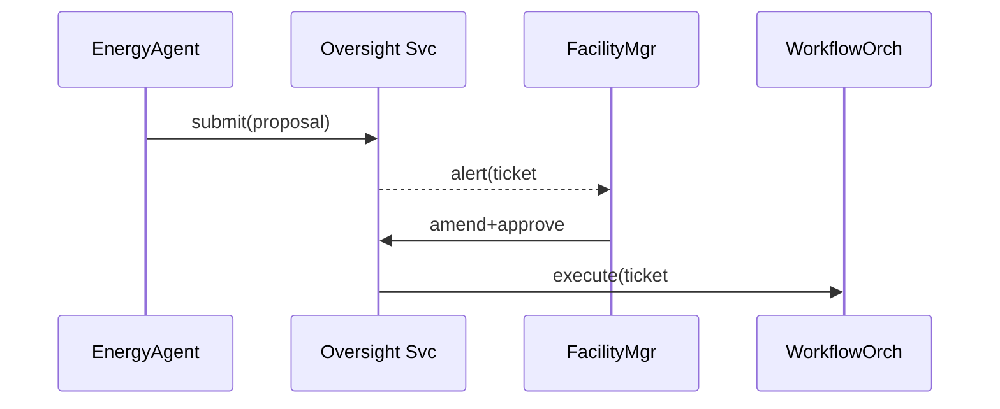

# Chapter 7: Human-in-the-Loop Oversight (HITL)

*(continuing from [AI Agent Framework (HMS-AGT / HMS-AGX)](06_ai_agent_framework__hms_agt___hms_agx__.md))*  

---

## 1 · Why Do We Need a “Big Red Button”?

Picture a **federal courthouse** that wants to cut energy costs.  
An AI agent in HMS-AGT analyses HVAC logs and recommends:

> “Shut off heating on Floor 7 after 4 p.m. to save \$18 000/year.”

Sounds great—unless court night sessions are still in progress!  
With **Human-in-the-Loop Oversight (HITL)** the facility manager gets an alert, inspects the plan, and either:

* Approves it as-is  
* Tweaks the schedule  
* Vetoes it entirely  

HITL is the constitutional brake pedal that earns stakeholder trust.

---

## 2 · Key Ideas in Plain English

| Idea | Beginner Analogy | What It Does |
|------|------------------|--------------|
| Approval Queue | Email inbox | AI suggestions wait for a human “👍 / 👎” |
| Threshold Alert | Smoke alarm | Pings a human when metrics cross a limit |
| Take-Over Button | Car’s hand brake | Instantly pauses the agent & action |
| Veto Record | Court ruling | Stores *who* said “No” and *why* |
| Safe Resume | Green light | Restarts the job after fixes are made |

---

## 3 · Five-Minute Quick-Start

Below we let an agent propose an HVAC change and route it through HITL.

```python
# hvac_oversight.py  (≤18 lines)
from hmshitl import Oversight, Alert, Decision
from hmsagt   import Agent
# 1️⃣ Agent proposes a change
proposal = {
    "action": "reduce_heat",
    "floor": 7,
    "after": "16:00"
}

# 2️⃣ Send to approval queue
hitl = Oversight()
ticket = hitl.submit(proposal, source="EnergyAgent")

# 3️⃣ Manager reviews & tweaks
Decision(ticket)\
   .comment("Keep heat until 18:00—night court.")\
   .amend({"after": "18:00"})\
   .approve()
```

What happens?

1. `submit()` returns a **ticket number** and freezes the agent’s action.  
2. The manager edits the `after` field and approves.  
3. An event is emitted to [Activity & Workflow Orchestrator (HMS-ACT / HMS-OMS)](08_activity___workflow_orchestrator__hms_act___hms_oms__.md); the HVAC schedule updates.

---

### Console Output

```
🟡 Ticket #912 waiting for review…
✍️  Comment saved.
✅ Ticket #912 approved (signature: a1b2c3…)
```

---

## 4 · Life of One Proposal (Step-By-Step)



Only **four** moving parts—easy to audit.

---

## 5 · Under the Hood (Simplified)

### 5.1 Queue Table

```
hitl_queue
┌──id──┬──status──┬─payload─┬─source─┬─created_at─┐
│ 912  │ pending  │ {...}   │ Energy │ 2024-05-01 │
```

*Rows stay *pending* until a signed decision arrives.*

### 5.2 Decision Endpoint (12 lines)

```python
# hmshitl/routes.py
@router.post("/ticket/<id>/decision")
@requires_role("facility_mgr")
def decide(id:str, body:DecisionBody, user:User):
    t = Queue.get(id)
    t.apply(body.amendments)
    t.status = body.approve and "approved" or "rejected"
    t.signed_by = user.id
    t.reason = body.comment
    t.save()
    audit.log("DECISION", user, id, t.status)
    orchestrator.emit("Ticket"+t.status.capitalize(), t.to_event())
    return {"ok": True}
```

• Fewer than 15 lines—nothing mysterious.  
• Every decision triggers an **audit** + **workflow event**.

---

## 6 · Hands-On: Triggering a Veto

1. Run the agent script but request heat **off at 14 °C** (too cold).  
2. The manager clicks **“Reject”** in [Governance Portal (HMS-GOV)](01_governance_portal__hms_gov__.md).  
3. Watch the agent log:

```
⛔ Ticket #913 vetoed — agent paused until review.
```

The agent container is automatically suspended by Kubernetes; no manual SSH needed.

---

## 7 · FAQ for Absolute Beginners

**Q: Do I need a separate server for HITL?**  
A: No. It’s a micro-service already running inside HMS-NFO; you only call its REST or SDK endpoints.

**Q: What if no one responds in time?**  
A: You can set an “auto-reject after X hours” rule in the queue settings.

**Q: Can multiple people review the same ticket?**  
A: Yes—enable **multi-sign**. All required roles must approve before execution.

**Q: How is “Take-Over” different from “Pause”?**  
A: *Take-Over* pauses **and** lets the human manually finish the task; *Pause* just stops the agent until further notice.

---

## 8 · Where HITL Fits in the Big Picture

```mermaid
flowchart LR
    AGT[AI Agents] -->|proposals| HITL
    HITL --> GOV[Governance Portal]
    HITL --> ACT[Workflow Orchestrator]
    HITL --> OPS[Monitoring & Ops (HMS-OPS)]
```

*Every critical path funnels through HITL before becoming reality.*

---

## 9 · Summary & Next Stop

In this chapter you learned:

1. Why HITL is the **constitutional brake pedal** for AI actions.  
2. How to submit, amend, approve, or veto an AI proposal in <20 lines of code.  
3. The simple queue-and-event machinery that powers oversight.  

Next we’ll explore how approved actions flow into coordinated multi-step processes inside the platform: [Activity & Workflow Orchestrator (HMS-ACT / HMS-OMS)](08_activity___workflow_orchestrator__hms_act___hms_oms__.md).

---

Generated by [AI Codebase Knowledge Builder](https://github.com/The-Pocket/Tutorial-Codebase-Knowledge)