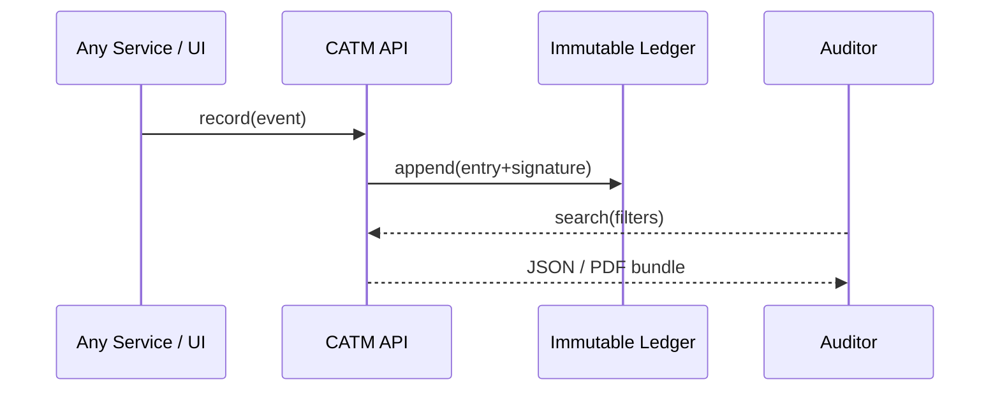

# Chapter 8: Compliance & Audit Trail Module  
*(The platform’s “body-cam” and chain-of-custody box)*  

[← Back to Chapter 7: Human-in-the-Loop (HITL) Oversight](07_human_in_the_loop__hitl__oversight_.md)

---

## 1. Why Should Anyone Care?

Meet **Ravi**, an investigator at the **Office of the Inspector General (OIG)**.  
He receives a congressional request:

> “Show every change that led the AI system to deny rural broadband grants last quarter.”  

Without a **tamper-proof audit trail**, Ravi would:

* Chase scattered log files  
* Compare inconsistent time zones  
* Pray nobody overwrote yesterday’s CSV  

With the **Compliance & Audit Trail Module (CATM)**, he simply opens a filter:

```
Agency      = USDA
Grant Type  = Rural Broadband
Date Range  = 2023-Q2
Action      = deny_grant
```

A few seconds later he exports a digitally signed PDF bundle ready for GAO review.  
This chapter shows how CATM makes that magic possible—and how **you** can record, verify, and retrieve every important event with three tiny helper functions.

---

## 2. Key Concepts (Plain English)

| Term | What It Really Means | Friendly Analogy |
|------|----------------------|------------------|
| Audit Event | One immutable record of “who did what, when.” | A receipt from the cash register. |
| Digital Signature | Cryptographic stamp proving the event was not altered. | Wax seal on a legal letter. |
| Immutable Ledger | Append-only file/db where events live forever. | A bound paper ledger—pages can’t be ripped out. |
| Filter View | Simple query language to slice events by agency, user, or regulation. | Flipbook tabs in a binder. |
| Evidence Package | Zip/PDF containing events + signatures + hashes. | A numbered evidence bag for court. |

**Mnemonic:** *“Ravi Wants Signed, Searchable Receipts.”*

---

## 3. 3-Step Beginner Workflow

We will:

1. Record an event (AI recommends a decision).  
2. Record a second event (human overrides it).  
3. Pull a filtered report for OIG.

### 3.1 Record an Event (10 lines)

```ts
// catm/record.ts
import { sign, append } from "./ledger";

export function record(actor, action, details){
  const event = {
    ts      : Date.now(),
    actor   : actor,          // e.g., "ai_agent_7"
    action  : action,         // e.g., "recommend_deny"
    details : details         // any object ≤ 2KB
  };
  event.sig = sign(event);    // 🔏 adds digital signature
  append(event);              // ➕ writes to ledger
}
```

Explanation  
1. Build a small JSON object.  
2. `sign()` hashes and encrypts it.  
3. `append()` stores it—never to be edited.

---

### 3.2 Record a Human Override (8 lines)

```ts
// somewhere in HITL handler
record("lena.bor", "override_approve", {
  originalEvent : "eventId-1234",
  comment       : "Hydro needs steady power."
});
```

Lena’s name, timestamp, and comment are forever linked to the original AI suggestion.

---

### 3.3 Fetch a Report (18 lines)

```ts
// catm/query.ts
import { load } from "./ledger";

export function search(filters){
  const data = load();                       // returns all events
  return data.filter(e =>
    (!filters.agency  || e.details.agency  === filters.agency ) &&
    (!filters.action  || e.action          === filters.action ) &&
    (!filters.after   || e.ts              >= filters.after  ) &&
    (!filters.before  || e.ts              <= filters.before)
  );
}

// ravi_report.js
const events = search({
  agency : "USDA",
  action : "deny_grant",
  after  : Date.parse("2023-04-01"),
  before : Date.parse("2023-06-30")
});
console.log(events.length, "events found");
```

**Output (console):**  
`42 events found` — ready for export.

---

## 4. What Happens Under the Hood?



1. Every service records **only** through CATM—one entry point.  
2. Ledger is append-only; even admins can’t delete rows.  
3. Auditors query via the same CATM—no direct DB access needed.

---

## 5. Inside the Box (Step-By-Step, No Big Code)

1. **API Layer** receives `record()` / `search()` calls.  
2. **Signature Service**:  
   • Serializes the event → SHA-256 hash → signs with platform private key.  
3. **Ledger Store** (could be DynamoDB, Postgres `INSERT ONLY`, or a simple file) appends the signed event.  
4. **Index Service** writes lightweight fields (timestamp, agency, action) into a searchable index (SQLite or Elasticsearch).  
5. **Export Service** bundles raw events + verification script into a zip/PDF.

---

## 6. Peeking at Implementation Files

```
hms-catm/
  src/
    record.ts       // tiny wrapper shown above
    query.ts        // filter helper
    ledger/
      append.ts     // low-level disk/db write
      load.ts
      verify.ts     // signature checker
    sign/
      sign.ts
      verifySig.ts
```

Beginners can open any file and understand it in under a minute.

---

### 6.1 Tiny Ledger Append (15 lines)

```ts
// ledger/append.ts
import fs from "fs";
const PATH = "ledger.jsonl";   // 1-event-per-line

export function append(event){
  fs.appendFileSync(PATH, JSON.stringify(event) + "\n");
}
```

Simple text file demo—swap for a real database later.

---

### 6.2 Verify Signature (14 lines)

```ts
// sign/verifySig.ts
import crypto from "crypto";
import { PUBLIC_KEY } from "./keys";

export function verify(event){
  const { sig, ...data } = event;
  const verifier = crypto.createVerify("RSA-SHA256");
  verifier.update(JSON.stringify(data));
  return verifier.verify(PUBLIC_KEY, sig, "base64");
}
```

Ravi can run this to confirm no one tampered with a record.

---

## 7. Hands-On Exercise (5 min)

1. Clone `hms-catm`, run `npm start demo`.  
2. Execute:

```bash
node demo/record_ai.js
node demo/record_override.js
node demo/export_report.js
```

3. Open `exports/report.zip`—you’ll find a CSV of events and a `verify.js` script.  
4. `node verify.js` ⇒ prints **“All 2 signatures valid ✅”**.  
You just produced an OIG-ready evidence package!

---

## 8. Common Pitfalls & Quick Fixes

| Pitfall | Symptom | Fix |
|---------|---------|-----|
| Clock Skew | Events out of order | Force UTC everywhere (`ts` in ms) |
| Oversized `details` | Ledger bloat | Enforce ≤ 2 KB JSON schema |
| Missing signature | `verify()` fails | Add unit test: every append must include `sig` |

---

## 9. How CATM Links to Earlier Chapters

* **HITL Oversight** (Chapter 7) calls `record()` for every human decision.  
* **Values Framework** (Chapter 6) logs any value violation attempts.  
* **RBAC** (Chapter 3) ensures only privileged roles can run `search()` or export evidence.

---

## 10. What’s Next?

You now own a **digital body-cam** for every config tweak, AI suggestion, and human override.  
Auditors, IGs, or the GAO ask—CATM answers with cryptographic confidence.

Ready to meet the specialized AI helpers that will generate many of these audit events?  
Jump to [Chapter 9: Specialized AI Agents (HMS-A2A)](09_specialized_ai_agents__hms_a2a__.md).

---

---

Generated by [AI Codebase Knowledge Builder](https://github.com/The-Pocket/Tutorial-Codebase-Knowledge)