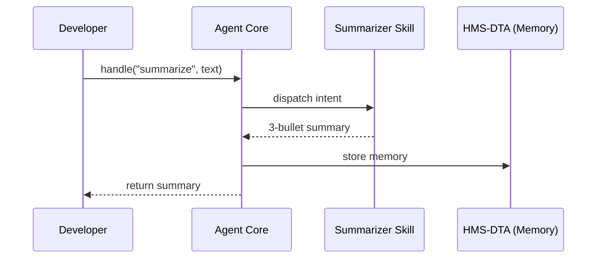

# Chapter 9: Agent Framework (HMS-AGT) & Extensions (HMS-AGX)

*(linked from [Financial Transaction Hub (HMS-ACH)](08_financial_transaction_hub__hms_ach__.md))*  

---

## 1. Why Build “Digital Employees” at All?

Imagine the **Bureau of Land Management (BLM)** receives thousands of oil-and-gas permit applications every month.  
A staff analyst must:

1. Read a 60-page application.  
2. Check that fees were paid (see [HMS-ACH](08_financial_transaction_hub__hms_ach__.md)).  
3. Verify compliance rules (see [HMS-ESQ](03_legal___compliance_reasoner__hms_esq__.md)).  
4. Draft a *routing workflow* so different offices review in the right order.

One analyst can finish maybe **3** files a day.

Now picture a **Policy-Drafting Agent** that:

* Reads the PDF within seconds.  
* Pulls fee status from HMS-ACH.  
* Calls HMS-ESQ to flag legal issues.  
* Produces a step-by-step workflow proposal ready for human sign-off in [HITL](04_human_in_the_loop_oversight__hitl__.md).

That agent is born from **HMS-AGT** (the skeleton) and **HMS-AGX** (the skill add-ons).  
This chapter shows you—*in under 20 lines of code*—how to create one.

---

## 2. Key Concepts (Plain-English Cheat-Sheet)

| Concept | What It Really Means | Government Analogy |
|---------|---------------------|--------------------|
| Agent (HMS-AGT) | A Python/Rust class with identity, memory, and a message inbox. | A federal employee with a badge and email. |
| Persona | The agent’s “business card” (name, mission, security level). | SF-50 personnel record. |
| Memory | A place to store past conversations in [HMS-DTA](07_central_data_repository__hms_dta__.md). | Employee’s notebook locked in a cabinet. |
| Skill (AGX) | Plug-in that handles a specific intent (summarize, schedule, draft policy). | Specialized training course (e.g., FOIA officer). |
| Extension Pack | A bundle of related skills (e.g., “Legislative Kit”). | Agency training academy bundle. |
| Message Bus | Light-weight channel agents use to talk to each other. | Government email/Slack. |

---

## 3. Five-Minute Walk-Through  
### Goal: Summarize a 100-Page Environmental Report into 3 Bullet Points

#### 3.1  Install & Import

```bash
pip install hms-agt hms-agx
```

```python
# file: demo_summarize.py
from hms_agt import Agent
from hms_agx.skills import TextSummarizer
```

#### 3.2  Spin Up an Agent

```python
# ≤ 15 lines
blm_agent = Agent(
    persona = {
        "name":  "BLM_PolicyDrafter_001",
        "role":  "Environmental Summary Assistant",
        "clearance": "FOUO"
    }
)

# Add the summarization skill
blm_agent.add_skill(TextSummarizer(max_bullets=3))

# Feed a long report (pretend string)
with open("EIS_report.txt") as f:
    report = f.read()

summary = blm_agent.handle("summarize", {"text": report})
print("\n".join(summary))
```

Expected console output (truncated):  
```
• Project impacts <5% of protected sage grouse habitat.  
• Water usage stays below NEPA thresholds with existing wells.  
• Public comment period shows 78% local support.  
```

Congratulations—your *digital employee* just saved hours of reading.

---

## 4. What Magic Happened Behind the Curtain?



Only **five actors** keep the mental load tiny.

---

## 5. Anatomy of an HMS-AGT Agent (≤20 Lines)

```python
# file: hms_agt/core.py   -- simplified
class Agent:
    def __init__(self, persona):
        self.persona = persona
        self.skills  = {}
        self.memory  = MemoryStore(persona["name"])  # wrapper over HMS-DTA

    def add_skill(self, skill):
        self.skills[skill.intent] = skill

    def handle(self, intent, payload):
        self.memory.store({"intent": intent, "in": payload})
        result = self.skills[intent].run(payload)
        self.memory.store({"intent": intent, "out": result})
        return result
```

Key takeaways:  
* **Only 9 functional lines** define identity, skills, and memory.  
* Memory simply dumps JSON rows to HMS-DTA—no SQL required.

---

## 6. Inside an AGX Skill (Policy Draft Example)

```python
# file: my_skills/policy_drafter.py
class PolicyDrafter:
    intent = "draft_policy"

    def run(self, payload):
        # payload = {'application_json': {...}}
        data = payload["application_json"]
        # 1) Pull fee & legal status
        fee_ok = check_fee(data["fee_txn"])        # calls HMS-ACH
        issues = legal_scan(data)                  # calls HMS-ESQ
        # 2) Craft a workflow string
        steps = [
            "Step 1 – Field Review Office",
            "Step 2 – Regional Supervisor" if fee_ok else "Step 2 – Finance Hold",
            "Step 3 – Legal Counsel" if issues else "Skip Legal"
        ]
        return {"workflow": steps}
```

Attach it exactly like earlier:

```python
blm_agent.add_skill(PolicyDrafter())
proposal = blm_agent.handle("draft_policy", {"application_json": app})
```

Output might be:

```json
{
  "workflow": [
    "Step 1 – Field Review Office",
    "Step 2 – Regional Supervisor",
    "Step 3 – Legal Counsel"
  ]
}
```

---

## 7. How Agents Plug into the Larger HMS Universe

* **Memory** → writes to [HMS-DTA](07_central_data_repository__hms_dta__.md).  
* **Sensitive actions** → paused via [HITL](04_human_in_the_loop_oversight__hitl__.md).  
* **Legal checks** → performed by [HMS-ESQ](03_legal___compliance_reasoner__hms_esq__.md).  
* **Payments** → verified through [HMS-ACH](08_financial_transaction_hub__hms_ach__.md).  
* **Performance metrics** → events forwarded to [APMT](05_accountability___performance_metrics_tracker_.md).

In short, AGT is the **brains**, the other layers are the **muscles, nerves, and paperwork**.

---

## 8. Hands-On Mini-Lab (10 Minutes)

1. Clone the examples:  
   `git clone https://github.com/example/hms-nfo.git`  
2. `cd hms-nfo/examples/agt_lab`  
3. Run `python demo_summarize.py` – watch the 3-bullet output.  
4. Open the mock DTA UI (`http://localhost:9400/ui`) and see the saved memory rows.  
5. Extend `policy_drafter.py` to add “Step 4 – Public Comment” and re-run.  

You just created, ran, and modified a federal “digital employee”!

---

## 9. Recap

* **HMS-AGT** gives every agent a badge (persona), a notebook (memory), and an inbox (message bus).  
* **HMS-AGX** supplies ready-made *skills*—summarizing, scheduling, policy drafting.  
* Less than **20 lines of glue code** let you build powerful automation that still plays nicely with governance, legal, and financial controls.  

Ready to see how *many* agents coordinate together to tackle bigger missions (like end-to-end permit processing)?  
Jump to: [Agent Orchestration (HMS-ACT)](10_agent_orchestration__hms_act__.md)

---

Generated by [AI Codebase Knowledge Builder](https://github.com/The-Pocket/Tutorial-Codebase-Knowledge)