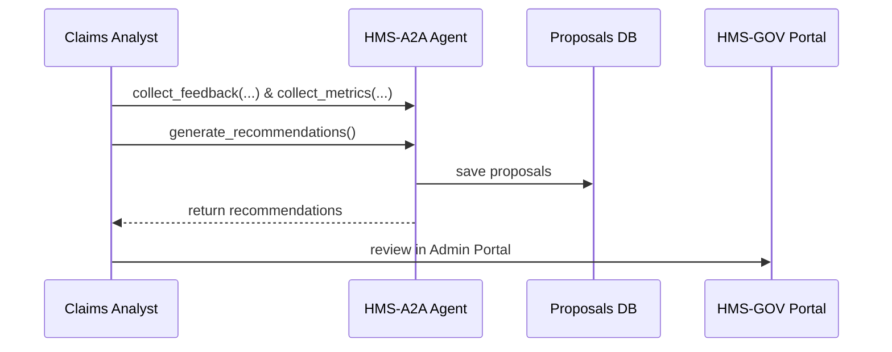

# Chapter 11: AI Representative Agent (HMS-A2A)

In [Chapter 10: Intent-Driven Navigation](10_intent_driven_navigation_.md) we learned how to guide users step-by-step through complex workflows. Now, we’ll introduce the **AI Representative Agent (HMS-A2A)**—a smart junior advisor embedded in the platform that gathers feedback, system metrics, and stakeholder input to propose policy or process optimizations.

---

## 1. Motivation: Why an AI Representative Agent?

Imagine the Department of Veterans Affairs (VA) is noticing that disability claims are taking 45 days on average instead of the target 30 days. Human teams struggle to spot subtle bottlenecks across dozens of regional offices. HMS-A2A acts like a policy intern who:

1. Collects user feedback (“My claim stalled in routing.”)  
2. Gathers system metrics (average queue length, processing time).  
3. Analyzes the combined data.  
4. Proposes optimizations (e.g., “Route claims from Texas to the new processing center”).  

These proposals appear in the [Gov/Admin Platform (HMS-GOV)](06_gov_admin_platform__hms_gov__.md) for review and approval—keeping human decision-makers in charge.

---

## 2. Key Concepts

1. **Data Collection**  
   – Feedback from users, system logs, throughput metrics.  
2. **Analysis Engine**  
   – Algorithms that detect patterns (bottlenecks, anomalies).  
3. **Recommendation Objects**  
   – Proposed changes (new routing rules, staffing adjustments).  
4. **Proposal Store**  
   – A database table storing pending recommendations.  
5. **Admin Portal Integration**  
   – Exposes proposals via an API for approval in HMS-GOV.

---

## 3. Using HMS-A2A: A Minimal Example

Below is how a claims analyst might invoke the agent in Python:

```python
# file: agent_client.py
from hms_a2a.agent import A2AAgent

agent = A2AAgent()
# 1. Collect feedback and metrics
agent.collect_feedback({"claim_id": 345, "note": "Delayed in lab"})
agent.collect_metrics({"average_delay_days": 45, "backlog": 120})

# 2. Generate recommendations
recs = agent.generate_recommendations()
print(recs)
# → [{"proposal_id":1,
#     "summary":"Route TX claims to Center B to reduce delay."}]
```

*Explanation:*  
- We instantiate `A2AAgent`.  
- We feed it feedback and metrics.  
- Calling `generate_recommendations()` returns a list of policy/process change suggestions.

---

## 4. What Happens Step-by-Step?



1. **Claims Analyst** feeds feedback and metrics to the agent.  
2. The agent analyzes data and saves proposals to its DB.  
3. Proposals are returned to the analyst, who then reviews them in the [Gov/Admin Platform](06_gov_admin_platform__hms_gov__.md).

---

## 5. Under the Hood: Internal Implementation

### 5.1 The Agent Core

```python
# file: src/hms_a2a/agent.py
class A2AAgent:
    def __init__(self):
        self.feedback = []
        self.metrics = []
        # Connect to the proposals store
        from hms_sys.db import HMSDatabase
        self.db = HMSDatabase.connect("a2a_db")

    def collect_feedback(self, fb):
        self.feedback.append(fb)

    def collect_metrics(self, m):
        self.metrics.append(m)

    def generate_recommendations(self):
        # Simple analysis: if average_delay > 40, propose routing change
        avg = self.metrics[-1].get("average_delay_days", 0)
        recs = []
        if avg > 40:
            proposal = {
              "summary": "Route high-delay claims to Center B",
              "details": {"threshold": 40}
            }
            record = self.db.save("proposals", proposal)
            recs.append({"proposal_id": record["id"], **proposal})
        return recs
```

*Explanation:*  
- We buffer feedback and metrics in memory.  
- A trivial rule checks the latest average delay.  
- If it exceeds 40 days, we save a new proposal in the `proposals` table and return it.

### 5.2 Exposing Recommendations via API

```python
# file: src/hms_a2a/api.py
from flask import Blueprint, jsonify
from .agent import A2AAgent

bp = Blueprint("hms_a2a", __name__)
agent = A2AAgent()

@bp.route("/recommendations", methods=["GET"])
def list_recommendations():
    recs = agent.generate_recommendations()
    return jsonify(recs), 200
```

*Explanation:*  
- We create a Flask Blueprint that listens at `/recommendations`.  
- When HMS-GOV or any client calls this endpoint, the agent runs its analysis and returns current proposals.

---

## 6. Conclusion

In this chapter you learned how the **AI Representative Agent (HMS-A2A)**:

- Acts like a junior policy advisor by collecting feedback and metrics.  
- Analyzes data to detect bottlenecks or opportunities.  
- Generates recommendation objects stored in a proposals database.  
- Exposes an API so administrators can review suggestions in [HMS-GOV](06_gov_admin_platform__hms_gov__.md).

Next up, we’ll ensure these AI suggestions follow clear rules and human oversight in the [AI Governance Layer](12_ai_governance_layer_.md).

---

Generated by [AI Codebase Knowledge Builder](https://github.com/The-Pocket/Tutorial-Codebase-Knowledge)