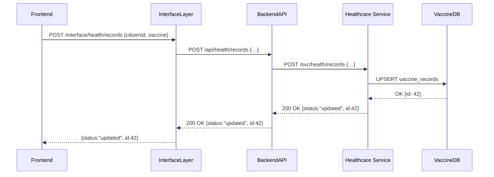

# Chapter 11: Backend Services (HMS-SVC)

In [Chapter 10: Microservices Architecture](10_microservices_architecture_.md) we split our platform into small, focused services. Now we’ll dive into the **workhorses** of our system—**Backend Services (HMS-SVC)**—the modules that implement business logic for each domain (healthcare, education, finance) and expose endpoints for frontends or AI agents.

---

## 1. Why Backend Services?

Imagine a municipal records office. When a citizen asks for their vaccination history, the clerk:

1. Looks up the record.
2. Validates the request.
3. Applies business rules (e.g., only show records from the last 10 years).
4. Returns the result.

Each domain in HMS-NFO needs its own “records office.” That’s what HMS-SVC modules are:

- They own **domain logic** (healthcare rules, education transcripts, grant eligibility).  
- They expose **REST endpoints** that [HMS-API](07_backend_api__hms_api_hms_mkt__.md) calls.  
- They handle **validation**, **data access**, and **error handling**.

---

## 2. Key Concepts

1. **Domain Module**  
   A self-contained service (e.g., Healthcare Service, Education Service).

2. **Endpoints**  
   HTTP routes like `POST /svc/health/records` or `GET /svc/edu/transcripts`.

3. **Business Logic Layer**  
   The “brains” that enforce rules and coordinate data access.

4. **Data Access (DAO/Repository)**  
   Interfaces to the database, caching layer, or other storage.

5. **Validation & Errors**  
   Checking inputs early and returning clear error codes.

---

## 3. A Simple Use Case: Updating a Vaccine Record

Let’s follow a citizen updating their immunization record from end to end.



---

## 4. Exposing the Service Endpoint

File: `services/healthcare/index.js`

```js
const express = require('express');
const recordHandler = require('./handlers/recordHandler');
const app = express();

app.use(express.json());
// Expose the healthcare endpoint
app.post('/svc/health/records', recordHandler.updateRecord);

app.listen(5001, () => console.log('Healthcare Service on port 5001'));
```

Above, we set up an Express server that listens for POSTs and delegates to our handler.

---

## 5. Handler: Thin HTTP Layer

File: `services/healthcare/handlers/recordHandler.js`

```js
const recordService = require('../services/recordService');

async function updateRecord(req, res) {
  // 1. Extract and (implicitly) validate input
  const { citizenId, vaccine } = req.body;
  // 2. Call the business logic
  const result = await recordService.upsertVaccineRecord(citizenId, vaccine);
  // 3. Return a simple JSON response
  res.json({ status: 'updated', id: result.id });
}

module.exports = { updateRecord };
```

This handler is a “telephone operator”—it takes requests, calls the service layer, and returns results.

---

## 6. Business Logic: Service Layer

File: `services/healthcare/services/recordService.js`

```js
const db = require('../lib/db');

async function upsertVaccineRecord(citizenId, vaccine) {
  // 1. Apply domain rules (omitted for brevity)
  // 2. Insert or update the vaccine record in the database
  const [record] = await db('vaccine_records')
    .insert({ citizen_id: citizenId, vaccine, updated_at: new Date() })
    .onConflict('citizen_id')
    .merge(['vaccine', 'updated_at'])
    .returning('*');
  return record;
}

module.exports = { upsertVaccineRecord };
```

Here we enforce business rules (e.g., allowed vaccines) and perform an upsert.

---

## 7. Data Access: Shared DB Library

File: `services/healthcare/lib/db.js`

```js
const knex = require('knex')({
  client: 'pg',
  connection: process.env.DATABASE_URL
});
module.exports = knex;
```

Our `knex` instance abstracts PostgreSQL calls—other services can have their own DB config.

---

## 8. What We’ve Learned

- **HMS-SVC** modules encapsulate business logic per domain.  
- Each service has a **router** (Express), a **handler** (HTTP → Service), and a **service layer** (business rules + data access).  
- The pattern is the same for other domains (Education, Finance):  
  - `services/education/…` for transcripts,  
  - `services/finance/…` for grant calculations, etc.

These Backend Services power the endpoints that frontends and AI agents call.

---

Up next, we’ll build and secure the underlying platform that hosts these services in [Chapter 12: Core Infrastructure (HMS-SYS)](12_core_infrastructure__hms_sys__.md).

---

Generated by [AI Codebase Knowledge Builder](https://github.com/The-Pocket/Tutorial-Codebase-Knowledge)