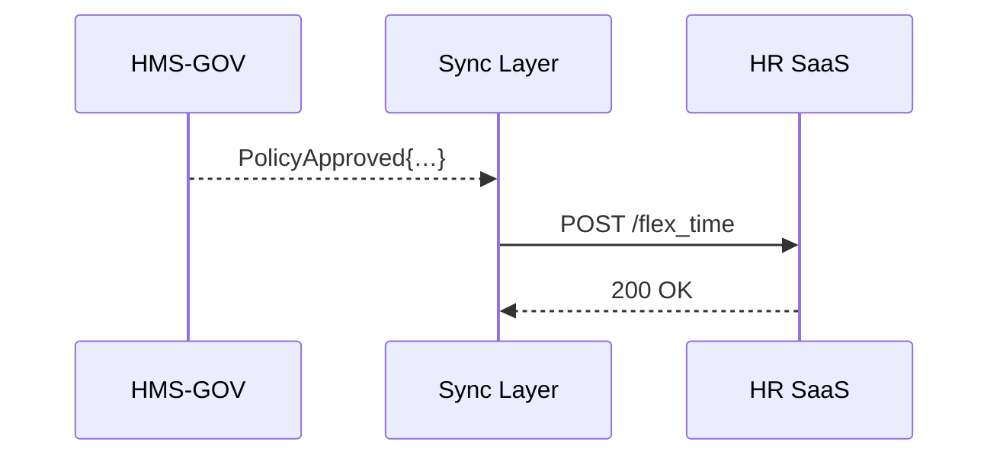

# Chapter 11: External System Sync & Integration Layer

*(coming from [Inter-Agency Communication Hub (HMS-A2A)](10_inter_agency_communication_hub__hms_a2a__.md))*  

---

## 1 · Why Do We Need “Plumbing” Between Systems?

> Use-Case — **Federal Telework Policy Update**  
> 1. A policy officer clicks **“Approve New Telework Plan”** in [HMS-GOV](01_governance_portal__hms_gov__.md).  
> 2. Twenty-five thousand employees must get updated badge-access times in the **Commercial HR SaaS** their agency already pays for.  
> 3. If the update takes hours, night-shift staff are locked out; if it goes out of sync, auditors yell “data silo!”  

The **External System Sync & Integration Layer** (we’ll just say **Sync Layer**) is the _water-pipe_ that keeps HMS data flowing into **non-HMS systems**—commercial HR apps, payroll, scheduling tools, even dusty mainframes—**within seconds** and **without manual exports**.

---

## 2 · Key Concepts (Plain Words)

| Concept | Beginner Analogy | What It Does |
|---------|------------------|--------------|
| Connector | Plug adapter | Knows how to talk to **one** external app |
| Event Stream | Conveyor belt | Carries every HMS change in real-time |
| Mapping | Translation sheet | Turns HMS field `teleworkHours` → HR field `flex_time` |
| Consistency Window | Grace period | Max time before both sides _must_ match (e.g., 60 s) |
| Back-fill Job | Catch-up truck | Re-syncs old data if the external app was offline |

---

## 3 · Five-Minute Quick-Start  
Goal: push the **“Telework Plan v2”** policy from HMS to the external HR SaaS in <20 lines.

```python
# telework_sync.py              (⚠ 18 lines total)
from hms_sync import Connector, Stream

# 1️⃣ Pick the built-in HR connector
hr = Connector("WorkForceNow")            # ADP sample

# 2️⃣ Declare the mapping once
hr.map({
    "teleworkHours":   "flex_time",
    "effectiveDate":   "policy_start",
    "approverEmail":   "last_modified_by"
})

# 3️⃣ Subscribe to the HMS event stream
for evt in Stream("PolicyApproved"):
    if evt["category"] == "Telework":
        hr.push(evt)                      # auto JSON → REST
        print("✅ synced", evt["id"])
```

What you _did not_ write: OAuth tokens, JSON-field mapping code, or retry loops—the Sync Layer hides them.

Typical console:

```
✅ synced policy_9ab34
```

---

## 4 · What Happens Behind the Curtain?



Only **three** hops; the Sync Layer retries & audits automatically.

---

## 5 · Hands-On: Testing Consistency

1. Run `telework_sync.py` (above).  
2. In HMS-GOV approve another dummy telework rule.  
3. Call the HR SaaS manually (curl or UI) and confirm the `flex_time` field updated in **<60 s**—the default _consistency window_.  
4. Kill your internet for 30 s, approve again, then bring it back.  
   The Sync Layer stores events locally and back-fills the HR system as soon as connectivity returns.

---

## 6 · Under the Hood (A Peek)

### 6.1  Event Listener (9 lines)

```python
# hms_sync/events.py
import kafka
bus = kafka.Consumer("hms.events")

def listen(topic):
    for msg in bus.subscribe(topic):
        yield msg.value        # native dict
```

### 6.2  Generic Connector Base (12 lines)

```python
# hms_sync/connector.py
import requests, json, time

class Connector:
    def __init__(self, vendor):
        self.cfg = load_cfg(vendor)       # url, token, retries
        self._map = {}

    def map(self, rules):                 # field map
        self._map = rules

    def push(self, payload):
        body = {self._map[k]: v for k, v in payload.items()
                                   if k in self._map}
        for _ in range(self.cfg["retries"]):
            r = requests.post(self.cfg["url"], json=body,
                              headers={"Auth": self.cfg["token"]})
            if r.ok: return
            time.sleep(2)
        raise RuntimeError("Sync failed")
```

Simple, replaceable: want a Payroll connector? Sub-class, override the `.push()` method.

---

## 7 · Common Beginner Questions

**Q: Is this an ETL tool?**  
A: Similar, but it runs in _real-time_ (seconds, not nightly batches) and is **bi-directional** when needed.

**Q: How do I add a new SaaS app?**  
A: 1) `class MyConnector(Connector): ...`  
   2) Upload API keys in [Governance Portal](01_governance_portal__hms_gov__.md).  
   3) Register with `SyncLayer.register("MyConnector")`. No core rebuild.

**Q: What if the external API schema changes?**  
A: Version each Connector (`v1`, `v2`) and set a *consistency window* overlap; old events flow to `v1` until cut-over.

**Q: Where are the audit logs?**  
A: Same append-only store as other layers inside [Central Data Repository](19_central_data_repository__hms_dta__.md), viewable in the **Sync Dashboard** tab of [HMS-OMS](08_activity___workflow_orchestrator__hms_act___hms_oms__.md).

---

## 8 · How This Layer Talks to the Rest of HMS-NFO

• **Events In** – Receives `UserUpdated`, `PolicyApproved`, etc. from [HMS-SVC](09_core_backend_service_layer__hms_svc__.md) and [HMS-ACT](08_activity___workflow_orchestrator__hms_act___hms_oms__.md).  
• **Policy Checks** – Any outbound payload is first scanned by [HMS-ESQ](03_legal_reasoning___compliance_engine__hms_esq__.md) to ensure no privacy violations.  
• **Monitoring** – Sync failures raise alerts in [Monitoring & Operations Center](20_monitoring___operations_center__hms_ops__.md).  
• **Human Overrides** – A stuck payload can be re-played or edited via [Human-in-the-Loop Oversight](07_human_in_the_loop_oversight__hitl__.md).

---

## 9 · Summary & What’s Next

You learned:

1. Why the **Sync Layer** is the _plumbing_ that prevents data silos.  
2. How a 17-line script mirrored a **telework policy** into an external HR system.  
3. The simple internals—event listener + mapping + connector—with automatic retries and audits.

Ready to handle **money flows** with the same confidence?  
On to [Financial Transaction Core (HMS-ACH)](12_financial_transaction_core__hms_ach__.md)!

---

Generated by [AI Codebase Knowledge Builder](https://github.com/The-Pocket/Tutorial-Codebase-Knowledge)