# Chapter 11: Model Context Protocol (HMS-MCP)

*(linked from [Agent Orchestration (HMS-ACT)](10_agent_orchestration__hms_act__.md))*  

---

## 1. Why Do Agents Need a “Diplomatic Language”?

Picture **three** digital employees (agents) at the **Center for Food Safety and Applied Nutrition (CFSAN)** trying to decide if a new snack bar can enter the U.S. market:

1. **Ingredient-Scanner** – reads the label and detects *“contains hemp extract.”*  
2. **Legal-Checker** – knows hemp is legal only below 0.3 % THC.  
3. **Citation-Bot** – must show the exact FDA regulation paragraph to a human reviewer in [HITL](04_human_in_the_loop_oversight__hitl__.md).

If each agent dumps raw text in its own style (“Mostly OK 👍”, “True/False”,  paragraph citations, etc.), the next agent—and the human—won’t understand.

**Model Context Protocol (HMS-MCP)** is the **single, standardized envelope** every agent uses to:

* Ask another agent (or tool) for help.  
* Share its chain-of-thought **transparently**.  
* Attach verifiable citations.  

Think of MCP as the **UN interpreter** for digital employees.

---

## 2. Key Concepts (Plain-English Cheat-Sheet)

| MCP Term | Plain Meaning | Analogy |
|----------|---------------|---------|
| `call`   | The tool or agent you want. | Dialing a colleague’s extension. |
| `input`  | Data you hand over (JSON or text). | Sliding a folder across the desk. |
| `thought`| A short reasoning step (optional). | “I think the sodium is too high.” |
| `cite`   | Source for the thought (`url` + line range). | Footnote in a legal memo. |
| `result` | Output once the call finishes. | The signed decision form. |
| `ok`     | Boolean flag: did the call succeed? | “Mission accomplished” stamp. |

One MCP message is just a **dictionary** (or JSON object) with those keys—nothing more.

---

## 3. A Five-Minute Walk-Through  
### Goal: Scan the snack bar label, check legality, produce a human-friendly report.

#### 3.1  Ingredient-Scanner Emits an MCP Message

```python
# file: ingredient_scanner.py  (≤15 lines)
from hms_mcp import send

msg = send({
    "call":  "read_label",
    "input": {"image_url": "https://imgs.gov/bar.jpg"},
    "thought": "Need text before any legal check."
})
print(msg)        # <- returns another MCP dict
```

Sample returned MCP (pretty-printed):

```json
{
  "ok": true,
  "result": {
    "ingredients": "dates, almonds, hemp extract (0.2% THC)"
  },
  "cite": {"url": "s3://labels/bar.jpg", "lines": "full"}
}
```

**What happened?**  
`read_label` (a tiny OCR skill from [HMS-AGX](09_agent_framework__hms_agt____extensions__hms_agx__.md)) extracted text and attached a citation to the raw image.

---

#### 3.2  Legal-Checker Uses the Output

```python
# file: legal_checker.py
from hms_mcp import send

msg = send({
    "call":  "legal_scan",
    "input": {"text": ingredients_string},
    "thought": "Ensure THC < 0.3% per 21 CFR §101.95"
})
```

Returned MCP:

```json
{
  "ok": true,
  "result": "COMPLIANT",
  "cite": {
    "url": "https://www.ecfr.gov/current/title-21/part-101",
    "lines": "§101.95(b)(2)"
  }
}
```

---

#### 3.3  Citation-Bot Crafts the Final Report

```python
report = f"""
✅ Snack bar approved.
Reason: THC level 0.2 % < 0.3 % limit  
Legal ref: {msg['cite']['url']} {msg['cite']['lines']}
"""
send({"call": "log_to_hitl", "input": {"text": report}})
```

Inside [HITL](04_human_in_the_loop_oversight__hitl__.md) the reviewer sees the exact regulation link—no guesswork needed.

---

## 4. Under the Hood – What Does *send()* Really Do?

```mermaid
sequenceDiagram
    participant AG as Calling Agent
    participant MCP as MCP Router
    participant SK as Target Skill/Agent
    participant AUD as Audit Ledger
    AG->>MCP: MCP dict (call, input, thought…)
    MCP->>AUD: log message
    MCP->>SK: forward input
    SK-->>MCP: result
    MCP->>AG: MCP dict (ok, result, cite…)
```



Only **four participants** = easy mental model.

---

## 5. Inside the Code (≤20 Lines Each)

### 5.1  Public Helper (`hms_mcp/__init__.py`)

```python
import requests, uuid, os

MCP_URL = os.getenv("MCP_URL", "https://mcp.gov")

def send(msg):
    # Ensure mandatory keys
    msg.setdefault("thought", "")
    msg.setdefault("cite", None)
    msg["id"] = uuid.uuid4().hex
    res = requests.post(f"{MCP_URL}/message", json=msg).json()
    return res            # another MCP dict
```

Beginner tips:  
* Adds a unique `id` automatically.  
* Falls back to empty `thought`/`cite` so newbies can omit them.

### 5.2  Router Endpoint (`mcp/router.py`)

```python
from fastapi import FastAPI
from .registry import dispatch, log
app = FastAPI()

@app.post("/message")
def route(msg: dict):
    log(msg)                          # audit first!
    result = dispatch(msg["call"], msg["input"])
    return {
        "ok":  result.get("ok", True),
        "result": result.get("data"),
        "cite": result.get("cite")
    }
```

Key points:  
* `log()` writes raw JSON to [HMS-DTA](07_central_data_repository__hms_dta__.md) → chain-of-thought is **never lost**.  
* `dispatch()` is just a lookup table mapping `call` → Python function (≤5 lines, omitted).

---

## 6. How MCP Plays with Other Layers

• **Agents** (from [HMS-AGT](09_agent_framework__hms_agt____extensions__hms_agx__.md)) call `send()` instead of raw function calls—no tight coupling.  
• **Orchestration** ([HMS-ACT](10_agent_orchestration__hms_act__.md)) uses MCP logs to build a timeline of who called what during each runway slot.  
• **Oversight** ([HITL](04_human_in_the_loop_oversight__hitl__.md)) can display every `thought` + `cite` for transparent review.  
• **Metrics** ([Accountability Tracker](05_accountability___performance_metrics_tracker_.md)) computes “citation coverage” (percentage of calls that include `cite`) to avoid hallucinations.

---

## 7. Hands-On Mini-Lab (10 min)

1. Clone mini demo  
   `git clone https://github.com/example/hms-nfo.git`  
2. `python -m mcp.mock_server` (starts router + two dumb skills).  
3. In a second terminal run:

   ```bash
   python examples/mcp/label_flow.py
   ```

4. Open `http://localhost:9600/logs` – watch messages stream:

```
→ call=read_label … thought="Need text…"
← ok=True result.ingredients=…
→ call=legal_scan …
← ok=True result=COMPLIANT cite=§101.95(b)(2)
```

Congrats—your agents spoke fluent MCP, and you saw every brain-cell they used!

---

## 8. FAQ Quick-Fire

**Q:** Is sharing `thought` always safe?  
**A:** Sensitive reasoning can be redacted (`thought_redacted=true`), still logged for internal auditors.

**Q:** Do I *have* to include `cite`?  
**A:** Policy-configurable. For high-stakes calls (medical, financial) MCP Router rejects messages without citations.

**Q:** How big can `input` be?  
**A:** Up to 16 KB JSON by default—large files should be stored in [HMS-DTA](07_central_data_repository__hms_dta__.md) and referenced via URL.

---

## 9. Recap & Next Step

* **HMS-MCP** is the **language** that keeps agents, tools, and humans on the same page.  
* One tiny dict—`call`, `input`, `thought`, `cite`, `result`, `ok`—delivers transparency and easy auditing.  
* All messages auto-log to HMS-DTA, empowering oversight, replay, and trust.

Ready to **test and train** your agents in a safe playground *before* they hit production?  
Jump to: [Simulation & Training Sandbox (HMS-ESR)](12_simulation___training_sandbox__hms_esr__.md)  

---

---

Generated by [AI Codebase Knowledge Builder](https://github.com/The-Pocket/Tutorial-Codebase-Knowledge)