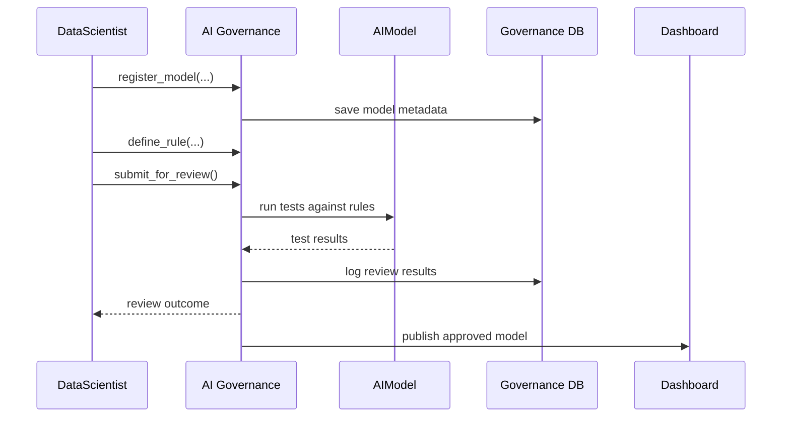

# Chapter 12: AI Governance Layer

In [Chapter 11: AI Representative Agent (HMS-A2A)](11_ai_representative_agent__hms_a2a__.md), we saw how AI can propose policy or process improvements. Before any AI model interacts with citizens or dashboards, we need a “board of directors” to set the ground rules. Welcome to the **AI Governance Layer**!

---

## 1. Motivation: Why an AI Governance Layer?

Imagine the Small Business Administration deploys an AI that recommends loan amounts. To keep public trust, SBA leaders must be confident each recommendation is:

- Fair (no hidden bias against certain regions),  
- Transparent (you can see why the model made each suggestion),  
- Safe (it never exposes private data),  
- Compliant (follows federal privacy and ethics policies).

Without oversight, an AI could accidentally suggest a loan based on prohibited factors (e.g., ZIP codes). The **AI Governance Layer** acts like a university’s ethics committee: it reviews every model **before** it talks to citizens or dashboards.

---

## 2. Key Concepts

1. **Rule Definition**  
   – Define transparency, fairness, privacy, and safety rules.  
2. **Model Registration**  
   – Catalog each AI model with metadata (version, owner, purpose).  
3. **Compliance Checks**  
   – Automated tests to verify rules (e.g., no PII leak).  
4. **Review & Approval Workflow**  
   – Human reviewers inspect logs and tests, then approve or reject.  
5. **Transparency Logs**  
   – Immutable records of every model decision, test result, and approval.

---

## 3. Using the AI Governance Layer

Here’s how a data scientist registers and approves a new credit‐scoring model:

```python
# file: gov/ai_governance_example.py
from hms_ai_gov.layer import AIGovernance

gov = AIGovernance()

# 1. Register the model with metadata
gov.register_model(name="credit_score_v1", owner="DataTeam")

# 2. Define simple rules
gov.define_rule("no_ssn_in_output", lambda output: "ssn" not in output)
gov.define_rule("max_age_bias", lambda stats: stats["age_bias"] < 0.05)

# 3. Submit for review
gov.submit_for_review("credit_score_v1")

# 4. Approve after passing tests
if gov.review_model("credit_score_v1"):
    gov.approve_model("credit_score_v1")
```

Explanation:
- We create an `AIGovernance` instance.  
- We register and tag our model.  
- We add rules that the model must pass.  
- We submit it, run automated tests (`review_model`), and then call `approve_model`.

---

## 4. Step-by-Step Flow



1. **register_model** saves details in the governance database.  
2. **define_rule** attaches compliance checks.  
3. **submit_for_review** triggers automated tests on the AI model.  
4. After passing, **approve_model** publishes it for use in dashboards or APIs.

---

## 5. Under the Hood: Internal Implementation

### 5.1 Core Governance Module

```python
# file: src/hms_ai_gov/layer.py
from hms_sys.db import HMSDatabase

class AIGovernance:
    def __init__(self):
        self.db = HMSDatabase.connect("gov_ai_db")
        self.rules = {}

    def register_model(self, name, owner):
        self.db.save("models", {"name": name, "owner": owner})

    def define_rule(self, model, fn):
        self.rules.setdefault(model, []).append(fn)

    def submit_for_review(self, model):
        self.db.save("reviews", {"model": model, "status": "pending"})

    def review_model(self, model):
        results = [rule(self._load_output(model)) 
                   for rule in self.rules.get(model, [])]
        self.db.update("reviews", model, {"status": all(results)})
        return all(results)

    def approve_model(self, model):
        self.db.update("models", model, {"approved": True})
```

Explanation:
- `rules` holds checks per model.  
- `review_model` runs each rule against a dummy output or stats.  
- Outcomes are logged in `reviews` and `models` tables.

### 5.2 Transparency Logging

```python
# file: src/hms_ai_gov/logging.py
from hms_sys.bus import HMSBus

class TransparencyLog:
    def __init__(self):
        self.bus = HMSBus.connect()

    def record(self, event_type, details):
        # Publish immutable review/approval events
        self.bus.publish("ai_gov.log", {"event": event_type, **details})
```

Every rule check, review decision, and approval fires an event on the [HMS-SYS Messaging Bus](01_core_system_platform__hms_sys__.md), ensuring an audit trail.

---

## 6. Conclusion

You’ve now learned how the **AI Governance Layer**:

- Registers and catalogs AI models,  
- Defines and runs compliance rules,  
- Manages a human-in-the-loop review and approval workflow,  
- Logs every step for full transparency.

With this foundation, your agency can trust AI-driven recommendations are fair, safe, and policy-compliant. Up next, we’ll dive deeper into legal and policy specifics in [Compliance & Regulatory Framework](13_compliance___regulatory_framework_.md).

---

Generated by [AI Codebase Knowledge Builder](https://github.com/The-Pocket/Tutorial-Codebase-Knowledge)