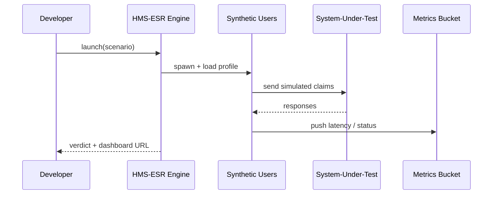

# Chapter 12: Simulation & Training Sandbox (HMS-ESR)

*(linked from [Model Context Protocol (HMS-MCP)](11_model_context_protocol__hms_mcp__.md))*  

---

## 1. Why Do We Need a “Flight Simulator” for Bureaucracy?

Picture the U.S. Department of Labor (DOL) rolling out a **brand-new rule**:

> “Unemployment-insurance claims must be processed in **48 hours** instead of 7 days.”

Great for citizens, risky for IT:

1. **Servers** might melt under the surge of weekend claims.  
2. **Agents** could miss hidden corner cases.  
3. A bad rollout means real families wait for money.

**Simulation & Training Sandbox (HMS-ESR)** lets DOL run the rule in a **parallel universe** first.  
It spins up *synthetic citizens*, *fake payments*, and a **time-accelerated clock** so you can see a *month* of traffic in *ten minutes*—without touching production.  

> Analogy: Airline pilots practice engine-failures in a flight simulator; agencies practice policy-failures in HMS-ESR.

---

## 2. Key Concepts (Plain-English Cheat-Sheet)

| ESR Term | What It Really Means | Friendly Analogy |
|----------|---------------------|------------------|
| Scenario | JSON recipe describing who does what and when. | A pilot’s “stormy-weather” lesson plan. |
| Synthetic User | Bot that mimics a citizen or employee. | Actor in a disaster-drill. |
| Load Profile | How many requests per minute. | Crowd size at the DMV counter. |
| Assertion | Pass/Fail rule (“95 % processed < 48 h”). | Grading rubric after the drill. |
| Metric Bucket | Place where latency, errors, cost are tallied. | Scoreboard in the simulator cockpit. |
| Time Warp | Ability to advance the clock faster than real time. | Movie fast-forward button. |

---

## 3. Five-Minute Walk-Through  
### Goal: Prove DOL can meet the **48-hour SLA** under **3× normal traffic**.

#### 3.1  Describe the Scenario (≤ 20 lines)

```python
# file: dol_scenario.py
from hms_esr_client import Scenario

scenario = Scenario(
    name="DOL_48h_SLA_Stress",
    duration_hours=24,            # in simulated time
    time_warp=60,                 # 1 real min = 1 sim hour
    load_profile=[                # simple table: hour -> RPS
        ( 0,  5),  # midnight calm
        ( 8, 30),  # morning spike
        (18, 40)   # evening spike
    ],
    assertions=[
        "latency_p95_ms < 2000",
        "sla_48h_success_rate > 0.95"
    ]
)
```

Explanation (plain English):

* `time_warp=60` means the whole **day** finishes in **24 minutes**.  
* `load_profile` stresses the system with up to **40 requests/second**.  
* Two **assertions** decide pass/fail.

---

#### 3.2  Launch the Simulator

```python
# file: run_simulation.py
from hms_esr_client import launch, report

run_id = launch(scenario, target="prod-like-staging.dol.gov")
print("Simulation started:", run_id)

summary = report(run_id, wait=True)   # blocks until done
print(summary["verdict"])             # => "PASS" or "FAIL"
```

What happens:

1. `launch` spins up **synthetic users** that call the real APIs on the *staging* cluster.  
2. ESR fast-forwards the clock (60×).  
3. `report(wait=True)` streams metrics until the virtual day ends, then prints a green “PASS” (or red “FAIL”).

---

## 4. Under the Hood – Step-by-Step



Only **five participants**—easy to reason about.

---

## 5. Peeking at the Core Code (Super-Tiny)

### 5.1  Public Client Helper (`hms_esr_client.py`)

```python
import requests, time, os
ESR = os.getenv("ESR_URL", "https://esr.gov")

def launch(scenario, target):
    body = scenario.to_dict() | {"target": target}
    return requests.post(f"{ESR}/run", json=body).json()["run_id"]

def report(run_id, wait=False):
    while True:
        r = requests.get(f"{ESR}/run/{run_id}/summary").json()
        if not wait or r["state"] == "FINISHED":
            return r
        time.sleep(5)
```

*Under 15 lines*—beginners can skim.

### 5.2  Simulator Loop (`esr/engine.py`)

```python
def run_loop(run):
    now = 0
    while now < run.duration_hours:
        rps = run.load(now)
        for _ in range(rps):
            spawn_user(run.target)
        tick_timewarp(run.time_warp)
        now += 1
    finalize(run)
```

Highlights:

* `spawn_user` creates a **thread** (or async task) that behaves like a citizen filing a claim.  
* `tick_timewarp()` sleeps **1 second** in real life but moves the sim clock **1 hour** forward.  
* When done, `finalize` evaluates assertions.

---

## 6. Assertions—The Grading Rubric

ESR ships with **one-line** assertion helpers:

```python
latency_p95_ms < 2000            # 95 % faster than 2 s
error_rate < 0.01                # < 1 % failures
sla_48h_success_rate > 0.95      # 95 % met deadline
```

You can also write custom functions:

```python
def cost_per_claim(metrics):
    return metrics["cloud_cost"] / metrics["claims_processed"]
```

Add to scenario: `assertions.append("cost_per_claim < 0.05")`

---

## 7. How ESR Talks to Other Layers

* **Agents** from [HMS-AGT](09_agent_framework__hms_agt____extensions__hms_agx__.md) are loaded with **simulated context** so they believe it’s “Monday 9 a.m.”  
* **Payments** via [HMS-ACH](08_financial_transaction_hub__hms_ach__.md) are redirected to a **fake Treasury sandbox**—no real money moves.  
* **Data writes** land in a **temporary fork** of [HMS-DTA](07_central_data_repository__hms_dta__.md) that auto-purges when the run finishes.  
* **Performance numbers** feed the familiar dashboards in [APMT](05_accountability___performance_metrics_tracker_.md) but are tagged `sim=true` so auditors can filter them out.

---

## 8. Hands-On Mini-Lab (10 Minutes)

1. Clone the repo  
   `git clone https://github.com/example/hms-nfo.git`  
2. Start the local sandbox  
   `python -m esr.mock_server`  
3. Run the walk-through scripts:  

   ```bash
   python dol_scenario.py
   python run_simulation.py
   ```  

4. Browse `http://localhost:9700/dashboard/{run_id}` for live graphs.  
5. Tweak `load_profile` to `rps=80` and watch assertions fail—instant feedback!

---

## 9. FAQ Quick-Fire

**Q:** Can I replay a production outage from last year?  
**A:** Yes. Point ESR at archived logs, set `time_warp=120`, and watch the incident unfold in half the time.

**Q:** Does ESR support **chaos testing** (e.g., kill a database node)?  
**A:** Yes—add `failure_injection=["db_down@hour12"]` to the scenario.

**Q:** How do I train new hires?  
**A:** Give them the **observer dashboard URL** so they can practice decision-making without harming real citizens.

---

## 10. Recap

* **HMS-ESR** is your **risk-free playground**—simulate weeks of policy changes in minutes.  
* Define a **scenario**, launch it, and check the **verdict**—three simple steps.  
* Synthetic users, time warp, and pass/fail assertions keep your agency out of tomorrow’s headlines.

Ready to **polish the front-end** that real citizens will touch once the policy passes the simulator?  
Head over to [Micro-Frontend Interface (HMS-MFE)](13_micro_frontend_interface__hms_mfe__.md).

---

Generated by [AI Codebase Knowledge Builder](https://github.com/The-Pocket/Tutorial-Codebase-Knowledge)