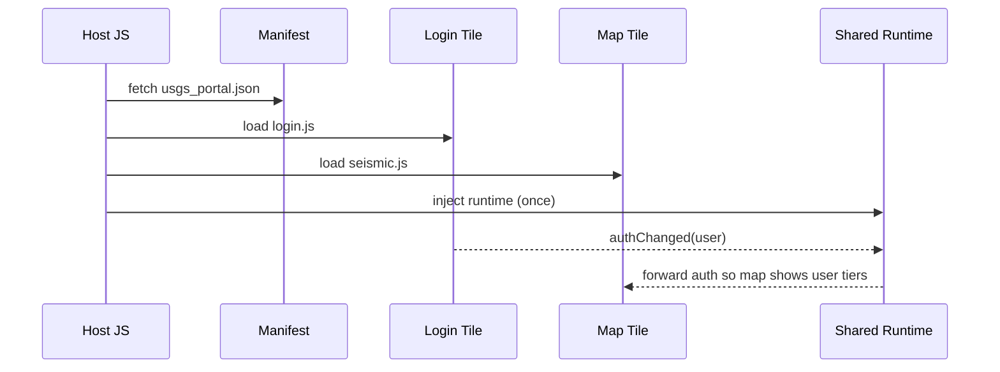

# Chapter 13: Micro-Frontend Interface (HMS-MFE)

*(linked from [Simulation & Training Sandbox (HMS-ESR)](12_simulation___training_sandbox__hms_esr__.md))*  

---

## 1. Why Build “Lego®-Style” Screens?

Imagine a citizen landing on the **U.S. Geological Survey** portal to:

1. Log-in with Login.gov.  
2. See a personalized seismic-activity map.  
3. Chat with a virtual ranger about mining permits.  
4. Pay an application fee.

Four different teams (identity, geospatial, chat-bot, payments) now have to ship **one** seamless page.  
Traditional choices:

* **Monolith:** one giant repo, every team blocks the others.  
* **Iframe soup:** hard to style, impossible to share state.

**Micro-Frontend Interface (HMS-MFE)** solves this by treating every UI block as a **snap-in tile**—just like Lego bricks. Each agency owns its tile, the browser snaps them together, and citizens get one coherent experience.

---

## 2. Key Concepts (Plain English)

| Term | What It Really Means | Analogy |
|------|---------------------|---------|
| Host App | The skeleton page that loads tiles. | Lego base-plate. |
| Tile | One independently-built UI block (React, Vue, plain JS). | A single Lego brick. |
| Tile Manifest | JSON file describing where to fetch the tile & its props. | The picture on a Lego box. |
| Shared Runtime | Tiny JS library that lets tiles talk & share auth. | The studs that make bricks interlock. |
| Design System | CSS + components every tile imports for a common look. | Same color palette for every brick. |

---

## 3. A 5-Minute, 15-Line Walk-Through  
### Goal: Assemble a page with **Login**, **Seismic Map**, and **ACH Payment** tiles.

#### 3.1  Host HTML (7 lines)

```html
<!-- file: index.html -->
<script src="https://cdn.gov/hms-mfe/host.js"></script>
<div id="root"></div>
<script>
  HMS_MFE.boot("usgs_portal.json", "#root");
</script>
```

Explanation:  
1. `host.js` is a 6 KB loader.  
2. `boot()` takes a **manifest** and a DOM node; it does the rest.

#### 3.2  The Manifest (JSON, 14 lines)

```json
{
  "title": "USGS Citizen Portal",
  "tiles": [
    { "name": "login",  "url": "https://tiles.gov/login/v3.js" },
    { "name": "quakes", "url": "https://tiles.gov/seismic/v5.js",
      "props": { "region": "CA" } },
    { "name": "pay",    "url": "https://tiles.gov/ach/v2.js",
      "props": { "feeCode": "MINING_APP" } }
  ]
}
```

The manifest is just a **shopping list** of bricks; nothing more.

#### 3.3  What the Citizen Sees

```
+---------------------------+
| Login Box                |- provided by Identity team
+---------------------------+
| Live Seismic Map (CA)    |- provided by Geo team
+---------------------------+
| Pay Mining Application   |- calls [HMS-ACH](08_financial_transaction_hub__hms_ach__.md)
+---------------------------+
```

No one team touched another’s code!

---

## 4. How Does It Work Under the Hood?



Five participants, zero mystery.

---

## 5. Tiny Peek at Real Code

### 5.1  Host Loader (`host.js`, ≤20 lines shown)

```js
export async function boot(manifestUrl, mountSel){
  const mount = document.querySelector(mountSel);
  const mf = await (await fetch(manifestUrl)).json();

  // load shared runtime first
  await import("https://cdn.gov/hms-mfe/runtime.js");

  // sequentially load tiles
  for (const t of mf.tiles){
    const mod = await import(t.url);
    const el  = await mod.mount(t.props ?? {});   // each tile exports mount()
    mount.appendChild(el);
  }
  document.title = mf.title;
}
```

Beginner takeaways:

1. Uses native `import()`—no frameworks needed.  
2. Each tile just needs to export a `mount()` function returning a DOM node.  

### 5.2  A Minimal Tile Skeleton (`seismic.js`, 18 lines)

```js
import { onAuth } from "https://cdn.gov/hms-mfe/runtime.js";

export function mount(props){
  const div = document.createElement("div");
  div.textContent = "Loading seismic map…";

  // demo: pretend fetch quake data
  setTimeout(()=>{
    div.textContent = `Live quakes for ${props.region}`;
  }, 500);

  // react to auth events
  onAuth(user=>{
    if(!user) div.textContent += " (guest)";
    else      div.textContent += ` (hi ${user.name})`;
  });

  return div;
}
```

Nothing but **vanilla JS**—works in any build pipeline.

---

## 6. Styling & Accessibility

* Tiles import `https://cdn.gov/hms-mfe/design.css` to get fonts, buttons, and the U.S. Web Design System colors.  
* The runtime exposes `announce(text)` for screen-reader alerts so every tile is Section 508 friendly.

---

## 7. How MFE Connects to the Rest of HMS

| Need | Where It Comes From |
|------|--------------------|
| Auth token | Runtime pulls from [HMS-GOV](01_governance_layer__hms_gov__.md) session cookie. |
| Payments | Payment tile calls [HMS-ACH](08_financial_transaction_hub__hms_ach__.md) API. |
| Real-time data | Map tile subscribes to quake events streamed by [HMS-ACT](10_agent_orchestration__hms_act__.md). |
| Legal footers | Shared component links to policies kept by [HMS-ESQ](03_legal___compliance_reasoner__hms_esq__.md). |

Everything snaps together with **zero** duplicated code.

---

## 8. Hands-On Mini-Lab (10 Minutes)

1. Clone the sample repo  

   ```bash
   git clone https://github.com/example/hms-nfo.git
   cd hms-nfo/examples/mfe_lab
   ```

2. Start a super-simple static server  

   ```bash
   npx serve .
   ```

3. Open `http://localhost:3000/index.html` – you’ll see the three tiles load.  
4. Edit `usgs_portal.json` to change `"region": "NV"` and refresh—the map immediately switches to Nevada without touching any other code.

Congrats! You just built a multi-agency portal by editing **one** JSON file.

---

## 9. Recap

* **HMS-MFE** lets every team ship UI blocks autonomously yet keep a unified look.  
* A **host page + manifest** is all you write; tiles do the rest.  
* Shared runtime handles auth, events, and design tokens for you.  
* Perfect match for agile gov teams serving diverse citizen needs.

Ready to guide users **across** those tiles with intent-aware links (e.g., “I want to renew a passport → jump to the right page”)?  
Head to [Intent-Driven Navigation & Journey Engine](14_intent_driven_navigation___journey_engine_.md).

---

---

Generated by [AI Codebase Knowledge Builder](https://github.com/The-Pocket/Tutorial-Codebase-Knowledge)