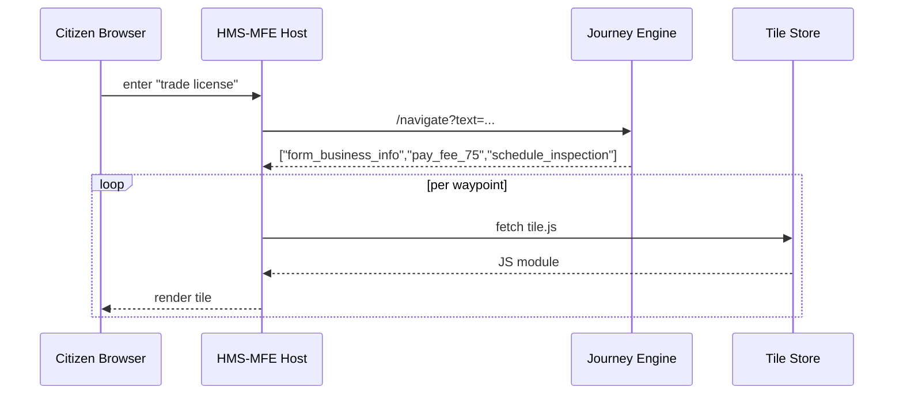

# Chapter 14: Intent-Driven Navigation & Journey Engine  

*(linked from [Micro-Frontend Interface (HMS-MFE)](13_micro_frontend_interface__hms_mfe__.md))*  

---

## 1  Why Bother?  
**Citizen Story:**  
María owns a food truck in New Mexico. She goes to the city website and types:  

> “I need a trade license.”  

She does **not** want to figure out:  
* Which form?  
* Which fee?  
* Which health-inspection step?  

The **Intent-Driven Navigation & Journey Engine (IDN-JE)** acts like **GPS for bureaucracy**:  
1. Detect the **destination** (“get trade license”).  
2. Plot the **shortest legal route** (forms → payments → inspections).  
3. Turn-by-turn guidance via the tiles we built in HMS-MFE.  

Citizens stop hunting menus; agencies stop writing page-by-page instructions.

---

## 2  Key Concepts (Plain-English Cheat-Sheet)

| Term | What It Really Means | Analogy |
|------|---------------------|---------|
| Intent | Desired outcome typed or spoken by user. | “Navigate to 1600 Pennsylvania Ave.” |
| Journey | Ordered list of steps to satisfy the intent. | GPS turn list. |
| Waypoint | One step (form, payment, upload, etc.). | “Turn left on Main St.” |
| Context | Extra facts (location, role) that influence the route. | Traffic & toll settings. |
| Journey Engine | Service that maps intent ➜ journey in real time. | GPS computer in the dash. |

---

## 3  A 5-Minute Walk-Through  

### 3.1  Define Two Intents (developer side, 12 lines)

```jsonc
// file: intents/trade_license.json
{
  "intent": "get_trade_license",
  "utterances": ["trade license", "business permit"],
  "journey": ["form_business_info", "pay_fee_75", "schedule_inspection"]
}
```

```jsonc
// file: intents/passport_renewal.json
{
  "intent": "renew_passport",
  "utterances": ["renew passport", "passport extension"],
  "journey": ["form_passport", "upload_photo", "pay_fee_130"]
}
```

*One JSON file per intent.*  
Each journey is just an **array of waypoint IDs**.

---

### 3.2  Ask the Engine for a Route (front-end, 14 lines)

```js
// file: call_engine.js
import { navigate } from "https://cdn.gov/hms-idn/engineClient.js";

async function handleSearch(text){
  const {journey, intent} = await navigate(text);
  console.log("Matched intent:", intent);
  // Each waypoint becomes a tile inside HMS-MFE
  for(const wp of journey){
    HMS_MFE.addTile(wp);    // helper from previous chapter
  }
}

handleSearch("I need a trade license");
```

Explanation:  
1. `navigate(text)` POSTs the citizen phrase to the Journey Engine.  
2. Returns `{intent, journey}`; in this case `journey = ["form_business_info", …]`.  
3. We loop through waypoints and load matching tiles—zero manual URL routing!

---

## 4  What Happens Behind the Curtain?



*Only four participants* keep the mental model tiny.

---

## 5  Inside the Journey Engine (All ≤ 20 Lines!)

### 5.1  Router Endpoint (`idn/api.py`, 18 lines)

```python
from fastapi import FastAPI
import json, glob, re
app = FastAPI()
# load all intent files into memory once
INTENTS = [json.load(open(f)) for f in glob.glob("intents/*.json")]

def match_intent(text):
    for it in INTENTS:
        if any(r in text.lower() for r in it["utterances"]):
            return it
    return None

@app.get("/navigate")
def nav(text: str):
    it = match_intent(text) or {"journey": ["generic_help"], "intent": "unknown"}
    return {"intent": it["intent"], "journey": it["journey"]}
```

Beginner takeaways:  
* **3** helper lines match utterances with `in` checks—no ML required for MVP.  
* Default fallback is a “Help” journey.

### 5.2  Waypoint Registry (`tiles/registry.json`, 8 lines)

```json
{
  "form_business_info": "https://tiles.gov/forms/business.js",
  "pay_fee_75":         "https://tiles.gov/pay/fee75.js",
  "schedule_inspection":"https://tiles.gov/appointments/inspect.js"
}
```

`HMS_MFE.addTile(id)` simply looks up this registry and loads the URL.

---

## 6  Power Features in One-Liners

| Feature | One-Line Example | Under the Hood |
|---------|-----------------|----------------|
| Role-based branching | `"condition": "user.role == 'veteran'"` | Engine skips steps if false. |
| Payment auto-link | `"waypoint": "pay_fee_$AMOUNT"` | Tile passes amount to [HMS-ACH](08_financial_transaction_hub__hms_ach__.md). |
| Legal gate | `"waypoint": "esq_compliance_check"` | Tile calls [HMS-ESQ](03_legal___compliance_reasoner__hms_esq__.md). |

All are plain JSON; no deep code required.

---

## 7  Hands-On Mini-Lab (10 Minutes)

1. Clone samples  
   ```bash
   git clone https://github.com/example/hms-nfo.git
   cd hms-nfo/examples/idn_lab
   ```  
2. Start mock services  
   ```bash
   python -m idn.mock_server           # Journey Engine
   npx serve tiles                      # tiny static tile server
   ```  
3. Open `index.html`, type “business permit,” watch the three tiles auto-load.  
4. Edit `trade_license.json` to **add** `"upload_insurance"` before payment; refresh and see the extra step appear instantly.

You just re-mapped a bureaucratic journey without touching any front-end code!

---

## 8  How IDN-JE Talks to Other HMS Layers

* Tiles rely on [HMS-MFE](13_micro_frontend_interface__hms_mfe__.md) for rendering.  
* Payment waypoints call [HMS-ACH](08_financial_transaction_hub__hms_ach__.md).  
* Compliance waypoints query [HMS-ESQ](03_legal___compliance_reasoner__hms_esq__.md).  
* Every step completion event is logged to [HMS-DTA](07_central_data_repository__hms_dta__.md) and scored by [APMT](05_accountability___performance_metrics_tracker_.md).  

The Journey Engine is therefore the **traffic cop**, not the road—it decides where to send the user next, while other layers do the heavy lifting.

---

## 9  FAQ Quick-Fire  

**Q:** Can two intents share steps?  
**A:** Yes—waypoints are reusable Lego bricks; “pay_fee_75” can live in many journeys.  

**Q:** Multilingual input?  
**A:** Add extra utterances (`"licencia comercial"`) or plug in a language detector—interface unchanged.  

**Q:** How do I A/B test two journeys?  
**A:** Upload both JSONs and add `"probability":0.5`; the engine randomly picks one and logs which was served.

---

## 10  Recap & Next Stop  

* **IDN-JE** turns a *sentence* into a *check-list* of steps.  
* Journeys are plain JSON → easy for non-developers to edit.  
* Front-end only needs `navigate(text)` and `HMS_MFE.addTile(id)`—no manual routing.  
* Plays nicely with payments, legal checks, and audit logs across HMS-NFO.  

Ready to **share and monetize** your newly built journeys and tiles across agencies?  
Jump ahead to [Marketplace & Discovery Layer (HMS-MKT)](15_marketplace___discovery_layer__hms_mkt__.md).

---

---

Generated by [AI Codebase Knowledge Builder](https://github.com/The-Pocket/Tutorial-Codebase-Knowledge)