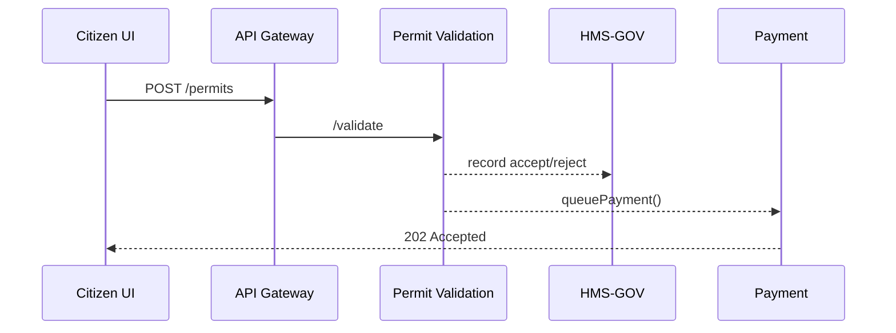

# Chapter 14: Multi-Layered Microservice Architecture
*(Turning one big “monolith” into a bustling, well-zoned city)*  

[← Back to Chapter&nbsp;13: External System Synchronization](13_external_system_synchronization_.md)

---

## 1. Why Do We Need Yet *Another* Layer?

Picture the **Susquehanna River Basin Commission (SRBC)**.  
A new environmental rule says every *industrial* water-withdrawal permit must include a **fish-impact study**.  
What has to change?

1. The **public form** needs a new upload slot.  
2. The **validation service** must reject submissions without the study.  
3. The **analytics dashboard** should graph “Fish Study Attached?” percentages.  
4. Treasury must still receive payment data **unchanged**.  

With a **monolithic** codebase we would:

* Re-deploy the *entire* platform.  
* Risk downtime for **20+** agencies.  
* Break unrelated features (“Why is parcel-tracking 404ing now?”).  

A **Multi-Layered Microservice Architecture (ML-MSA)** slices the platform into **small, focused buildings** (microservices) arranged in **districts** (layers).  
We remodel *one* building—the *Permit Validation Service*—without closing the rest of the city.

---

## 2. Key Concepts (Plain English)

| Term | What It Really Means | City Analogy |
|------|----------------------|--------------|
| Microservice | A single-purpose backend/API. | One shop on Main Street. |
| Layer | Group of related services. | A city district (financial, residential, industrial). |
| API Gateway | Single entry point that routes to services. | City toll booth deciding which road you take. |
| Service Mesh | Common plumbing for traffic, retries, auth. | Water & power pipes running under every street. |
| Domain Boundary | Data/logic each service *owns* exclusively. | Property fence—no neighbor trespassing. |

Acronym Memory Aid: **“GLAMP”**  
*Gateway, Layers, APIs, Mesh, Property (domain) boundaries.*

---

## 3. The SRBC Use-Case, Layer by Layer

```mermaid
flowchart LR
  subgraph Interface
    UI[MFE\n(Chapter 1)]
  end
  subgraph Governance
    GOV[HMS-GOV\n(Chapter 5)]
  end
  subgraph Management
    VAL[Permit-Validation SVC]
    PAY[Payment SVC]
  end
  subgraph Sync
    EXT[Sync Adapter → Treasury\n(Chapter 13)]
  end

  UI -->|POST /permits| VAL
  VAL -->> GOV
  VAL --> PAY
  PAY --> EXT
```

1. Citizen uploads *fish-study.pdf* via **UI**.  
2. **Permit-Validation Service** checks the file; if missing, it politely says “Fish study required.”  
3. Validation logs the decision to **HMS-GOV** for audits.  
4. If valid, it calls **Payment Service**.  
5. Payment posts a message to the **Treasury Sync Adapter**.  
None of the *other* 40+ services even blink.

---

## 4. Mini “Hello, Microservice” Code Tour

### 4.1 Permit Validation Service  –  API (18 lines)

```ts
// src/handlers/permit.ts
import { record } from "@hms-nfo/catm";          // Chapter 8
import { hasFishStudy } from "../rules/fish";
import { queuePayment } from "../clients/payment";

export async function submitPermit(req, res) {
  const ok = await hasFishStudy(req.files);
  record("permit_validation", ok ? "accept" : "reject", { id: req.id });

  if (!ok) return res.status(400).send("🐟 study required");

  await queuePayment(req.id, req.body.fee);
  res.status(202).send("Accepted!");
}
```

*What did we see?*  
• Only **one** concern: “Does the file exist?”  
• Calls out to other services via **clients**—no direct DB poking.

---

### 4.2 Service Registration (10 lines)

```yaml
# docker-compose.yaml (excerpt)
permit-validation:
  build: ./permit-validation
  environment:
    - PORT=7100
    - GOV_API=http://hms-gov:7000
    - PAYMENT_URL=http://payment:7200
  depends_on:
    - payment
```

Start this micro-building without redeploying the rest:

```bash
docker compose up -d permit-validation
```

---

## 5. What Happens Under the Hood? (Step-By-Step)



1. **Gateway** routes the request.  
2. **Validation** owns the *permit* domain—other services *never* touch this data.  
3. Log/audit handled centrally (Chapter 8).  
4. Payment—and only payment—touches money.

---

## 6. Internal File Skeleton

```
permit-validation/
  src/
    handlers/permit.ts
    rules/
      fish.ts
    clients/
      payment.ts
    index.ts          // http server
  Dockerfile
```

Total LOC ≈ 120—easy for a new developer to grok in an afternoon.

---

## 7. How Layers Talk (and *Don’t* Talk)

| Layer | Can Talk To | Cannot Skip |
|-------|-------------|-------------|
| Interface (MFE) | API Gateway | Direct DBs |
| Governance | Any service via events | Citizen browsers |
| Management | Own DB + other services’ APIs | Raw UI calls |
| Sync | External systems | Internal DBs |

Enforced by:

* **API Gateway** rules  
* **RBAC** scopes (see [Chapter 3](03_role_based_access_control__rbac__.md))  
* **Service Mesh** policies (timeouts, retries, mTLS)

---

### 7.1 Sample Mesh Policy (≤ 12 lines)

```yaml
# mesh/permit-validation-policy.yaml
apiVersion: mesh/v1
kind: TrafficPolicy
metadata:
  name: permit-validation
spec:
  destination: permit-validation
  retries: 3
  circuitBreaker:
    maxConnections: 100
```

*If* Validation crashes, requests automatically retry three times; the rest of the city keeps humming.

---

## 8. Hands-On Exercise (≈ 5 min)

1. Clone the sample repo:

```bash
git clone https://github.com/hms-nfo/examples && cd examples/14-mlmsa
```

2. Start two services only:

```bash
docker compose up -d api-gateway permit-validation
```

3. POST a bad permit (no fish study):

```bash
curl -F file=@/tmp/plan.pdf localhost:8080/permits
# → "🐟 study required"
```

4. Add the PDF, re-POST → you’ll get `202 Accepted`.  
5. Bring up **payment** later—other services were never touched. 🎉

---

## 9. Common Pitfalls & Quick Fixes

| Pitfall | Symptom | Fast Fix |
|---------|---------|----------|
| “Chatty” cross-calls | Latency spikes | Move shared logic into a **Domain Service** or cache. |
| Leaky boundaries | Multiple services write same table | Give each service its *own* DB schema; share via events. |
| Version hell | Gateway routes to wrong API | Adopt semantic versions & follow [Continuous Deployment & Versioning](15_continuous_deployment___versioning_.md). |

---

## 10. Recap

A **Multi-Layered Microservice Architecture** lets SRBC—and every other agency—update *one* rule, *one* service, **zero** downtime:

1. **Tiny services** own single responsibilities.  
2. **Layers/districts** keep concerns clean.  
3. **Gateways & Mesh** handle traffic and safety.  
4. **Event bus** + **audit logs** keep everyone honest.  

Up next we’ll learn how to ship these many little buildings to production without chaos using automated pipelines and semantic version tags:  
[Chapter 15: Continuous Deployment & Versioning](15_continuous_deployment___versioning_.md)

---

---

Generated by [AI Codebase Knowledge Builder](https://github.com/The-Pocket/Tutorial-Codebase-Knowledge)