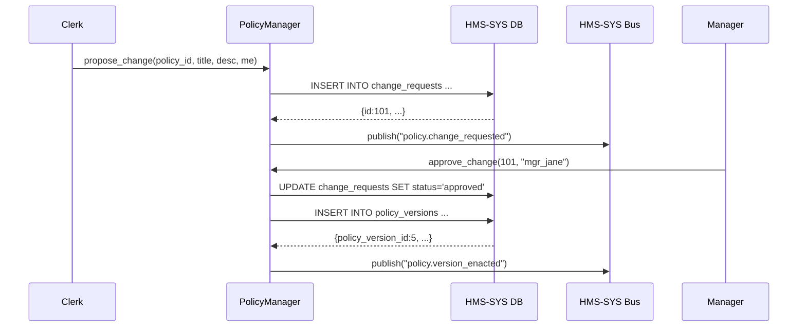

# Chapter 14: Policy Management Module

In [Chapter 13: Compliance & Regulatory Framework](13_compliance___regulatory_framework_.md) we learned how to enforce laws like HIPAA or GDPR before any data operation. Now let’s build the “law library” itself—the **Policy Management Module**—where change requests, versioned policies, enacted rules, and audit trails live.

---

## 1. Motivation: Managing Rules & Amendments

Imagine the Office of Postsecondary Education (OPE) has a grant program for STEM research. They need to:

1. Propose an amendment (e.g., “Increase max award to \$600k”).  
2. Keep older versions of the policy around for audits.  
3. Let senior staff override a change if needed (e.g., freeze new rules during a budget review).  
4. See who proposed or approved each amendment and when.

Without a policy library, these changes scatter across spreadsheets, emails, or siloed databases—making it impossible to track history, enforce consistency, or demonstrate compliance. The **Policy Management Module** solves this by acting like a centralized “law library”:

- Storing **change requests** (proposals).  
- Hosting **versioned policies**.  
- Recording **enacted rules**.  
- Tracking **human overrides** and an **audit trail**.

---

## 2. Key Concepts

1. **Change Request**  
   A draft amendment proposed by a policy clerk or external partner.  

2. **Policy Version**  
   A numbered snapshot of a policy after approval (v1, v2, …).  

3. **Enacted Rule**  
   The active policy text enforced by downstream systems.  

4. **Human Override**  
   A manual freeze or rollback initiated by a senior official.  

5. **Audit Trail**  
   An immutable log of who did what (proposed, approved, overridden) and when.

---

## 3. Using the Policy Management Module

Here’s a minimal Python example showing how to propose, approve, and view policy history. All data is stored via [HMS-SYS Database Service](01_core_system_platform__hms_sys__.md) and events are published on the [HMS-SYS Messaging Bus](01_core_system_platform__hms_sys__.md).

### 3.1 Propose a Change

```python
# file: policy_manager/api.py
from hms_sys.db import HMSDatabase
from hms_sys.bus import HMSBus

db = HMSDatabase.connect("policy_db")
bus = HMSBus.connect()

def propose_change(policy_id, title, description, proposer):
    req = {
      "policy_id": policy_id,
      "title": title,
      "description": description,
      "proposer": proposer,
      "status": "pending"
    }
    record = db.save("change_requests", req)
    bus.publish("policy.change_requested", record)
    return record
```
*Explanation:*  
- We save a new change request with status “pending.”  
- We publish an event so reviewers see the new proposal.

### 3.2 Approve & Enact a Version

```python
# file: policy_manager/api.py (continued)
def approve_change(request_id, approver):
    # 1. Mark request approved
    db.update("change_requests", request_id, {"status":"approved", "approver": approver})
    change = db.get("change_requests", request_id)
    # 2. Create new policy version
    version = {
      "policy_id": change["policy_id"],
      "version": change.get("version", 1),
      "content": change["description"]
    }
    vrec = db.save("policy_versions", version)
    bus.publish("policy.version_enacted", vrec)
    return vrec
```
*Explanation:*  
- We update the change request to “approved.”  
- We save a new version in `policy_versions`.  
- We publish an event so other modules pick up the new rule.

### 3.3 View Version History

```python
# file: policy_manager/api.py (continued)
def get_history(policy_id):
    # Returns all versions and change requests
    versions = db.query("policy_versions", {"policy_id":policy_id})
    changes  = db.query("change_requests", {"policy_id":policy_id})
    return {"versions": versions, "requests": changes}
```
*Explanation:*  
- We query both `policy_versions` and `change_requests` to show a full history.

---

## 4. Step-by-Step Flow

Below is what happens when a clerk proposes an amendment and a manager approves it:



---

## 5. Internal Implementation Details

The core of the module lives in `src/policy_manager/module.py`:

```python
# file: src/policy_manager/module.py
from hms_sys.db import HMSDatabase
from hms_sys.bus import HMSBus

class PolicyManager:
    def __init__(self):
        self.db  = HMSDatabase.connect("policy_db")
        self.bus = HMSBus.connect()

    def propose_change(self, policy_id, title, desc, proposer):
        req = {"policy_id":policy_id, "title":title,
               "description":desc, "proposer":proposer, "status":"pending"}
        rec = self.db.save("change_requests", req)
        self.bus.publish("policy.change_requested", rec)
        return rec

    def approve_change(self, req_id, approver):
        self.db.update("change_requests", req_id,
                       {"status":"approved","approver":approver})
        change = self.db.get("change_requests", req_id)
        version = {"policy_id":change["policy_id"],
                   "version":change.get("version",1),
                   "content":change["description"]}
        vrec = self.db.save("policy_versions", version)
        self.bus.publish("policy.version_enacted", vrec)
        return vrec

    def override(self, version_id, reason, by):
        over = {"version_id":version_id, "reason":reason, "overridden_by":by}
        rec = self.db.save("overrides", over)
        self.bus.publish("policy.override", rec)
        return rec

    def get_history(self, policy_id):
        return {
          "versions": self.db.query("policy_versions", {"policy_id":policy_id}),
          "requests": self.db.query("change_requests",{"policy_id":policy_id})
        }
```
*Explanation:*  
- `propose_change`, `approve_change`, `override`, and `get_history` cover the full lifecycle.  
- Every action writes to the database and publishes an event for transparency.

---

## 6. Conclusion

You’ve now seen how the **Policy Management Module** provides a central “law library” to:

- Store and track **change requests**,  
- Version and **enact rules**,  
- Record **human overrides**,  
- Maintain a complete **audit trail**.

This ensures agencies can review every policy update—vital for compliance and transparency.  

Next up, we’ll learn how to track system health and usage with [Chapter 15: Monitoring & Metrics](15_monitoring___metrics_.md).

---

Generated by [AI Codebase Knowledge Builder](https://github.com/The-Pocket/Tutorial-Codebase-Knowledge)