# Chapter 15: Continuous Deployment & Versioning  
*(The “conveyor belt” that keeps every microservice safe, traceable, and always up-to-date.)*  

[← Back to Chapter&nbsp;14: Multi-Layered Microservice Architecture](14_multi_layered_microservice_architecture_.md)

---

## 1. Why Should We Care?

Meet **Aisha**, a DevOps engineer at the **U.S. Department of Agriculture (USDA)**.  
Her team just:

1. Added a *Spanish-language selector* to the Broadband Grant portal  
2. Fixed a rounding bug in the payout calculation  
3. Upgraded a cryptography library because of a DHS advisory

They need those changes **live today**, but the portal also handles millions of dollars in rural broadband grants.  
One broken deploy could stall payments across 30 states—headline nightmare!

**Continuous Deployment & Versioning (CD&V)** gives Aisha a **friction-free, fully audited conveyor belt**:

* Code commit → automated build → security scan → integration tests → staging → canary → production  
* If something smells off, **one rollback command** puts yesterday’s stable version back online.  
* Every artifact is tagged (`v1.8.2`) so auditors know **exactly** which code processed which grant.

---

## 2. Key Concepts (Plain English)

| Term | What It Really Means | Analogy |
|------|----------------------|---------|
| CI/CD Pipeline | A script that runs every time code changes and decides “ship or stop.” | Airport security line. |
| Immutable Artifact | A compiled container image (`app:v1.8.2`) that never changes. | Sealed evidence bag. |
| Staging Environment | A production-like sandbox with fake data. | Dress rehearsal stage. |
| Canary Release | Deploying to 5 % of real users first. | Taste test before serving the banquet. |
| Semantic Versioning (SemVer) | `MAJOR.MINOR.PATCH` number that tells what changed. | Edition number on a law textbook. |
| Rollback | Instantly swap back to the previous artifact. | Undo button on a typewriter. |

---

## 3. A Concrete Walk-Through: “Spanish Button Goes Live Today”

### 3.1 The Pipeline File (GitHub Actions, 19 lines)

```yaml
# .github/workflows/deploy.yml
name: CD Conveyor Belt

on: [push]

jobs:
  build-test:
    runs-on: ubuntu-latest
    steps:
      - uses: actions/checkout@v3
      - run: npm ci && npm run build          # compile
      - run: npm run test:ci                 # unit tests
      - run: npm run lint                    # code style
      - run: npx snyk test                   # security scan
      - run: docker build -t usda/grant:${{ github.sha }} .
      - run: docker push usda/grant:${{ github.sha }}

  deploy:
    needs: build-test
    environment: staging                     # GitHub env
    runs-on: ubuntu-latest
    steps:
      - run: helm upgrade --install grant charts/ \
              --set image.tag=${{ github.sha }}
```

**What happens?**

1. Every `git push` triggers **build-test**.  
2. If tests & security scans pass, a **Docker image** (`grant:<commit-hash>`) is built and pushed.  
3. **Deploy** job installs that image to the *staging* Kubernetes namespace.

---

### 3.2 Promoting to Production (CLI, 1 line)

```bash
helm upgrade --install grant charts/ -f prod.yaml --set image.tag=v1.8.2
```

• `v1.8.2` is the immutable artifact already tested in staging.  
• Helm’s `--install` works like *replace-in-place* (blue/green deploy).

---

### 3.3 Instant Rollback (1 line)

```bash
helm rollback grant 17      # go back to release #17 in seconds
```

Yesterday’s stable release returns ⏪ —citizens never notice.

---

## 4. How Version Numbers Are Decided

```
v2.0.0 = breaking API change       (MAJOR)
v1.9.0 = new Spanish selector      (MINOR)
v1.8.2 = payout rounding hot-fix   (PATCH)
```

Rule of thumb:

1. **MAJOR** – incompatible; other services must adapt.  
2. **MINOR** – new features; backward compatible.  
3. **PATCH** – bug or security fixes only.

A tiny script bumps the number automatically when `package.json` contains `#major`, `#minor`, or `#patch` in the commit message.

---

## 5. What Happens Under the Hood? (Words + Diagram)

1. Developer pushes code to **GitHub**.  
2. Pipeline builds, tests, scans, and tags an **immutable image**.  
3. Pipeline deploys to **staging**; synthetic tests hit all endpoints.  
4. Human (or bot) promotes the exact same tag to **production**.  
5. Metrics dashboard watches error rate; if > 1 %, pipeline auto-rolls back.

```mermaid
sequenceDiagram
    participant Dev as Developer
    participant GH  as GitHub Actions
    participant STG as Staging K8s
    participant PRD as Prod K8s
    participant MON as Monitor

    Dev->>GH: push code
    GH->>STG: deploy tag t1
    STG-->>GH: tests ✅
    GH->>PRD: canary tag t1 (5%)
    MON-->>GH: error < 1% ✅
    GH->>PRD: full rollout t1
```



---

## 6. Internal File Peek

```
deployment/
  charts/               # Helm templates
  version-bump.js       # auto SemVer helper
.github/
  workflows/deploy.yml  # pipeline file
scripts/
  rollback.sh           # single-command revert
```

---

### 6.1 Auto Version Bumper (Node, 17 lines)

```js
// scripts/version-bump.js
const fs = require("fs");
const pkg = JSON.parse(fs.readFileSync("package.json"));
const msg = process.env.GIT_MSG;

let [maj, min, pat] = pkg.version.split(".").map(Number);
if (msg.includes("#major")) maj++, min=0, pat=0;
else if (msg.includes("#minor")) min++, pat=0;
else pat++;

pkg.version = `${maj}.${min}.${pat}`;
fs.writeFileSync("package.json", JSON.stringify(pkg, null, 2));
console.log("Bumped to", pkg.version);
```

Run as a **pre-commit hook**; the new tag is committed with the code.

---

## 7. Hands-On Exercise (5 min)

1. Fork the sample repo:  

   ```bash
   gh repo clone hms-nfo/grant-portal
   cd grant-portal
   ```

2. Add `#minor` to your commit message and push.  
3. Watch GitHub Actions: pipeline should label the Docker image `vX.Y.0`.  
4. Merge PR; staging auto-updates.  
5. Promote to production:

   ```bash
   gh workflow run promote.yml -f version=vX.Y.0
   ```

6. Break something locally, push `#patch` → rollback script proves painless. 🎉

---

## 8. Common Pitfalls & Quick Fixes

| Pitfall | Symptom | Quick Fix |
|---------|---------|-----------|
| “Works on staging, fails on prod” | Missing env vars | Use the *same* Helm chart values; only secrets differ. |
| Canary never rolls back | Errors hidden by small traffic | Add synthetic health checks that run every second. |
| Version chaos | Two services require different library versions | Pin dependency versions; upgrade via coordinated **MAJOR** bumps. |

---

## 9. How This Connects to Earlier Chapters

* New images are built **per microservice** introduced in [Multi-Layered Microservice Architecture](14_multi_layered_microservice_architecture_.md).  
* Rollbacks still obey **Audit Trail** logging (Chapter 8) — each deploy emits `deploy.started` / `deploy.succeeded`.  
* Canary health checks call **Values Guard** (Chapter 6) to ensure no ethical rules break post-deploy.

---

## 10. What You Learned

You can now:

1. Build an **immutable, signed artifact** on every commit.  
2. March that artifact through security scans, tests, staging, canary, and production—automatically.  
3. Tag each release with clear, auditable **semantic versions**.  
4. Roll back with a single command when alarms scream.

With Continuous Deployment & Versioning, Aisha sleeps better—and rural broadband funds keep flowing without a hitch.

*Congratulations, you’ve reached the end of the HMS-NFO beginner series. Happy shipping!*

---

Generated by [AI Codebase Knowledge Builder](https://github.com/The-Pocket/Tutorial-Codebase-Knowledge)