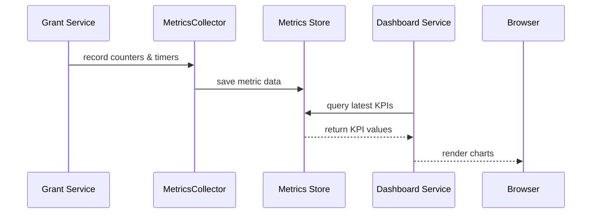

# Chapter 15: Monitoring & Metrics

In the previous chapter, we built a “law library” with the [Policy Management Module](14_policy_management_module_.md). Now it’s time for performance reviews—seeing how our system and processes really perform in the field. Welcome to **Monitoring & Metrics**!

---

## 1. Motivation: Why Monitoring & Metrics Matter

Imagine the Department of Housing and Urban Development (HUD) is processing thousands of grant applications each month. Leaders need to know:

- How long does an application sit in **Review** on average?  
- What percentage of users report a **good experience** on our satisfaction survey?  
- Are **error rates** spiking in any service?  

Without a monitoring layer, you’re flying blind—only hearing about problems when citizens complain. **Monitoring & Metrics** acts like monthly performance reviews for every part of your system. You collect KPIs (processing times, satisfaction scores, error counts), display them in dashboards, and let your AI agents spot inefficiencies and validate the impact of improvements.  

---

## 2. Key Concepts

1. **Metric Types**  
   - **Counter**: counts how many times something happened (e.g., `grant_submissions_total`).  
   - **Histogram / Timer**: measures durations or distributions (e.g., `processing_time_seconds`).  
   - **Gauge**: records arbitrary values at a moment in time (e.g., `active_users`).  

2. **Metrics Collector**  
   A small library embedded in your services to record metrics.  

3. **Metrics Store**  
   A time-series database that holds metric data (could be Prometheus, InfluxDB, or our own simple DB).  

4. **Dashboard**  
   Visual front-end with charts and tables so administrators can track KPIs at a glance.  

5. **Alerts**  
   Rules that trigger notifications when a metric crosses a threshold (e.g., error rate > 1%).

---

## 3. Capturing Metrics: A Simple Example

Below is a minimal Python snippet showing how a “Grant Service” might record several metrics during one request.  

```python
# file: services/grant_service.py
from hms_metrics.collector import MetricsCollector

metrics = MetricsCollector()

def submit_grant(application):
    # Start a timer for processing time
    timer = metrics.start_timer("grant_processing_time_sec")

    try:
        # ... process the application ...
        save_to_db(application)
        metrics.increment("grant_submissions_total")
        user_score = get_user_satisfaction(application.user_id)
        metrics.gauge("user_satisfaction_score", user_score)
    except Exception:
        metrics.increment("grant_errors_total")
        raise
    finally:
        # Stop and record the timer
        timer.stop()
```

Explanation:

- We call `metrics.start_timer()` before work begins.  
- After saving, we increment a **counter** and record a **gauge** for satisfaction.  
- On errors, we increment an error **counter**.  
- Finally, we stop the timer to record duration.

---

## 4. Exposing Metrics to Dashboards

Once metrics are recorded, a dashboard service can query them:

```python
# file: dashboard/query.py
from hms_metrics.store import MetricsStore

store = MetricsStore()

def get_kpis():
    return {
        "total_submissions": store.query_counter("grant_submissions_total"),
        "avg_time_sec":     store.query_histogram_avg("grant_processing_time_sec"),
        "error_rate":       store.query_rate("grant_errors_total"),
        "avg_satisfaction": store.query_gauge_avg("user_satisfaction_score")
    }
```

Explanation:

- `MetricsStore` reads time-series data.  
- We calculate sums, averages, and rates.  
- The result feeds into charts or tables on the admin dashboard.

---

## 5. What Happens Under the Hood?

Here’s a high-level sequence when a grant is submitted and the dashboard updates:



1. The **Grant Service** calls `MetricsCollector` methods.  
2. **MetricsCollector** writes raw data to the **Metrics Store**.  
3. The **Dashboard Service** polls or queries the store for up-to-date KPIs.  
4. Charts in the browser show live numbers.

---

## 6. Internal Implementation: MetricsCollector

Below is a simplified view of how our collector might work, storing metrics in a database table:

```python
# file: src/hms_metrics/collector.py
from hms_sys.db import HMSDatabase
import time

class Timer:
    def __init__(self, name, db):
        self.name = name
        self.db = db
        self.start = time.time()
    def stop(self):
        duration = time.time() - self.start
        self.db.save("histograms", {"name": self.name, "value": duration})

class MetricsCollector:
    def __init__(self):
        self.db = HMSDatabase.connect("metrics_db")
    def increment(self, name, value=1):
        self.db.save("counters", {"name": name, "value": value})
    def gauge(self, name, value):
        self.db.save("gauges", {"name": name, "value": value})
    def start_timer(self, name):
        return Timer(name, self.db)
```

Explanation:

- We use **three tables**: `counters`, `gauges`, and `histograms`.  
- `increment()` inserts a counter record.  
- `gauge()` inserts the current value.  
- `start_timer()` returns a `Timer` object that measures elapsed time and saves it on `stop()`.

---

## 7. Conclusion

In this chapter, you learned how **Monitoring & Metrics**:

- Provides performance reviews for every service and process.  
- Uses **counters**, **timers**, and **gauges** to capture KPIs like processing time, user satisfaction, and error rates.  
- Stores raw metric data in a time-series store and exposes it via a **Dashboard Service**.  
- Enables AI agents or admins to detect inefficiencies and measure the impact of improvements.  

With Monitoring & Metrics in place, your agency can continuously improve service delivery and keep citizens satisfied—now you have the insights to make data-driven decisions!

---

Generated by [AI Codebase Knowledge Builder](https://github.com/The-Pocket/Tutorial-Codebase-Knowledge)