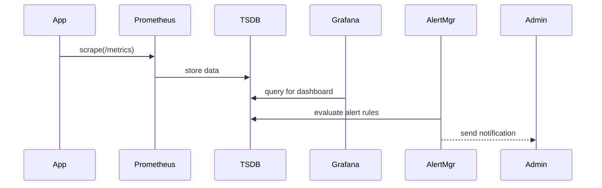

# Chapter 15: Real-Time Metrics & Monitoring

In [Chapter 14: Governance Layer](14_governance_layer_.md) we learned how to enforce high-level policy rules. Now it’s time to **observe** the entire HMS-NFO platform in action with **Real-Time Metrics & Monitoring**—our traffic-camera network that keeps an eye on performance, errors, and user happiness so we can respond instantly.

---

## 1. Why Real-Time Metrics & Monitoring?

Imagine your FOIA request portal feels sluggish on Monday mornings, or error rates spike when thousands of users check status updates. Without live indicators, administrators only find out after citizen complaints flood in. With real-time dashboards and alerts:

- You spot slowdowns the moment they start.  
- You catch elevated error rates before they affect hundreds.  
- You measure user satisfaction (e.g., feedback scores) and tie it to system health.  
- You can even trigger auto-scale or AI-driven policy tweaks for instant relief.

---

## 2. Key Concepts

1. **Metrics Collection**  
   Instrument your code to record counters (requests, errors) and histograms (latency).

2. **Time-Series Storage**  
   Tools like Prometheus store these metrics over time for queries and alerts.

3. **Dashboards**  
   Grafana panels visualize metrics in charts and gauges for operators.

4. **Alerting**  
   Thresholds trigger notifications (email, Slack) via Alertmanager.

5. **Auto-Adjustment**  
   Scripts or AI agents consume alerts and adjust system parameters (e.g., scale up).

---

## 3. Use Case: Monitoring FOIA Request Processing

We want to:

- Track how long each API call takes.  
- Count total requests and 5xx errors.  
- Alert administrators if error rate > 5% over 5 minutes.



---

## 4. Getting Started: Instrumentation & Endpoint

### 4.1 Instrument Your App

File: `src/metrics/middleware.js`  
```js
const client = require('prom-client');
const httpDur = new client.Histogram({
  name: 'http_request_duration_ms',
  help: 'HTTP request duration in ms',
  buckets: [50, 100, 300, 500]
});

function timer(req, res, next) {
  const end = httpDur.startTimer();
  res.on('finish', () => end());
  next();
}

module.exports = { timer };
```
This middleware times every incoming request.

### 4.2 Expose a `/metrics` Endpoint

File: `src/metrics/server.js`  
```js
const express = require('express');
const { register } = require('prom-client');
const app = express();

app.get('/metrics', async (req, res) => {
  res.set('Content-Type', register.contentType);
  res.end(await register.metrics());
});

app.listen(9100, () => console.log('Metrics on :9100'));
```
Prometheus will **scrape** this endpoint to collect your data.

---

## 5. Prometheus & Alerting Configuration

### 5.1 `prometheus.yml`
```yaml
scrape_configs:
  - job_name: 'hms_app'
    static_configs:
      - targets: ['localhost:9100']
alerting:
  alertmanagers:
    - static_configs:
        - targets: ['localhost:9093']
```

### 5.2 Alert Rule
File: `alert_rules.yml`  
```yaml
groups:
- name: hms_alerts
  rules:
  - alert: HighErrorRate
    expr: rate(http_request_duration_ms_count{status="500"}[5m]) 
           / rate(http_request_duration_ms_count[5m]) > 0.05
    for: 2m
    labels:
      severity: warning
    annotations:
      summary: "5xx errors > 5% over 5m"
```
When triggered, Alertmanager can email or Slack-post to admins.

---

## 6. Auto-Adjustment Example

Once alerted, an AI agent or script can act:

```js
// scripts/autoScale.js
const api = require('../backend/apiClient');

async function adjust() {
  const alert = await api.get('/alerts/HighErrorRate');
  if (alert.active) {
    await api.post('/management/scale', {
      service: 'hms-api',
      replicas: 5
    }, 'system-token');
  }
}

setInterval(adjust, 60_000);
```
This checks for the “HighErrorRate” alert every minute and scales your API service up to 5 replicas automatically.

---

## 7. What We’ve Learned

- How to **instrument** your application with Prometheus client libraries.  
- How to **expose** a `/metrics` endpoint for scraping.  
- How to **configure** Prometheus and **define** alert rules.  
- How to **visualize** data in Grafana (not shown here) and **auto-adjust** with a simple script.

With Real-Time Metrics & Monitoring in place, administrators can keep HMS-NFO running smoothly, catch issues instantly, and even let AI-driven scripts react. Congratulations—you’ve completed Chapter 15!

---

Generated by [AI Codebase Knowledge Builder](https://github.com/The-Pocket/Tutorial-Codebase-Knowledge)