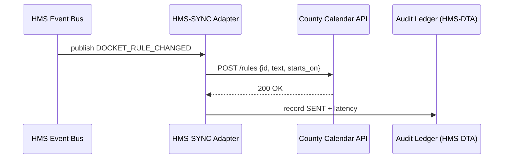

# Chapter 17: External System Sync Adapter  
*(linked from [Inter-Agency Data Exchange (HMS-A2A)](16_inter_agency_data_exchange__hms_a2a__.md))*  

---

## 1. Why Do We Need a “Universal Translator” for Outside Platforms?

Picture the **Federal Judicial Center** rolling out a brand-new “Friday-only” docket rule (created inside HMS-NFO).  
Unless every **county-level** court calendar, **vendor-hosted** e-filing tool, and the public **court-watch RSS feed** updates the same day, clerks will still schedule hearings for Tuesday—causing chaos.

Sending each vendor a PDF of the new rule is too slow.  
Re-implementing the vendor’s custom API in every HMS service is too expensive.

**External System Sync Adapter (HMS-SYNC)** is the paper-thin, but critical, shim that:

1. Listens to events inside HMS (e.g., “docket-rule changed”).  
2. Translates them into whatever format the outside world understands—REST, SOAP, CSV, even an SFTP file drop.  
3. Confirms delivery so no one works from stale information.

Result: **One change → many systems updated in minutes, not months.**

---

## 2. Key Concepts in Plain English

| Concept | What It Really Means | Analogy |
|---------|---------------------|---------|
| Source Event | Change that happens *inside* HMS (“policy updated”, “payment settled”). | The town crier’s announcement. |
| Target System | Any *external* platform that needs the news (state court app, vendor CRM, EHR). | Neighboring town hall. |
| Mapping | JSON rules that turn HMS fields into the target’s fields. | Translating English → Spanish. |
| Adapter | Tiny plug-in that knows how to call one target system. | Universal electrical plug. |
| Back-off / Retry | Automatic wait-and-try-again logic when the target is down. | Mail carrier retries tomorrow if office is closed. |
| Health Ping | A 200-byte heartbeat proving the sync line is alive. | Daily “all clear” radio check. |

> Good news: you rarely write code—90 % of the work is **declaring mappings**.

---

## 3. Five-Minute Use Case  
### Goal: Push the new **“Friday-only” docket rule** to a county court calendar SaaS.

#### 3.1  Declare a Mapping (10 lines)

```yaml
# file: mappings/court_calendar.yml
source_event: "DOCKET_RULE_CHANGED"
target_endpoint: "https://county-court.gov/api/v1/rules"
method: POST
headers:
  Authorization: "Bearer $SECRET"
field_map:
  policy_id:      id
  description:    text
  effective_date: starts_on
```

*Plain English*:

* “When HMS emits `DOCKET_RULE_CHANGED`  
  → make a **POST** call to `/rules`  
  → copy `policy_id` into `id`, etc.”*

#### 3.2  Turn the Adapter On (12 lines)

```python
# file: enable_sync.py
from hms_sync import enable

enable(
    mapping_file="mappings/court_calendar.yml",
    retry_seconds=30,      # back-off
    health_url="https://county-court.gov/ping"
)
print("Adapter running ✅")
```

What happens next?

1. The adapter subscribes to internal HMS events.  
2. On the *next* docket change it fires the POST automatically.  
3. Retries every 30 s if the county API is down.  

> You wrote **only 12 Python lines** and zero HTTP code!

#### 3.3  Watch It Work (8 lines)

```python
# file: tail_logs.py
from hms_sync import tail
for evt in tail(limit=3):
    print(evt)
```

Console (sample):

```
[12:01] SENT  DOCKET_RULE_CHANGED → county-court.gov 200 OK
[12:06] RETRY DOCKET_RULE_CHANGED → county-court.gov 503 → waiting 30 s
[12:06] PING  county-court.gov  OK=247 ms
```

---

## 4. What Happens Under the Hood?



Four actors—**easy to keep in your head**.

---

## 5. A Peek at the Adapter Code (All < 20 Lines)

### 5.1  Minimal Runner (`hms_sync/__init__.py`, 18 lines)

```python
import yaml, requests, time, json
from hms_bus import subscribe          # fires callbacks
from hms_dta_client import log_event   # audit

def enable(mapping_file, retry_seconds=30, health_url=None):
    m = yaml.safe_load(open(mapping_file))

    def handler(evt):
        if evt["type"] != m["source_event"]:
            return                       # ignore others
        body = {m["field_map"][k]: v for k, v in evt.items()
                if k in m["field_map"]}
        while True:
            try:
                r = requests.request(m.get("method","POST"),
                                      m["target_endpoint"],
                                      json=body,
                                      headers=m.get("headers",{}), timeout=5)
                log_event({"type":"SYNC_SENT","code":r.status_code})
                break
            except Exception as e:
                log_event({"type":"SYNC_RETRY","error":str(e)})
                time.sleep(retry_seconds)

    subscribe(handler)                   # start listening

    if health_url:                       # optional heartbeat
        def ping():
            while True:
                try: requests.get(health_url, timeout=2)
                except: pass
                time.sleep(60)
        import threading; threading.Thread(target=ping,daemon=True).start()
```

Highlights:

* **14 functional lines** handle mapping, POST, retry, and heartbeat.  
* Uses `subscribe` from the internal event bus introduced in [Core Backend Services (HMS-SVC)](06_core_backend_services__hms_svc__.md).  
* Writes every attempt to the audit table in [Central Data Repository (HMS-DTA)](07_central_data_repository__hms_dta__.md).

---

## 6. Health & Monitoring

HMS-SYNC is tiny but critical, so operations teams watch three metrics (exposed at `/metrics`):

| Metric | Meaning | Alert When |
|--------|---------|-----------|
| `sync_success_total` | How many events delivered. | Drops below 95 % in 1 h. |
| `sync_latency_ms` | Median round-trip. | > 2000 ms. |
| `health_ping_fail_total` | Failed heartbeats. | > 3 in 10 m. |

These plug straight into the dashboards we’ll explore in the next chapter: [Operations & Monitoring (HMS-OPS)](18_operations___monitoring__hms_ops__.md).

---

## 7. Hands-On Mini-Lab (10 min)

1. `git clone https://github.com/example/hms-nfo.git`  
2. `python -m sync.mock_bus`   # fires a “rule changed” event every minute  
3. `python enable_sync.py`     # starts adapter  
4. Tail logs (`python tail_logs.py`)—watch retries if you unplug the internet!  
5. Open `http://localhost:9800/metrics` to see live counters.

You just kept county courts in lockstep with federal rules—without writing a single REST call yourself.

---

## 8. Where HMS-SYNC Fits in the Bigger Picture

* **Source events** originate from services covered earlier (e.g., policy updates in [HMS-CDF](02_legislative_workflow_engine__hms_cdf__.md) or payment receipts in [HMS-ACH](08_financial_transaction_hub__hms_ach__.md)).  
* **Audit logs** land in [HMS-DTA](07_central_data_repository__hms_dta__.md) so auditors can replay every sync.  
* **Performance metrics** surface in [Accountability & Performance Metrics Tracker](05_accountability___performance_metrics_tracker_.md).  
* **Ops teams** monitor heartbeat & retries through [Operations & Monitoring (HMS-OPS)](18_operations___monitoring__hms_ops__.md).

---

## 9. Recap & What’s Next

* **External System Sync Adapter** is the **universal translator** that keeps outside platforms in perfect rhythm with HMS.  
* Declare a YAML mapping → call `enable()`—done.  
* Automatic retries, heartbeats, and full audits ensure no one ever works off stale data.  

Up next, see how the whole HMS-NFO constellation stays healthy **24 × 7**:  
[Operations & Monitoring (HMS-OPS)](18_operations___monitoring__hms_ops__.md)  

---

---

Generated by [AI Codebase Knowledge Builder](https://github.com/The-Pocket/Tutorial-Codebase-Knowledge)