# Chapter 21: AI Governance Value Guardrails  
*(continuing from [Monitoring & Operations Center (HMS-OPS)](20_monitoring___operations_center__hms_ops__.md))*  

---

## 1 · Why Do We Need “Seat-Belts” for AI?

> Evening case-worker **Alex** uses the new **FEMA Flood-Relief Chatbot** to draft personalized grant letters.  
> Within seconds the bot  
> 1. reveals the citizen’s **full SSN** (*privacy breach*), and  
> 2. promises “guaranteed approval” (*false claim*).  
>   
> If that e-mail is sent, FEMA violates the **Privacy Act** *and* misleads the public.  
>   
> **AI Governance Value Guardrails (GVG)** stop the e-mail before it leaves—just like a seat-belt that locks during a sudden stop.

---

## 2 · Beginner Mental Model

| Pillar (the “Value”) | Beginner Analogy | What GVG Checks at Runtime |
|----------------------|------------------|---------------------------|
| Transparency         | Receipt on fast-food bag | Has the model attached justification & sources? |
| Truth                | Fact-checker bot | Are cited facts verifiable? |
| Safety               | Handrails on stairs | Any self-harm or dangerous advice? |
| Ethics               | HR code of conduct | Bias, hate-speech, or protected-class issues? |
| Privacy              | Marker that blurs text | Does output expose PII/PHI beyond scope? |

Think of GVG as **middleware** that every AI message must pass through before humans or other systems can see it.

---

## 3 · Five-Minute Quick-Start

### 3.1 One Function Wraps Any Model

```python
# grant_letter.py  (18 lines)
from hms_gvg import Guardian
from hms_agt import Agent           # Chapter 6

model = Agent("GrantLetterBot")

guardian = Guardian( pillars=["truth", "privacy", "ethics"] )

prompt = "Draft a flood-relief approval letter for Jane Doe, SSN 123-45-6789."
safe_reply = guardian.run(model, prompt)

print(safe_reply)
```

What happens?  
1. `model` produces a **raw reply**.  
2. `Guardian.run` runs **3 pillar checks**.  
3. If **all pass**, the cleaned reply returns.  
4. If **any fails**, the call raises `ViolationError` and sends an alert to [Human-in-the-Loop Oversight (HITL)](07_human_in_the_loop_oversight__hitl__.md).

---

### 3.2 Possible Console Outputs

```
Dear Ms Doe, … (redacted SSN) … Your application is approved…
```

_or_

```
ViolationError: privacy  ❌  (SSN detected)
```

---

## 4 · What Happens Behind the Curtain?

```mermaid
sequenceDiagram
    participant A as AI Model
    participant GV as Guardian
    participant PC as Pillar Checkers
    participant HI as HITL Queue
    A-->>GV: raw reply
    GV->>PC: run all checks
    alt any pillar fails
        PC-->>GV: violation
        GV->>HI: open ticket
    else all good
        PC-->>GV: ✅
        GV-->>A: cleaned reply
    end
```



Only **four** actors; if *any* checker screams, humans step in.

---

## 5 · Under-the-Hood Mini Code

### 5.1 Guardian Orchestrator (≤ 16 lines)

```python
# hms_gvg/guardian.py
from .pillars import Truth, Privacy, Ethics

class Guardian:
    MAP = {"truth": Truth(), "privacy": Privacy(), "ethics": Ethics()}
    def __init__(self, pillars):
        self.chain = [self.MAP[p] for p in pillars]
    def run(self, agent, prompt):
        raw = agent.ask(prompt)              # may include PII
        for p in self.chain:
            ok, clean = p.check(raw)
            if not ok:
                self._escalate(p.name, raw)
                raise ViolationError(p.name)
            raw = clean                      # carry cleaned text forward
        return raw
    def _escalate(self, pillar, text):
        # send to HITL + OPS
        pass
```

### 5.2 Privacy Checker (≤ 14 lines)

```python
# hms_gvg/pillars/privacy.py
import re
PII = re.compile(r"\b\d{3}-\d{2}-\d{4}\b")   # SSN pattern

class Privacy:
    name = "privacy"
    def check(self, txt):
        if PII.search(txt):
            safe = PII.sub("[REDACTED SSN]", txt)
            return False, safe
        return True, txt
```

Real deployment swaps in NLP + policy configs, but the skeleton is one regex.

---

## 6 · Dashboard at a Glance

| Pillar | Last 24h Pass-Rate | Violations (auto-escalated) |
|--------|-------------------|-----------------------------|
| Transparency | 97 % | 3 |
| Truth        | 93 % | 8 |
| Safety       | 100 % | 0 |
| Ethics       | 99 % | 1 |
| Privacy      | 96 % | 5 |

The dashboard lives in [Governance Portal (HMS-GOV)](01_governance_portal__hms_gov__.md). Clicking a count opens the exact transcript (with `<redact>` per [MCP](16_model_context_protocol__hms_mcp__.md)).

---

## 7 · Integrations with Other HMS Layers

| Where It Hooks | How |
|----------------|-----|
| **AI Agents** – [AGT](06_ai_agent_framework__hms_agt___hms_agx__.md) | `Agent(..., guardian="default")` auto-wraps every `.ask()` |
| **Workflows** – [ACT](08_activity___workflow_orchestrator__hms_act___hms_oms__.md) | Steps fail fast on pillar error; timeline shows reason |
| **Ops Alerts** – [OPS](20_monitoring___operations_center__hms_ops__.md) | `ViolationError` increments `gvg.violations_total` metric |
| **Marketplace** – [MKT](15_marketplace___discovery_service__hms_mkt__.md) | Listings declare supported pillars; GOV rejects installs missing them |

---

## 8 · Frequently Asked Newbie Questions

**Q: Does GVG slow my model down?**  
A: Typical overhead is 40–120 ms—worth it for legal safety. Heavy workloads can batch-check replies.

**Q: Can I add a new pillar (e.g., “Accessibility”)?**  
A: Yes—implement `.check()` and register it:  
```python
Guardian.MAP["access"] = Accessibility()
```

**Q: What if a pillar falsely flags my text?**  
A: Approvers in [HITL](07_human_in_the_loop_oversight__hitl__.md) can **override** once, and training data updates reduce future false-positives.

**Q: Where are the policies stored?**  
A: YAML files in HMS-GOV; changing a regex or threshold **does not** require redeploying services.

---

## 9 · Hands-On Mini Exercise (3 min)

```bash
pip install hms-gvg
python - <<'PY'
from hms_gvg import Guardian
g = Guardian(["privacy"])
try:
    print(g.run(lambda p:"My SSN is 111-22-3333", "ignored"))
except Exception as e:
    print("Blocked:", e)
PY
```

You should see:

```
Blocked: ViolationError: privacy
```

---

## 10 · What You Learned

1. **GVG** is the seat-belt for every AI reply—five pillars, one Guardian call.  
2. A 14-line checker can stop privacy leaks or bias.  
3. Violations automatically escalate through existing HITL & OPS layers.  
4. Dashboards give executives instant assurance of **truth, safety, ethics, privacy, and transparency**.

Next we meet the nuts-and-bolts that let all these services run fast and securely: [Low-Level System Infrastructure (HMS-SYS)](22_low_level_system_infrastructure__hms_sys__.md) 🚀

---

Generated by [AI Codebase Knowledge Builder](https://github.com/The-Pocket/Tutorial-Codebase-Knowledge)