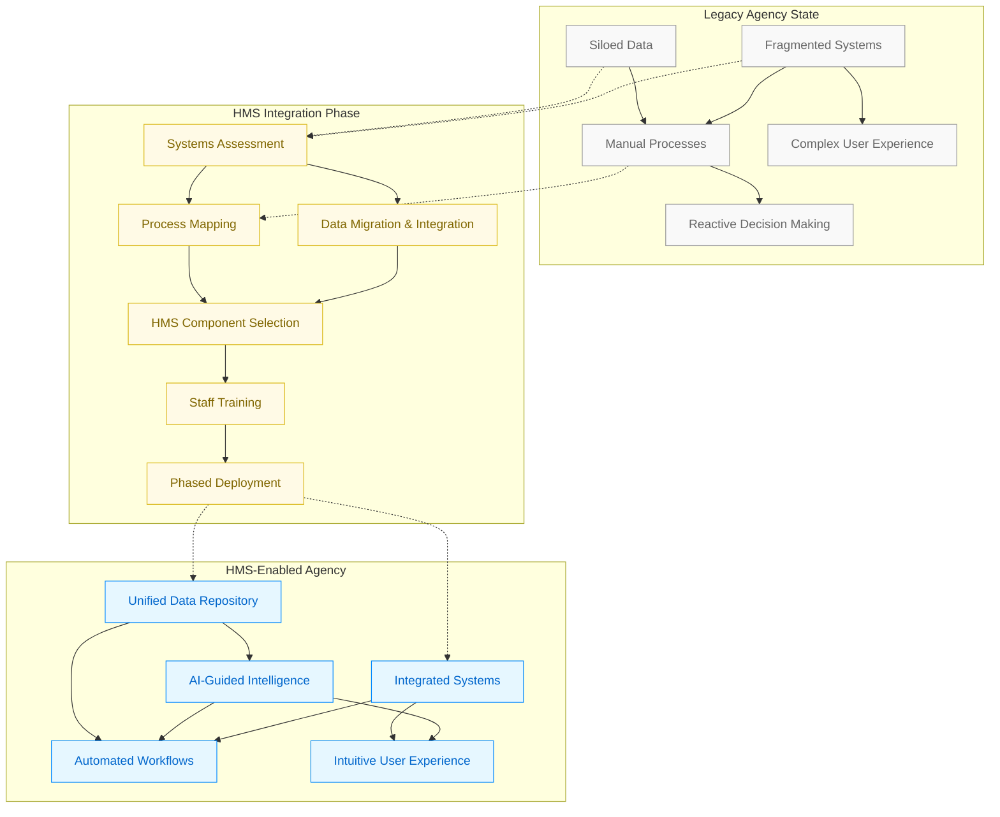
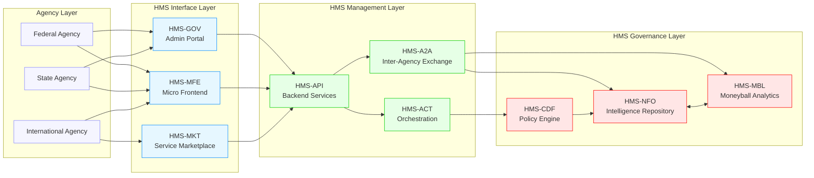
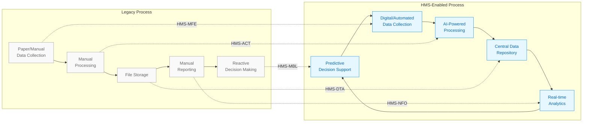
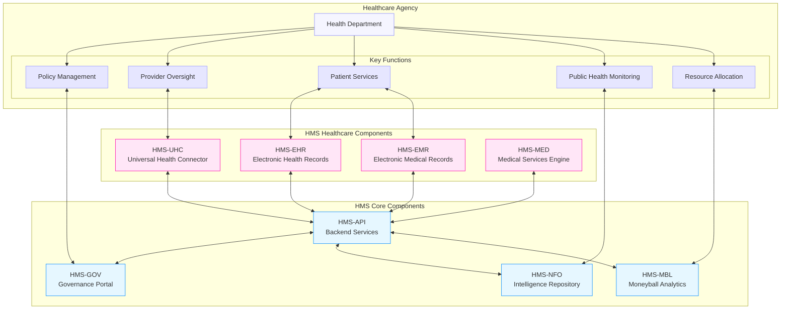
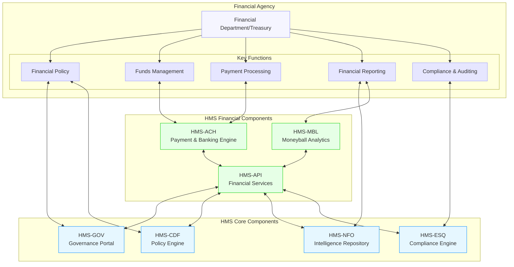
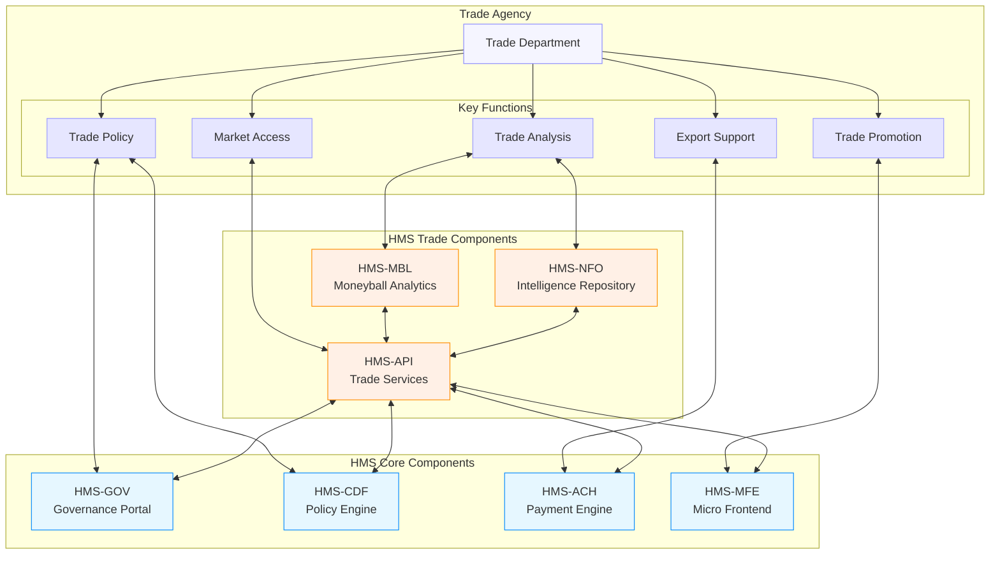

# Agency Visualization with HMS

This document provides visualizations of how various government agencies transform with HMS integration.

## Agency Transformation Process

The following diagram illustrates how agencies transition from legacy systems to HMS-powered operations:

## Federal Agency Component Integration

This diagram shows how federal agencies integrate with HMS components:

## Agency Process Transformation

The following diagram illustrates the transformation of key agency processes:

## Healthcare Agency Integration

Special focus on healthcare agencies with HMS:

## Financial Agency Integration

Visualization of financial agencies with HMS:

## Trade Agency Integration

Special visualization for trade-focused agencies:

