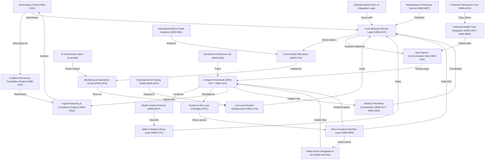

# Tutorial: HMS-NFO

**HMS** is an *expert-led, AI-powered* platform that lets governments
codify policy, build citizen-facing services, and move money or data
safely at “AI speed.”  Politicians set rules in **HMS-GOV**, engineers
plug logic into the **Service Layer**, and reusable micro-frontends
deliver forms, dashboards, and AI helpers to the public.  
Behind the scenes, compliant workflows, human-in-the-loop approvals,
and financial/health integrations keep every action legal, auditable,
and centered on better outcomes for citizens.

**Source Repository:** [None](None)

## Chapters

1. [Governance Portal (HMS-GOV)
](01_governance_portal__hms_gov__.md)
2. [Codified Democracy Foundation Engine (HMS-CDF)
](02_codified_democracy_foundation_engine__hms_cdf__.md)
3. [Legal Reasoning & Compliance Engine (HMS-ESQ)
](03_legal_reasoning___compliance_engine__hms_esq__.md)
4. [Micro-Frontend Interface Layer (HMS-MFE)
](04_micro_frontend_interface_layer__hms_mfe__.md)
5. [Intent-Driven Navigation & AI-Guided Journeys
](05_intent_driven_navigation___ai_guided_journeys_.md)
6. [AI Agent Framework (HMS-AGT / HMS-AGX)
](06_ai_agent_framework__hms_agt___hms_agx__.md)
7. [Human-in-the-Loop Oversight (HITL)
](07_human_in_the_loop_oversight__hitl__.md)
8. [Activity & Workflow Orchestrator (HMS-ACT / HMS-OMS)
](08_activity___workflow_orchestrator__hms_act___hms_oms__.md)
9. [Core Backend Service Layer (HMS-SVC)
](09_core_backend_service_layer__hms_svc__.md)
10. [Inter-Agency Communication Hub (HMS-A2A)
](10_inter_agency_communication_hub__hms_a2a__.md)
11. [External System Sync & Integration Layer
](11_external_system_sync___integration_layer_.md)
12. [Financial Transaction Core (HMS-ACH)
](12_financial_transaction_core__hms_ach__.md)
13. [Universal Health Care Integration (HMS-UHC / HMS-MED)
](13_universal_health_care_integration__hms_uhc___hms_med__.md)
14. [International Micro-Trade Analytics (HMS-MBL)
](14_international_micro_trade_analytics__hms_mbl__.md)
15. [Marketplace & Discovery Service (HMS-MKT)
](15_marketplace___discovery_service__hms_mkt__.md)
16. [Model Context Protocol (HMS-MCP)
](16_model_context_protocol__hms_mcp__.md)
17. [Simulation & Behavior Lab (HMS-ESR)
](17_simulation___behavior_lab__hms_esr__.md)
18. [Utility & Shared Library Layer (HMS-UTL)
](18_utility___shared_library_layer__hms_utl__.md)
19. [Central Data Repository (HMS-DTA)
](19_central_data_repository__hms_dta__.md)
20. [Monitoring & Operations Center (HMS-OPS)
](20_monitoring___operations_center__hms_ops__.md)
21. [AI Governance Value Guardrails
](21_ai_governance_value_guardrails_.md)
22. [Low-Level System Infrastructure (HMS-SYS)
](22_low_level_system_infrastructure__hms_sys__.md)
23. [Development & Testing Toolkit (HMS-DEV)
](23_development___testing_toolkit__hms_dev__.md)

---

Generated by [AI Codebase Knowledge Builder](https://github.com/The-Pocket/Tutorial-Codebase-Knowledge)